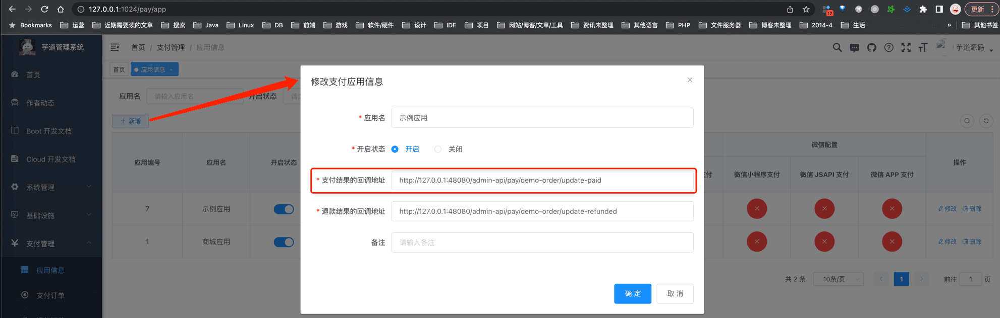
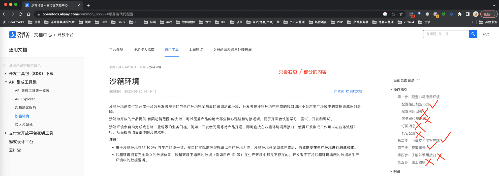
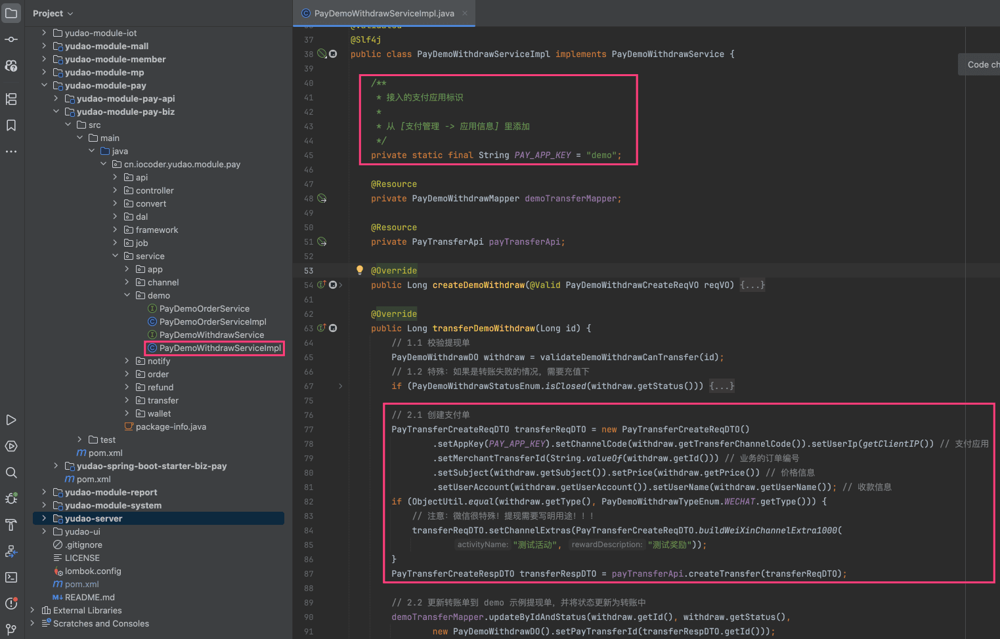
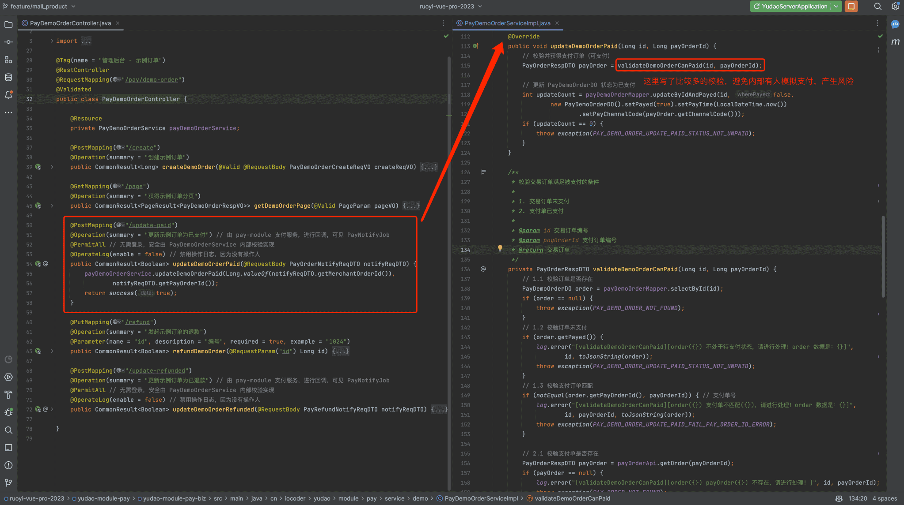
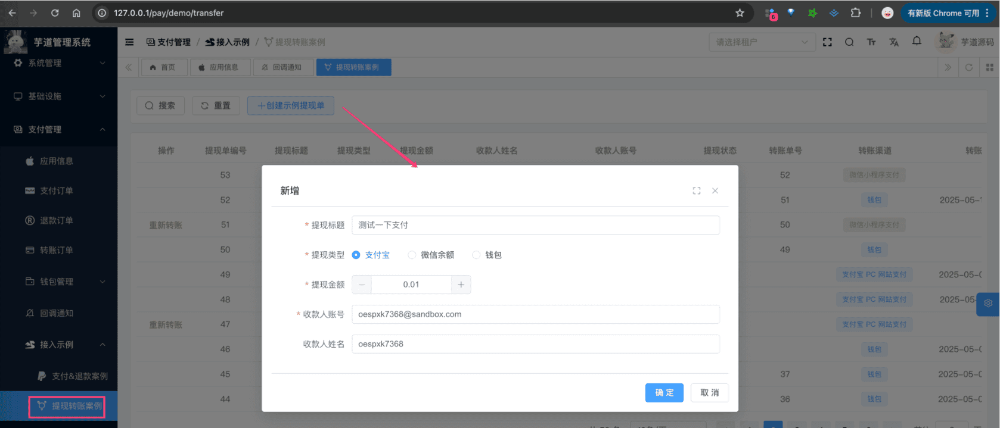
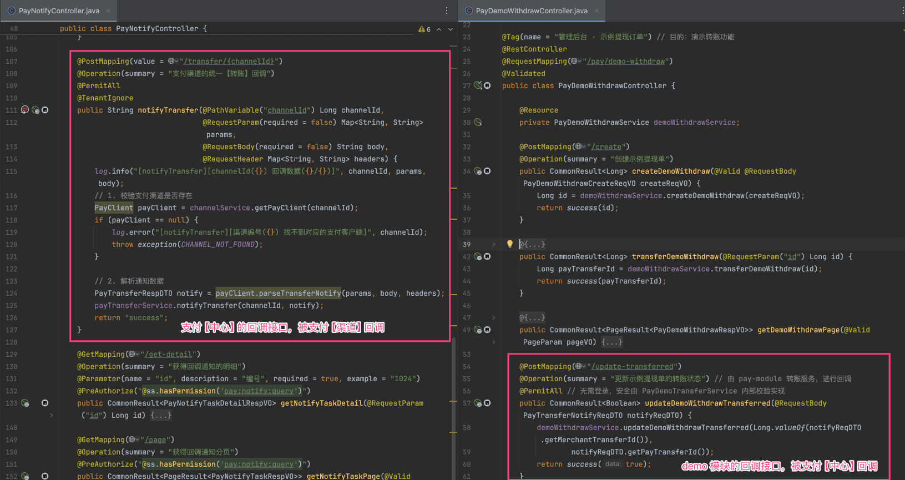

# 支付宝转账接入

## # 0. 概述
在 `yudao-module-pay` 模块的 [`demo` (opens new window)](https://github.com/YunaiV/ruoyi-vue-pro/tree/master/yudao-module-pay/src/main/java/cn/iocoder/yudao/module/pay/controller/admin/demo) 模块，我们提供了一个 **转账** 接入的示例（PayDemoWithdrawController）。
它支持如下支付（转账）渠道：
- 支付宝转账
- 钱包转账
疑问：为什么不支持微信转账呢？
因为 `demo` 是使用 PC 网页提供示例，而微信转账流程依赖微信公众号、小程序等，所以不太好支持！
如果你有这方面的诉求，可以阅读 [《微信转账接入》](/pay/wx-transfer-demo)
下面，我们以 `demo` 模块为例子，讲解如何接入支付宝的转账功能。
## # 1. 第一步，配置支付渠道
① 在 [支付管理 -> 应用信息] 菜单，新建 `demo` 模块使用的支付应用。如下图所示：
 
- 转账结果的回调地址：对应「2.4 第四步，实现回调接口」实现的接口。这里因为我们在本地演示，所以使用了 `127.0.0.1` IP 地址，如果你部署到服务器上，要设置服务器可调用到的 IP 地址。
因为 `demo` 模块的支付应用默认已经创建，所以你可以直接使用。注意，这里的应用标识 **“demo”** 稍后会使用到。
疑问：为什么应用上有回调地址，然后 `application.yaml` 配置文件中也有 `yudao.pay.transfer-notify-url` 回调地址呢？
请详细阅读 [《支付手册 —— 功能开启》](/pay/build) 的「3.5 支付回调【重要】」小节。
简单来说：
- 配置文件的回调地址，是外部的支付渠道（支付宝、微信）回调 `pay` 支付模块（支付中心）的地址。
- 应用的回调地址，是 `pay` 回调内部的各个 `biz` 模块（支付应用）的地址。例如收：`trade` 商城的分销提现的转账
因为内部会有多个业务模块，所以它们每个都有自己的回调地址，就是配置到对应的支付应用上！
② 点击“示例用户”对应的【支付宝 PC 网站支付】，进入支付渠道的配置。如下图所示：
 友情提示：
如果你还没有支付宝开放平台的账号，可以先参考 [《沙箱环境》 (opens new window)](https://opendocs.alipay.com/common/02kkv7) 文档，申请一个测试账号，我目前就是这么测试的。只需要阅读该文档的如下小节即可：
 最终在 [沙箱应用 (opens new window)](https://open.alipay.com/develop/sandbox/app) 可以看到支付渠道的配置。
## # 2. 第二步，实现转账调用【重要】
友情提示：由于 demo 模块的转账接入已经实现，这里你只要看懂什么意思即可，不用操作。
① 【后端】在 `demo` 模块所在的 `yudao-module-xx` 模块的 `pom.xml` 文件，引入 `yudao-module-pay` 依赖，这样才可以调用到 PayTransferApi 接口。代码如下：
cn.iocoder.boot
yudao-module-pay
${revision}
② 【后端】在 `demo` 模块的转账逻辑中，需要调用 PayTransferApi 的 [`#createTransfer(...)` (opens new window)](https://github.com/YunaiV/ruoyi-vue-pro/blob/master-jdk17/yudao-module-pay/src/main/java/cn/iocoder/yudao/module/pay/service/demo/PayDemoWithdrawServiceImpl.java#L77-L87) 方法，创建转账单。如下图所示：
图片纠错：最新版本不区分 yudao-module-pay-api 和 yudao-module-pay-biz 子模块，代码直接合并到 yudao-module-pay 模块的 src 目录下，更适合单体项目
 
## # 3. 第三部，实现回调接口【重要】
友情提示：由于 demo 模块的转账接入已经实现，这里你只要看懂什么意思即可，不用操作。
在 `demo` 模块所在的 `yudao-module-xx` 模块，实现一个转账回调的接口，提供给支付【中心】回调。对应的代码在 PayDemoWithdrawController 的 [`#updateDemoWithdrawTransferred(...)` (opens new window)](https://github.com/YunaiV/ruoyi-vue-pro/blob/master-jdk17/yudao-module-pay/src/main/java/cn/iocoder/yudao/module/pay/controller/admin/demo/PayDemoWithdrawController.java#L54-L61) 方法中，如下图所示：
 
## # 4. 第四步，转账功能测试
至此，我们已经完成了转账接入的所有步骤，接下来，我们来测试一下转账功能。
① 打开 [支付管理 -> 接入示例 -> 提现转账案例] 菜单，点击【创建示例提现单】按钮，创建一个提现单。如下图所示：
 此时，只是创建了一个提现单，并没有调用 PayTransferApi 发起转账。
② 创建完成后，点击该提现单的【发起转账】按钮，发起转账流程。如下图所示：
 此时，才会调用 PayTransferApi 发起转账，而在 `pay_transfer` 表中，会新增一条转账记录。
然后，它的转账状态会变为【转账中】。刷新几次列表，可以看到转账状态变为【转账成功】或者【转账失败】。
③ 转账完成后，先是支付【中心】的回调接口被回调，然后是 `demo` 模块的回调接口被回调。如下图所示：
 至此，我们已经完成转账接入的测试流程，可以试着多多 debug 调试整个流程，并不复杂噢。
.pageB img{width:80px!important;}
.wwads-horizontal .wwads-text, .wwads-content .wwads-text{line-height:1;}
[支付宝、微信退款接入](/pay/refund-demo/) [微信转账接入](/pay/wx-transfer-demo/) 
←
[支付宝、微信退款接入](/pay/refund-demo/) [微信转账接入](/pay/wx-transfer-demo/)→
 
Theme by
[Vdoing](https://github.com/xugaoyi/vuepress-theme-vdoing) 
| Copyright © 2019-2026
芋道源码 | MIT License   
- 跟随系统
- 浅色模式
- 深色模式
- 阅读模式
× 
.windowRB{ padding: 0;}
.windowRB .wwads-img{margin-top: 10px;}
.windowRB .wwads-content{margin: 0 10px 10px 10px;}
.custom-html-window-rb .close-but{
display: none;
}