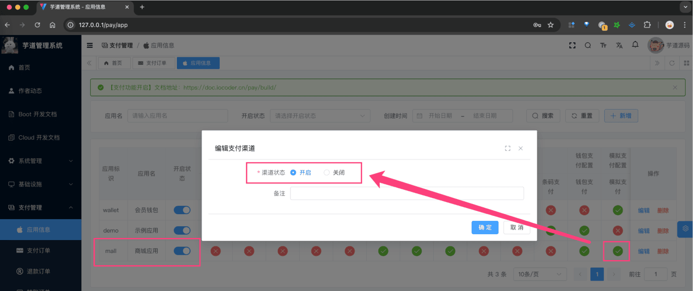
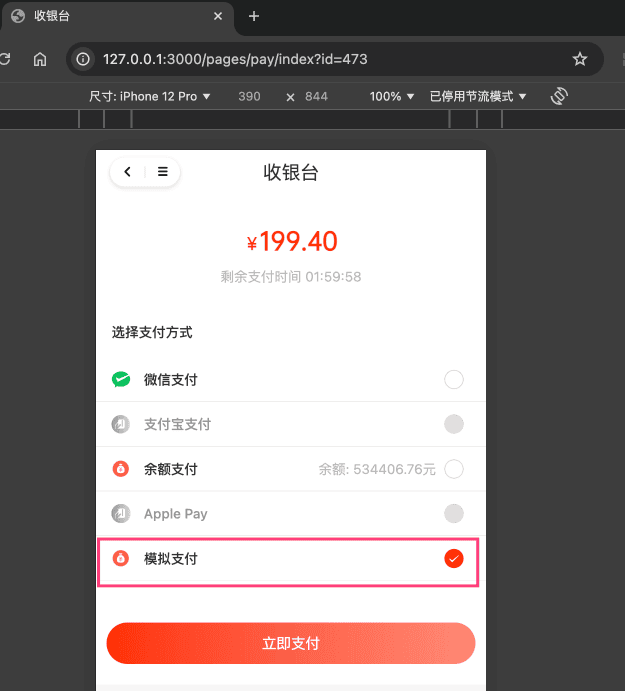

# 模拟支付、退款

前置阅读：
需要先阅读如下文档，对支付、退款功能有一定了解：
- [《支付功能开启》](/pay/build/)
- [《支付宝支付接入》](/pay/alipay-pay-demo/)
- [《支付宝、微信退款接入》](/pay/refund-demo)
考虑到支付、退款功能的接入，需要依赖支付宝、微信等支付渠道，会比较麻烦。所以，我们提供了模拟支付、退款的功能，方便开发者进行接入。
具体的实现，可见 MockPayClient 客户端：
- 在 `#doUnifiedOrder(...)` 方法中，直接返回支付【成功】
- 在 `#doUnifiedRefund(...)` 方法中，直接返回退款【成功】
下面，我们以“商城”为例子，讲解模拟支付的开启、使用。
## # 1. 模拟支付的开启
在管理后台的 [支付管理 -> 应用信息] 菜单，将商城对应的支付应用 `mall` 进行开启（开启状态为打开）。如下图所示：
 
## # 2. 模拟支付的使用
在商城 uni-app 收银台，选择“模拟支付”时，内部会调用 MockPayClient 的 `#doUnifiedOrder(...)` 方法，发起支付，直接成功。
它的整体流程和 [《支付宝支付接入》](/pay/alipay-pay-demo) 是类似的。
 
## # 3. 模拟退款的使用
模拟支付后，如果发起退款，内部会调用 MockPayClient 的 `#doUnifiedRefund(...)` 方法，发起退款，直接成功。
它的整体流程和 [《支付宝、微信退款接入》](/pay/refund-demo) 是类似的。
.pageB img{width:80px!important;}
.wwads-horizontal .wwads-text, .wwads-content .wwads-text{line-height:1;}
[钱包充值、支付、退款](/pay/wallet/) [功能开启](/member/build/) 
←
[钱包充值、支付、退款](/pay/wallet/) [功能开启](/member/build/)→
 
Theme by
[Vdoing](https://github.com/xugaoyi/vuepress-theme-vdoing) 
| Copyright © 2019-2026
芋道源码 | MIT License   
- 跟随系统
- 浅色模式
- 深色模式
- 阅读模式
× 
.windowRB{ padding: 0;}
.windowRB .wwads-img{margin-top: 10px;}
.windowRB .wwads-content{margin: 0 10px 10px 10px;}
.custom-html-window-rb .close-but{
display: none;
}