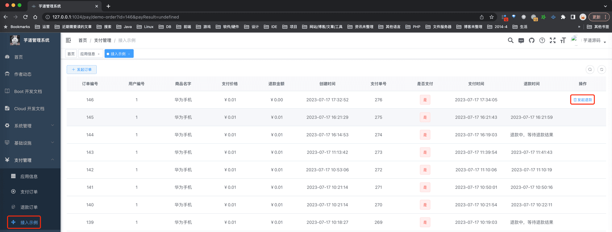
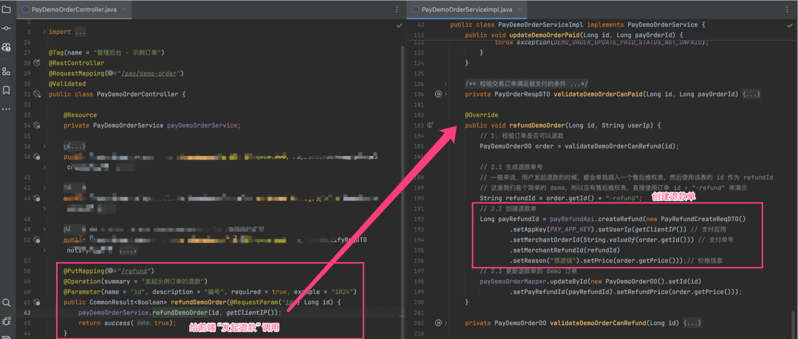
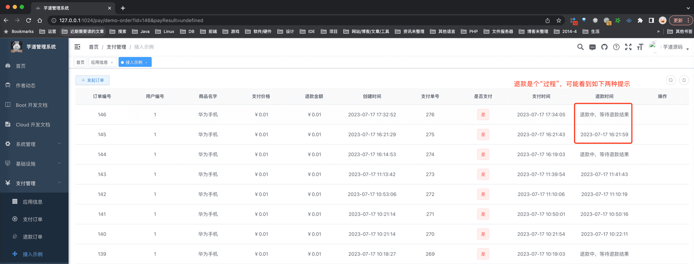
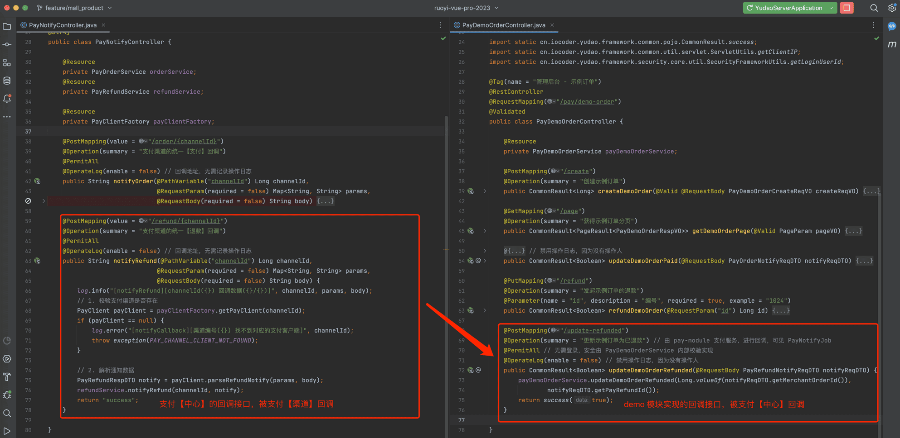

# 支付宝、微信退款接入

## # 0. 概述
在 `yudao-module-pay` 模块的 [`demo`](https://github.com/YunaiV/ruoyi-vue-pro/tree/master/yudao-module-pay/src/main/java/cn/iocoder/yudao/module/pay/controller/admin/demo) 模块，我们提供了一个 **退款** 接入的示例，它已支持支付宝、微信的所有退款方式。
下面，我们以 `demo` 模块为例子，讲解如何接入退款。
## # 1. 第一步，创建支付订单
① 如果你是看支付宝退款接入，则需要先看完 [《支付宝支付接入》](/pay/alipay-pay-demo/) 文档
② 如果你是看微信退款接入，则需要先看完 [《微信小程序支付接入》](/pay/wx-pub-pay-demo/) 或 [《微信公众号支付接入》](/pay/wx-pub-pay-demo/) 文档
③ 然后，我们在 [支付管理 -> 支付&退款案例] 菜单，可以看到一个可以“发起退款”的订单。如下图所示：
 
## # 2. 第二步，实现退款调用【重要】
友情提示：由于 demo 模块的退款接入已经实现，这里你只要看懂什么意思即可，不用操作。
① 【后端】在 `demo` 模块所在的 `yudao-module-xx` 模块的 `pom.xml` 文件，引入 `yudao-module-pay` 依赖，这样才可以调用到 PayOrderApi 接口。代码如下：
cn.iocoder.boot
yudao-module-pay
${revision}
② 【后端】在 `demo` 模块的退款逻辑中，需要调用 PayRefundApi 的 [`#createRefund(...)`](https://github.com/YunaiV/ruoyi-vue-pro/blob/master/yudao-module-pay/src/main/java/cn/iocoder/yudao/module/pay/service/demo/PayDemoOrderServiceImpl.java#L190-L203) 方法，创建退款单。如下图所示：
 
## # 3. 第三步，实现回调接口【重要】
友情提示：由于 demo 模块的退款接入已经实现，这里你只要看懂什么意思即可，不用操作。
在 `demo` 模块所在的 `yudao-module-xx` 模块，实现一个支付回调的接口，提供给支付【中心】回调。对应的代码在 PayDemoOrderController 的 [`#updateDemoOrderRefunded(...)`](https://github.com/YunaiV/ruoyi-vue-pro/blob/master/yudao-module-pay/src/main/java/cn/iocoder/yudao/module/pay/controller/admin/demo/PayDemoOrderController.java#L68-L76) 方法中，如下图所示：
 
## # 4. 第四步，退款功能测试
至此，我们已经完成了退款接入的所有步骤，接下来，我们来测试一下退款功能。
① 点击“发起退款”按钮，发起刚支付订单的退款流程。
 此时，在 `pay_refund` 表中，会新增一条退款订单记录。
② 退款成功后，先是支付【中心】的回调接口被回调，然后是 `demo` 模块的回调接口被回调。如下图所示：
 注意
- 支付宝发起退款时，它是直接返回退款成功，所以它没有支付【中心】 PayNotifyController 的异步回调，只有 `demo` 模块的回调接口被回调。
- 微信发起退款时，它是可能返回退款成功，也可能返回退款处理中。微信退款是有支付【中心】 PayNotifyController 的异步回调，也有 `demo` 模块的回调接口被回调。
至此，我们已经完成退款接入的测试流程，可以试着多多 debug 调试整个流程，并不复杂噢。
.pageB img{width:80px!important;}
.wwads-horizontal .wwads-text, .wwads-content .wwads-text{line-height:1;}
[微信小程序支付接入](/pay/wx-lite-pay-demo/) [支付宝转账接入](/pay/alipay-transfer-demo/) 
←
[微信小程序支付接入](/pay/wx-lite-pay-demo/) [支付宝转账接入](/pay/alipay-transfer-demo/)→
 
Theme by
[Vdoing](https://github.com/xugaoyi/vuepress-theme-vdoing) 
| Copyright © 2019-2026
芋道源码 | MIT License   
- 跟随系统
- 浅色模式
- 深色模式
- 阅读模式
× 
.windowRB{ padding: 0;}
.windowRB .wwads-img{margin-top: 10px;}
.windowRB .wwads-content{margin: 0 10px 10px 10px;}
.custom-html-window-rb .close-but{
display: none;
}