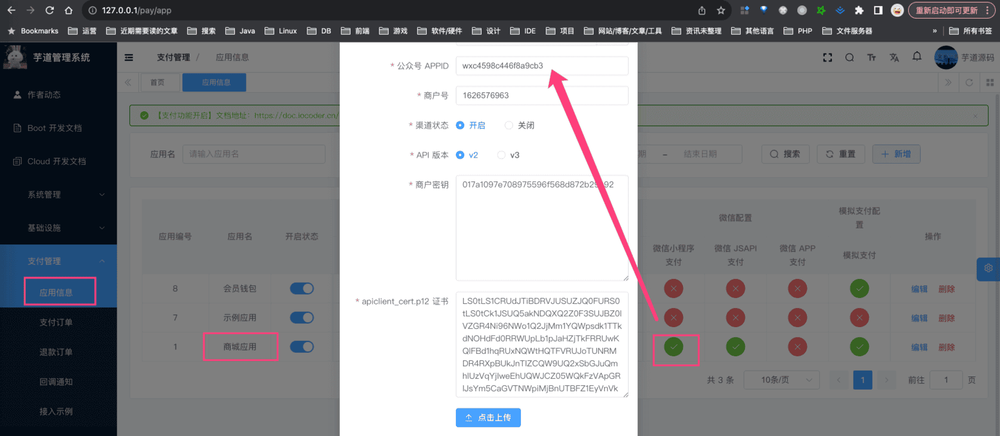
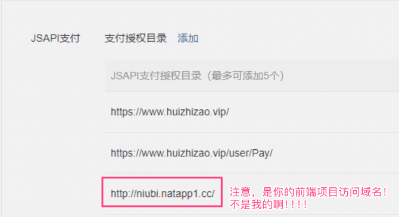
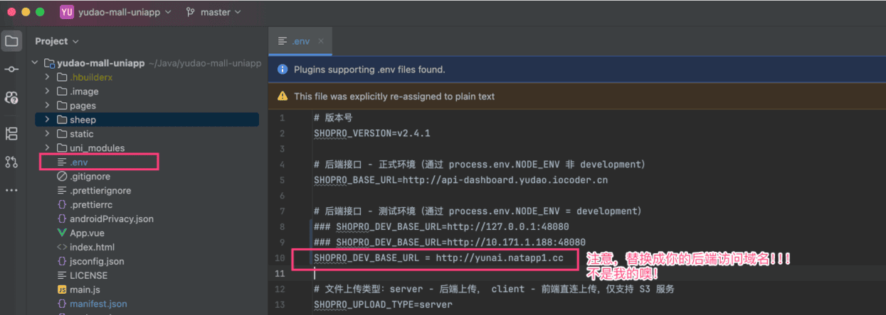
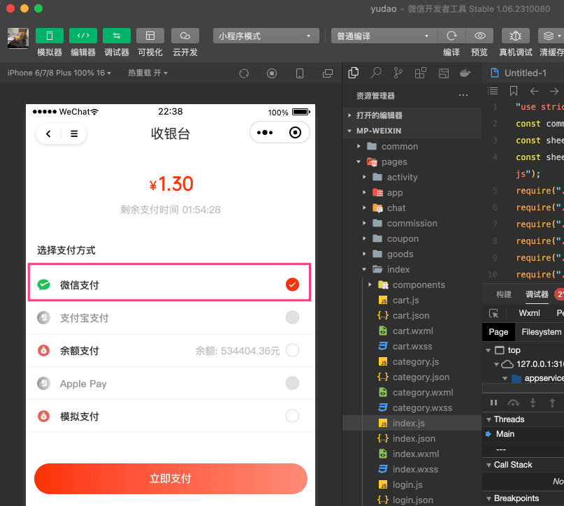
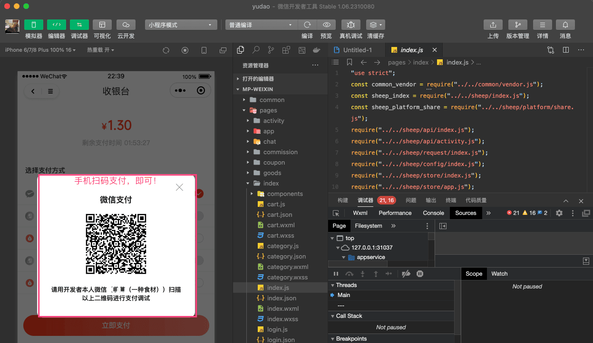

# 微信公众号支付接入

前置阅读：
① 阅读 [《支付功能开启》](/pay/build/) 和 [《支付宝支付接入》](/pay/alipay-pay-demo/) 文档，一定要先跑通支付宝支付流程！！！不跑通支付宝，微信公众号支付更跑不通。
② 阅读 [《微信公众号登录》](/member/weixin-mp-login/) 文档，因为微信公众号支付需要先微信公众号登录，超级麻烦的说！
注意，微信公众号支付不能使用“测试公众号”，必须使用认证过的公众号。并且，在阅读《公众号登录》文档时，前端项目需要使用 [《内网穿透》](/natapp/)，因为微信公众号支付只能在手机微信上测试！！！
微信公众号支付，使用 WxPubPayClient 客户端进行对接。
下面，我们以 `yudao-mall-uniapp` 商城项目，演示微信公众号支付的接入流程。
友情提示：
- [http://niubi.natapp1.cc (opens new window)](http://niubi.natapp1.cc) 域名，是我前端项目的访问域名
- [http://yunai.natapp1.cc (opens new window)](http://yunai.natapp1.cc) 域名，是我后端项目的访问域名
所以，你的前后端项目也要分别使用 [《内网穿透》](/natapp/) 实现独立域名！！！
## # 1. 第一步，配置支付渠道
① 访问 [支付管理 -> 应用信息] 菜单，点击“商城应用”对应的【微信 JSAPI 支付】，进入支付渠道的配置。如下图所示：
 
- 在 [https://pay.weixin.qq.com/index.php/core/account/info (opens new window)](https://pay.weixin.qq.com/index.php/core/account/info) 地址，可获取微信支付商户号
- 在 [https://pay.weixin.qq.com/index.php/core/cert/api_cert#/ (opens new window)](https://pay.weixin.qq.com/index.php/core/cert/api_cert#/) 地址，可获取 API 证书、密钥
友情提示：
可以简单阅读下 [《微信官方文档 —— JSAPI 支付的接入前准备》 (opens new window)](https://pay.weixin.qq.com/doc/v3/partner/4012069852) 文章。
目前建议使用微信支付的 V3 版本，并且使用[“微信支付公钥” (opens new window)](https://pay.weixin.qq.com/doc/v3/merchant/4012153196)！！！
如果使用 V2 版本，最好参考 [https://gitee.com/zhijiantianya/yudao-cloud/issues/ICY1MT (opens new window)](https://gitee.com/zhijiantianya/yudao-cloud/issues/ICY1MT) 帖子，降低 `weixin-java` 组件的版本。
② 访问微信支付的 [开发配置 (opens new window)](https://pay.weixin.qq.com/index.php/extend/pay_setting) 地址，设置 JSAPI 支付目录，设置为前端项目的访问域名。如下图所示：
 
## # 2. 支付功能测试
① IDEA 打开前端 uniapp 项目，修改 `.env` 配置文件的 `SHOPRO_DEV_BASE_URL` 配置项目，替换成你的后端项目的访问域名。例如说下图：
 ② 使用手机微信，访问前端项目的域名。随便找个商品下单，一路往下走，可以进入“收银台”界面（对应前端项目的 `pages/pay/index.vue` 文件）。如下图所示：
 ③ 选择“微信支付”，点击“立即支付”按钮，即可进行微信支付。如下图所示：
 
- 前端代码的实现，可见 `sheep/platform/pay.js` 文件的 `#wechatOfficialAccountPay(...)` 方法
- 后端代码的实现，可见 AppPayOrderController 提供的 `#submitPayOrder(...)` 接口
④ 支付成功后，跳转到“支付结果”界面（对应前端项目的 `pages/pay/result.vue` 文件）。
友情提示：
如果这个过程中碰到问题，可以先使用「微信开发者工具」访问前端项目的域名，看看这个过程中有没什么报错。
自查 30-60 分钟，如果还是无法解决，可以在星球发帖求助！但是注意，一定要先自查，因为这玩意没环境现场，很难搞啊！！！
.pageB img{width:80px!important;}
.wwads-horizontal .wwads-text, .wwads-content .wwads-text{line-height:1;}
[支付宝支付接入](/pay/alipay-pay-demo/) [微信小程序支付接入](/pay/wx-lite-pay-demo/) 
←
[支付宝支付接入](/pay/alipay-pay-demo/) [微信小程序支付接入](/pay/wx-lite-pay-demo/)→
 
Theme by
[Vdoing](https://github.com/xugaoyi/vuepress-theme-vdoing) 
| Copyright © 2019-2026
芋道源码 | MIT License   
- 跟随系统
- 浅色模式
- 深色模式
- 阅读模式
× 
.windowRB{ padding: 0;}
.windowRB .wwads-img{margin-top: 10px;}
.windowRB .wwads-content{margin: 0 10px 10px 10px;}
.custom-html-window-rb .close-but{
display: none;
}