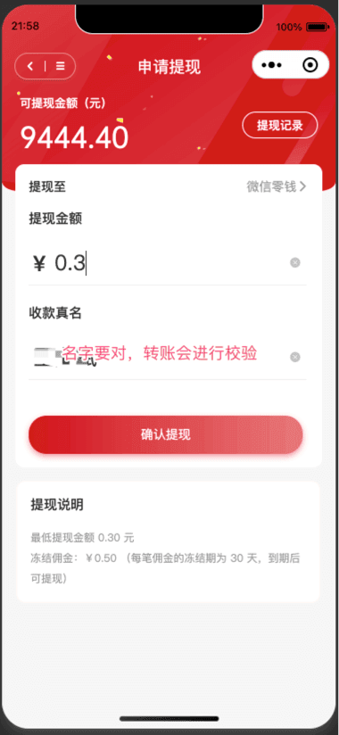
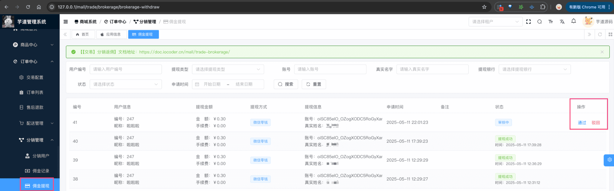
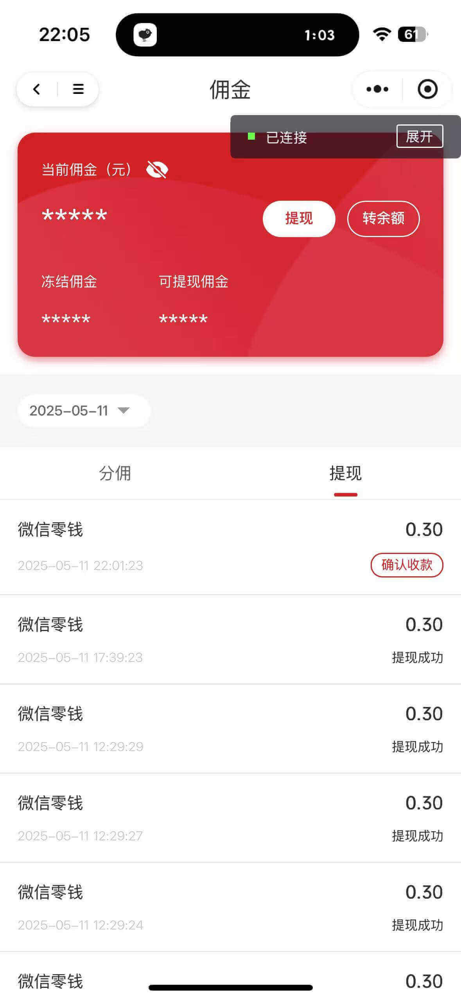

# 微信转账接入

前置阅读：
① 阅读 [《支付功能开启》](/pay/build/) 和 [《支付宝转账接入》](/pay/alipay-transfer-demo/) 文档，一定要先跑通支付宝转账流程！！！不跑通支付宝，微信转账更跑不通。
② 阅读 [《商城手册 —— 【交易】分销返佣》](/mall/trade-brokerage) 文档，整体流程跑下，因为使用它作为微信转账的示例。
③ 阅读 [微信商家转账](https://pay.weixin.qq.com/doc/v3/merchant/4012711988) 的文档，特别是 [《微信转账 —— 发起转账》](https://pay.weixin.qq.com/doc/v3/merchant/4012716434) 和 [《微信转账 —— JSAPI 调起用户确认收款》](https://pay.weixin.qq.com/doc/v3/merchant/4012716430) 文档，这非常重要。相比支付宝转账来说，微信转账多了一个步骤，需要用户确认收款。
ps：没错，微信转账真的会复杂一些，需要前置阅读比较多的东西，才能跑通！！！我也开发了好几天，一度想放弃，但是还是坚持下来了！！！简直是太不容易了！！！
本小节，我们以商城的“分销提现”功能，大体讲解微信转账的接入流程，主要只会讲和支付宝转账不同的地方。
这里，使用微信小程序作为演示，其实微信公众号也是类似的。
## # 1.【用户】申请商城分佣提现
在商城 uniapp 微信小程序中，申请分佣提现，如下图所示：
 注意，需要选择“微信零钱”提现方式，并且最小金额是 0.3 元。
ps：这一部，不涉及到 PayTransferAPI 的调用，只是商城的 `trade_brokerage_withdraw` 表的插入操作。
### # 2.【管理员】通过商城分佣提现
在商城后台，点击该分佣提现的【通过】按钮，如下图所示：
 此时，商城后端会调用 PayTransferAPI 的 `createTransfer` 方法，创建微信转账订单。它的内部，实际调用的是 [《微信转账 —— 发起转账》](https://pay.weixin.qq.com/doc/v3/merchant/4012716434)。
具体的实现，可见 AppBrokerageWithdrawController 的 `#createBrokerageWithdraw(...)` 方法对应的 HTTP 接口。
补充说明：
① 微信转账 API，需要去 [https://pay.weixin.qq.com/index.php/extend/mch_sec_ip](https://pay.weixin.qq.com/index.php/extend/mch_sec_ip) 配置 IP 白名单。
② 微信转账回调接口，即 `application.yaml` 配置文件中的 `yudao.pay.transfer-notify-url` 配置项，必须是 https 协议，否则会报错。
### # 3.【用户】确认收款
在商城 uniapp 微信小程序中，点击该分佣提现的【确认收款】按钮，如下图所示：
 补充说明：
这里必须使用微信开发者工具的真机模拟，因为微信电脑模拟器，无法调起确认收款流程。
此时，商城 uniapp 会调用微信小程序提供的 requestMerchantTransfer 方法，确认收款。它的内部，实现调用的是 [《微信转账 —— JSAPI 调起用户确认收款》](https://pay.weixin.qq.com/doc/v3/merchant/4012716430)。
具体的实现，可见商城 uniapp 项目的 `pages/commission/wallet.vue` 界面的 `#onRequestMerchantTransfer(...)` 方法。
.pageB img{width:80px!important;}
.wwads-horizontal .wwads-text, .wwads-content .wwads-text{line-height:1;}
[支付宝转账接入](/pay/alipay-transfer-demo/) [钱包充值、支付、退款](/pay/wallet/) 
←
[支付宝转账接入](/pay/alipay-transfer-demo/) [钱包充值、支付、退款](/pay/wallet/)→
 
Theme by
[Vdoing](https://github.com/xugaoyi/vuepress-theme-vdoing) 
| Copyright © 2019-2026
芋道源码 | MIT License   
- 跟随系统
- 浅色模式
- 深色模式
- 阅读模式
× 
.windowRB{ padding: 0;}
.windowRB .wwads-img{margin-top: 10px;}
.windowRB .wwads-content{margin: 0 10px 10px 10px;}
.custom-html-window-rb .close-but{
display: none;
}