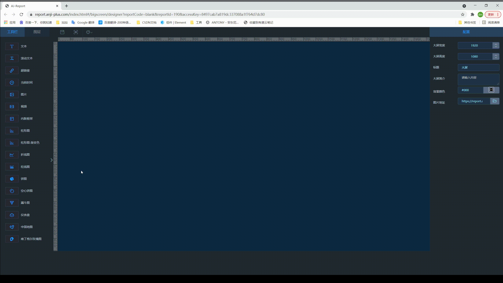
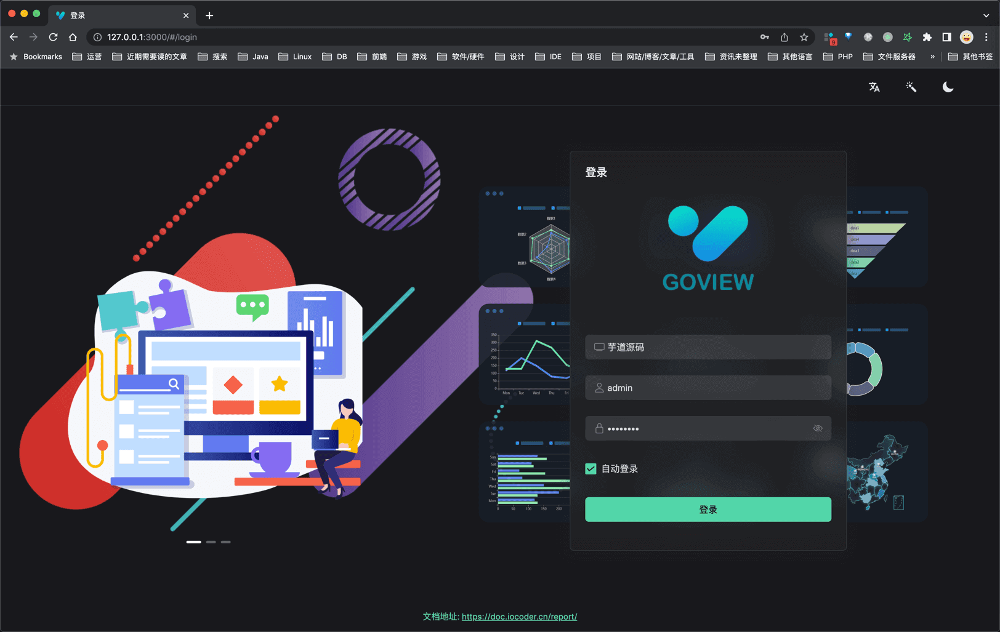
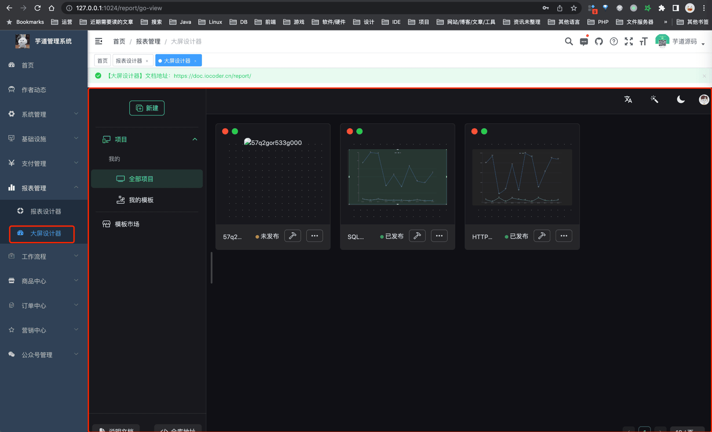
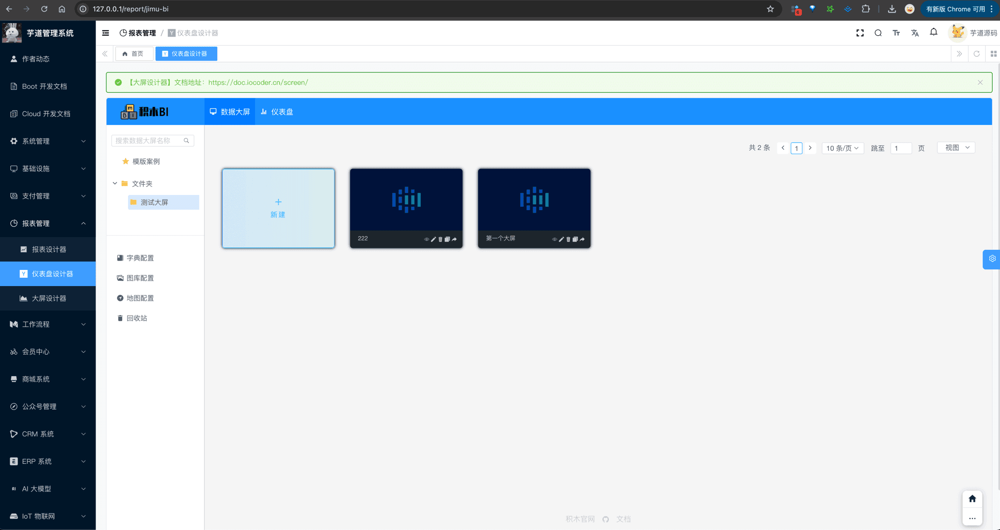
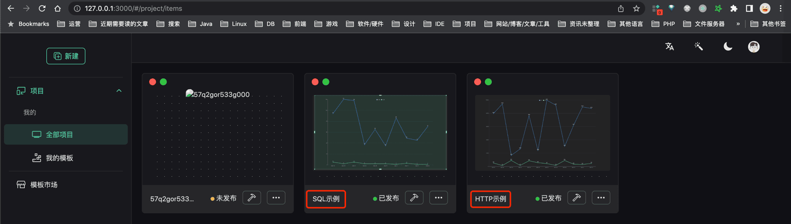

# 大屏设计器

数据可视化，一般可以通过报表设计器、或者大屏设计器来实现。本小节，我们来讲解大屏设计器的功能开启。
大屏设计器，指的是通过拖拽图表或页面元素，无需编写代码即可制作数据大屏。如下图所示：
 在项目中，通过集成市面上的报表引擎，实现了大屏设计器的能力。目前使用如下：
|  | 是否集成 | 是否开源 |
| --- | --- | --- |
| [AJ-Report](https://gitee.com/anji-plus/report) | 已经 | 开源 |
| [Go-View](https://gitee.com/dromara/go-view) | 已集成 | 开源 |
| [JimuReport](https://github.com/jeecgboot/JimuReport) | 已集成 | 不开源 |
## # 1. 功能开启
`yudao-module-report` 也实现了大屏设计器的能力，考虑到编译速度，默认是关闭的。开启步骤如下：
- 第一步，开启 `yudao-report-report` 模块
- 第二步，导入报表的 SQL 数据库脚本
- 第三步，启动后端项目，确认功能是否生效
- 第四步，启动大屏设计器的前端项目
### # 1.1 第一步，开启模块
① 修改根目录的 [`pom.xml`](https://github.com/YunaiV/ruoyi-vue-pro/blob/master/pom.xml) 文件，取消 `yudao-module-report` 模块的注释。
 ② 修改 `yudao-server` 目录的 [`pom.xml`](https://github.com/YunaiV/ruoyi-vue-pro/blob/master/yudao-server/pom.xml) 文件，引入 `yudao-module-report` 模块。如下图所示：
 ③ 点击 IDEA 右上角的【Reload All Maven Projects】，刷新 Maven 依赖。如下图所示：
 
### # 1.2 第二步，导入 SQL
① （如果使用 Go-View 的话）下载 [`go-view.sql`](/file/go-view.sql) 脚本，并导入数据库，初始化 Go-View 相关的表结构和数据。
友情提示：↑↑↑ go-view.sql 是可以点击下载的！ ↑↑↑
 ② （如果使用 JimuReport 的话）下载 [`jimureport.mysql5.7.create.sql`](/file/jimureport.mysql5.7.create.sql) 脚本，并导入数据库，初始化 JimuReport 相关的表结构和数据。如果你是 Oracle、PostgreSQL 等其它数据库，需要自己使用 Navicat 进行转换。
友情提示：↑↑↑ jimureport.mysql5.7.create.sql 是可以点击下载的！ ↑↑↑
### # 1.3 第三步，启动后端项目
启动后端项目，看到 `"Init JimuReport Config [ 线程池 ] "` 说明开启成功。
### # 1.4 第四步，启动前端项目（AJ-Report）
TODO 开发中，预计 4 月份左右。
### # 1.4 第四步，启动前端项目（Go-View）
① 克隆 [yudao-ui-go-view](https://gitee.com/yudaocode/yudao-ui-go-view) 项目，执行如下命令进行启动：
# 安装 pnpm，提升依赖的安装速度
npm config set registry https://registry.npmmirror.com
npm install -g pnpm
# 安装依赖
pnpm install
# 启动服务
npm run dev
② 启动完成后，浏览器会自动打开 [http://127.0.0.1:3000](http://127.0.0.1:3000) 地址，可以看到前端界面。
 ③ 访问 [报表管理 -> 大屏设计器] 菜单，可以查看对应的功能。如下图所示：
 
### # 1.5 第四步，启动前端项目（JimuReport）
① 它的前端，已经内嵌到了后端项目中，所以无需启动。
② 访问 [报表管理 -> BI 设计器] 菜单，可以查看对应的功能。如下图所示：
 ps：目前 JimuReport 有个报错，需要等 1.9.5 版本全量发布！！！
## # 2. 如何使用？
### # 2.1 AJ-Report 大屏设计器
TODO 开发中，预计 4 月份左右。
### # 2.2 Go-View 大屏设计器
可以查看 Go-View 的官方文档，主要是：
- [GoView 说明文档 —— 页面引导](https://www.mtruning.club/guide/start/pageGuide.html)
- [GoView 说明文档 —— 常见问题](https://www.mtruning.club/guide/start/more.html)
如果你想了解在 Go-View 中，如何使用 SQL 或 HTTP 查询数据，可以查看内置的两个示例：
 集成 Go-View 的代码实现？
① 后端：Go-View 的后端代码，主要在 [`go-view`](https://github.com/YunaiV/ruoyi-vue-pro/blob/master/yudao-module-report/src/main/java/cn/iocoder/yudao/module/report/controller/admin/goview/) 包下实现。
② 前端：在 [`@/views/report/go-view`](https://github.com/yudaocode/yudao-ui-admin-vue2/blob/master/src/views/report/goview/index.vue) 文件，通过 IFrame 嵌入 Go-View 界面。
### # 2.3 JimuReport 仪表盘设计器
可以查看 JimuReport 的官方文档，主要是：
- [快速入门](http://report.jeecg.com/2075805)
- [操作手册（仪表盘设计器）](https://help.jimureport.com/drag/intro)
注意，JimuReport 是商业化的产品，分成免费版、商业版，需要关注下它的 [价格](https://jimureport.com/vip) ！！！
集成 JimuReport 的代码实现？
① 后端：在 [`jmreport`](https://github.com/YunaiV/ruoyi-vue-pro/tree/master/yudao-module-report/src/main/java/cn/iocoder/yudao/module/report/framework/jmreport) 包下，进行 JimuReport 的集成。
② 前端：在 [`@/views/report/jmreport/bi.vue`](https://github.com/yudaocode/yudao-ui-admin-vue2/blob/master/src/views/report/jmreport/bi.vue) 文件，通过 IFrame 嵌入 JimuReport 界面。
星球里，不错的问题：
- [《我想问下积木报表集成里，官方的 yaml 配置参数维护在哪里呀？》](https://t.zsxq.com/19s87CV2J)
- [《GoView 使用全局配置设置请求地址为第三方时，出现 404 的 BUG？》](https://t.zsxq.com/Mg9GM)
.pageB img{width:80px!important;}
.wwads-horizontal .wwads-text, .wwads-content .wwads-text{line-height:1;}
[报表设计器](/report/) [功能开启](/pay/build/) 
←
[报表设计器](/report/) [功能开启](/pay/build/)→
 
Theme by
[Vdoing](https://github.com/xugaoyi/vuepress-theme-vdoing) 
| Copyright © 2019-2026
芋道源码 | MIT License   
- 跟随系统
- 浅色模式
- 深色模式
- 阅读模式
× 
.windowRB{ padding: 0;}
.windowRB .wwads-img{margin-top: 10px;}
.windowRB .wwads-content{margin: 0 10px 10px 10px;}
.custom-html-window-rb .close-but{
display: none;
}