# 系统组件

## # 1. 常用组件
### # 1.1 Vben Vxe Table 表格
Vben 提供的 Table 列表组件，基于 `vxe-table`，结合 Vben Form 表单进行了二次封装，支持树形结构。
- 源码位置：`@vben/common-ui` 中的 `useVbenVxeTable`
- Vben 文档：[Vben Vxe Table 表格 (opens new window)](https://doc.vben.pro/components/common-ui/vben-vxe-table.html)
- Vben 示例：[playground/src/views/examples/vxe-table (opens new window)](https://github.com/vbenjs/vue-vben-admin/tree/main/playground/src/views/examples/vxe-table)
- 实战案例（分页列表）： 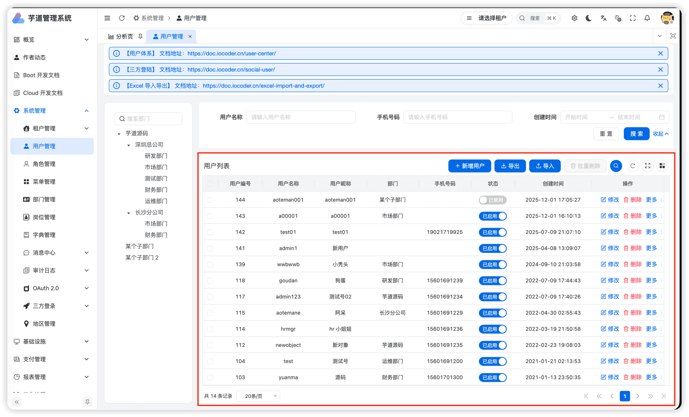 antd 版本：[apps/web-antd/src/views/system/user/index.vue (opens new window)](https://github.com/yudaocode/yudao-ui-admin-vben/blob/master/apps/web-antd/src/views/system/user/index.vue)
- ele 版本：[apps/web-ele/src/views/system/user/index.vue (opens new window)](https://github.com/yudaocode/yudao-ui-admin-vben/blob/master/apps/web-ele/src/views/system/user/index.vue)
实战案例（树形列表）：
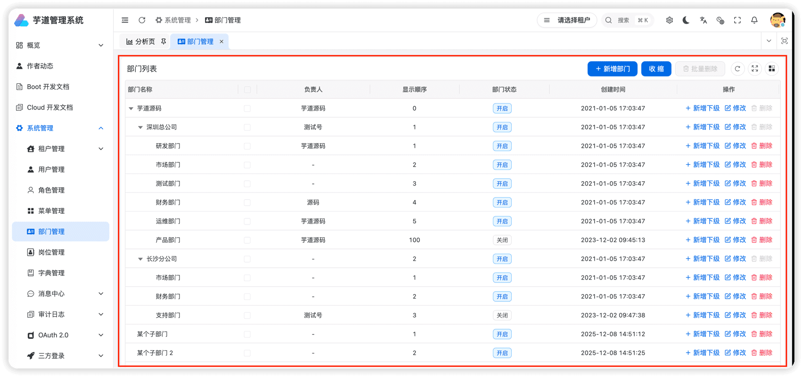 
- antd 版本：[apps/web-antd/src/views/system/dept/index.vue (opens new window)](https://github.com/yudaocode/yudao-ui-admin-vben/blob/master/apps/web-antd/src/views/system/dept/index.vue)
- ele 版本：[apps/web-ele/src/views/system/dept/index.vue (opens new window)](https://github.com/yudaocode/yudao-ui-admin-vben/blob/master/apps/web-ele/src/views/system/dept/index.vue)
### # 1.2 TableAction 表格操作
表格行操作按钮组件，用于展示编辑、删除等操作按钮。
- 源码位置： antd 版本：[apps/web-antd/src/components/table-action (opens new window)](https://github.com/yudaocode/yudao-ui-admin-vben/tree/master/apps/web-antd/src/components/table-action)
- ele 版本：[apps/web-ele/src/components/table-action (opens new window)](https://github.com/yudaocode/yudao-ui-admin-vben/tree/master/apps/web-ele/src/components/table-action)
实战案例：
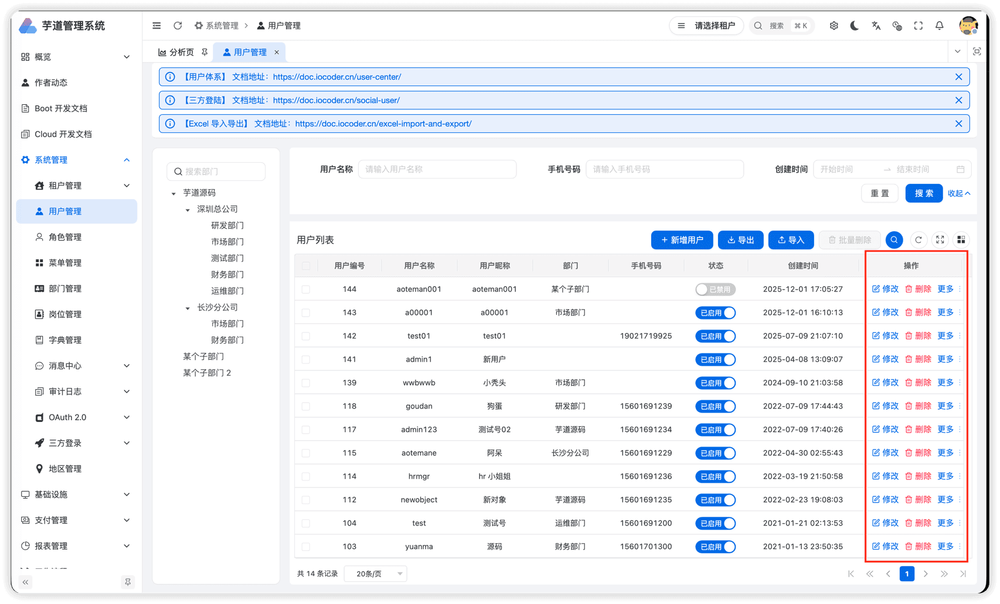 
- antd 版本：[apps/web-antd/src/views/system/user/index.vue (opens new window)](https://github.com/yudaocode/yudao-ui-admin-vben/blob/master/apps/web-antd/src/views/system/user/index.vue) 的 TableAction 部分
- ele 版本：[apps/web-ele/src/views/system/user/index.vue (opens new window)](https://github.com/yudaocode/yudao-ui-admin-vben/blob/master/apps/web-ele/src/views/system/user/index.vue) 的 TableAction 部分
### # 1.3 Vben Modal 模态框
Vben 提供的模态框组件，支持拖拽、全屏、自动高度、loading 等功能。
- 源码位置：`@vben/common-ui` 中的 `useVbenModal`
- Vben 文档：[Vben Modal 模态框 (opens new window)](https://doc.vben.pro/components/common-ui/vben-modal.html)
- Vben 示例：[playground/src/views/examples/modal (opens new window)](https://github.com/vbenjs/vue-vben-admin/tree/main/playground/src/views/examples/modal)
- 实战案例： 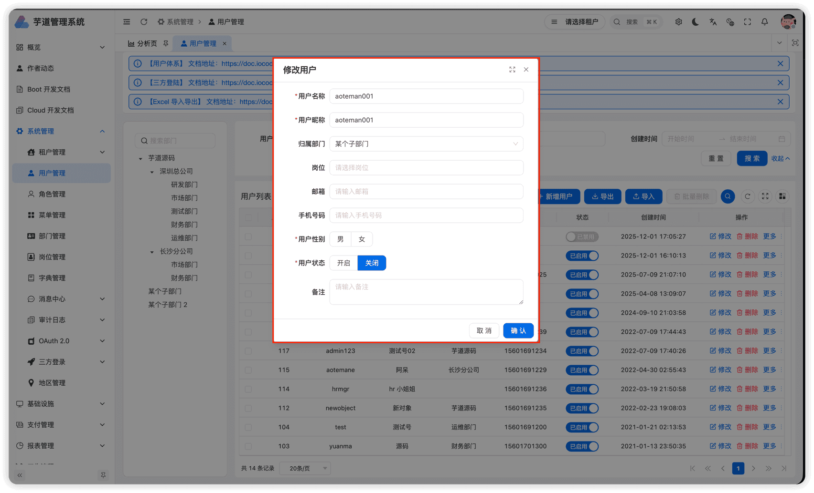 antd 版本：[apps/web-antd/src/views/system/user/modules/form.vue (opens new window)](https://github.com/yudaocode/yudao-ui-admin-vben/blob/master/apps/web-antd/src/views/system/user/modules/form.vue)
- ele 版本：[apps/web-ele/src/views/system/user/modules/form.vue (opens new window)](https://github.com/yudaocode/yudao-ui-admin-vben/blob/master/apps/web-ele/src/views/system/user/modules/form.vue)
### # 1.4 Vben Drawer 抽屉
Vben 提供的抽屉组件，类似 Modal 但以侧边栏形式展示。
- 源码位置：`@vben/common-ui` 中的 `useVbenDrawer`
- Vben 文档：[Vben Drawer 抽屉 (opens new window)](https://doc.vben.pro/components/common-ui/vben-drawer.html)
- Vben 示例：[playground/src/views/examples/drawer (opens new window)](https://github.com/vbenjs/vue-vben-admin/tree/main/playground/src/views/examples/drawer)
- 实战案例： 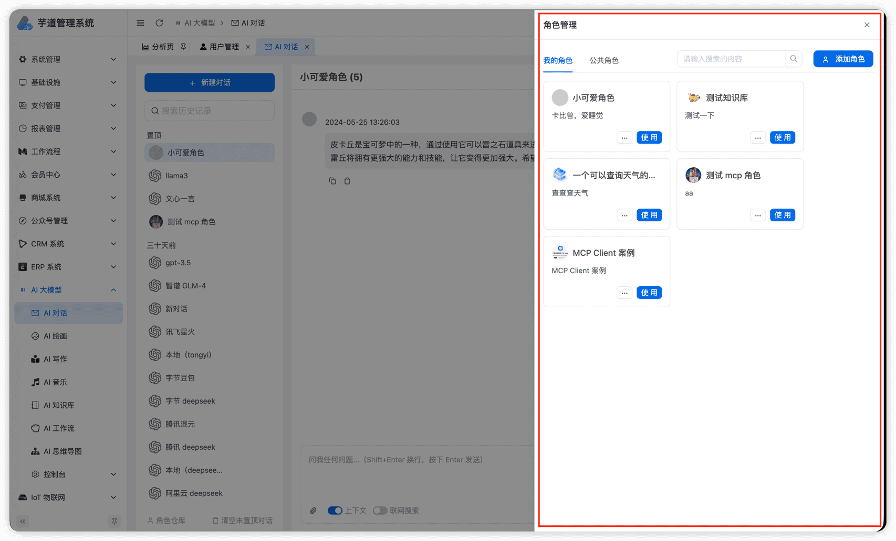 antd 版本：[web-antd/src/views/ai/chat/index/modules/role/repository.vue (opens new window)](https://github.com/yudaocode/yudao-ui-admin-vben/blob/master/apps/web-antd/src/views/ai/chat/index/modules/role/repository.vue)
- ele 版本：[web-antd/src/views/ai/chat/index/modules/role/repository.vue (opens new window)](https://github.com/yudaocode/yudao-ui-admin-vben/blob/master/apps/web-antd/src/views/ai/chat/index/modules/role/repository.vue)
### # 1.5 Vben Form 表单
Vben 提供的表单组件，可适配 `Element Plus`、`Ant Design Vue`、`Naive UI` 等框架。支持表单验证、表单联动、自定义组件等功能。
- 源码位置：`@vben/common-ui` 中的 `useVbenForm`
- Vben 文档：[Vben Form 表单 (opens new window)](https://doc.vben.pro/components/common-ui/vben-form.html)
- Vben 示例：[playground/src/views/examples/form (opens new window)](https://github.com/vbenjs/vue-vben-admin/tree/main/playground/src/views/examples/form)
- 实战案例：  antd 版本：[apps/web-antd/src/views/system/user/modules/form.vue (opens new window)](https://github.com/yudaocode/yudao-ui-admin-vben/blob/master/apps/web-antd/src/views/system/user/modules/form.vue)
- ele 版本：[apps/web-ele/src/views/system/user/modules/form.vue (opens new window)](https://github.com/yudaocode/yudao-ui-admin-vben/blob/master/apps/web-ele/src/views/system/user/modules/form.vue)
### # 1.6 Description 描述列表
项目提供的详情组件，可适配 `Element Plus`、`Ant Design Vue`、`Naive UI` 等框架。类似 Form，支持多列布局。
- 源码位置： antd 版本：[apps/web-antd/src/components/description (opens new window)](https://github.com/yudaocode/yudao-ui-admin-vben/tree/master/apps/web-antd/src/components/description)
- ele 版本：[apps/web-ele/src/components/description (opens new window)](https://github.com/yudaocode/yudao-ui-admin-vben/tree/master/apps/web-ele/src/components/description)
实战案例：
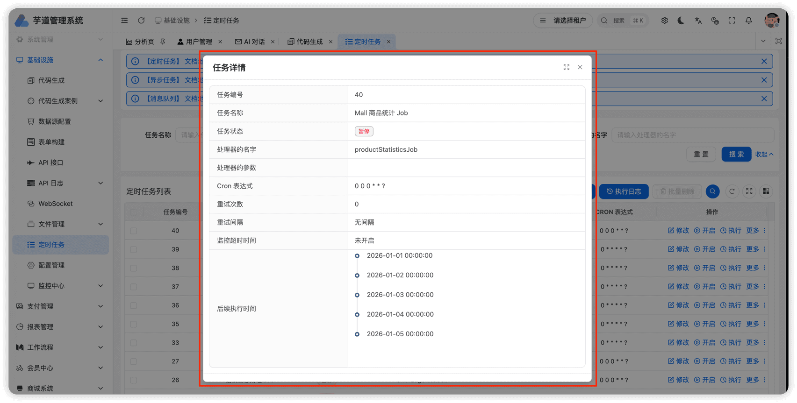 
- antd 版本：[apps/web-antd/src/views/infra/job/modules/detail.vue (opens new window)](https://github.com/yudaocode/yudao-ui-admin-vben/blob/master/apps/web-antd/src/views/infra/job/modules/detail.vue)
- ele 版本：[apps/web-ele/src/views/infra/job/modules/detail.vue (opens new window)](https://github.com/yudaocode/yudao-ui-admin-vben/blob/master/apps/web-ele/src/views/infra/job/modules/detail.vue)
### # 1.7 Vben ApiComponent API 组件包装器
Vben 提供的 API “包装器”，它一般不独立使用，主要用于包装其它组件，为目标组件提供自动获取远程数据的能力，但仍然保持了目标组件的原始用法。
- 源码位置：`@vben/common-ui` 中的 `ApiComponent`
- Vben 文档：[Vben ApiComponent (opens new window)](https://doc.vben.pro/components/common-ui/vben-api-component.html)
- Vben 示例：[playground/src/views/examples/form/api.vue (opens new window)](https://github.com/vbenjs/vue-vben-admin/blob/main/playground/src/views/examples/form/api.vue)
- 实战案例（ApiSelect）： 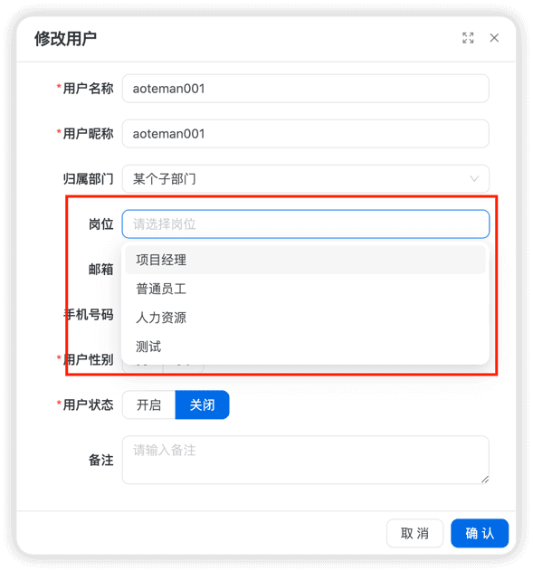 antd 版本：[apps/web-antd/src/views/system/user/data.ts (opens new window)](https://github.com/yudaocode/yudao-ui-admin-vben/blob/master/apps/web-antd/src/views/system/user/data.ts) 的 `postIds` 字段
- ele 版本：[apps/web-ele/src/views/system/user/data.ts (opens new window)](https://github.com/yudaocode/yudao-ui-admin-vben/blob/master/apps/web-ele/src/views/system/user/data.ts) 的 `postIds` 字段
实战案例（ApiTreeSelect）：
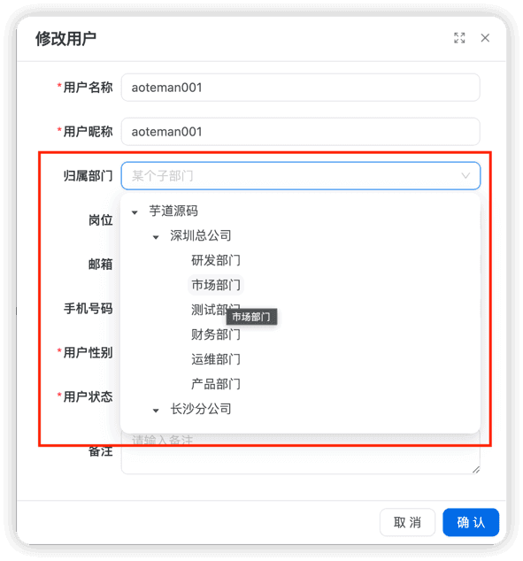 
- antd 版本：[apps/web-antd/src/views/system/user/data.ts (opens new window)](https://github.com/yudaocode/yudao-ui-admin-vben/blob/master/apps/web-antd/src/views/system/user/data.ts) 的 `deptId` 字段
- ele [apps/web-ele/src/views/system/user/data.ts (opens new window)](https://github.com/yudaocode/yudao-ui-admin-vben/blob/master/apps/web-ele/src/views/system/user/data.ts) 的 `deptId` 字段
### # 1.8 Upload 上传
文件上传组件，支持单（多）文件、单（多）图片上传等。
- 源码位置： antd 版本：[apps/web-antd/src/components/upload (opens new window)](https://github.com/yudaocode/yudao-ui-admin-vben/tree/master/apps/web-antd/src/components/upload)
- ele 版本：[apps/web-ele/src/components/upload (opens new window)](https://github.com/yudaocode/yudao-ui-admin-vben/tree/master/apps/web-ele/src/components/upload)
实战案例（文件 FileUpload）：
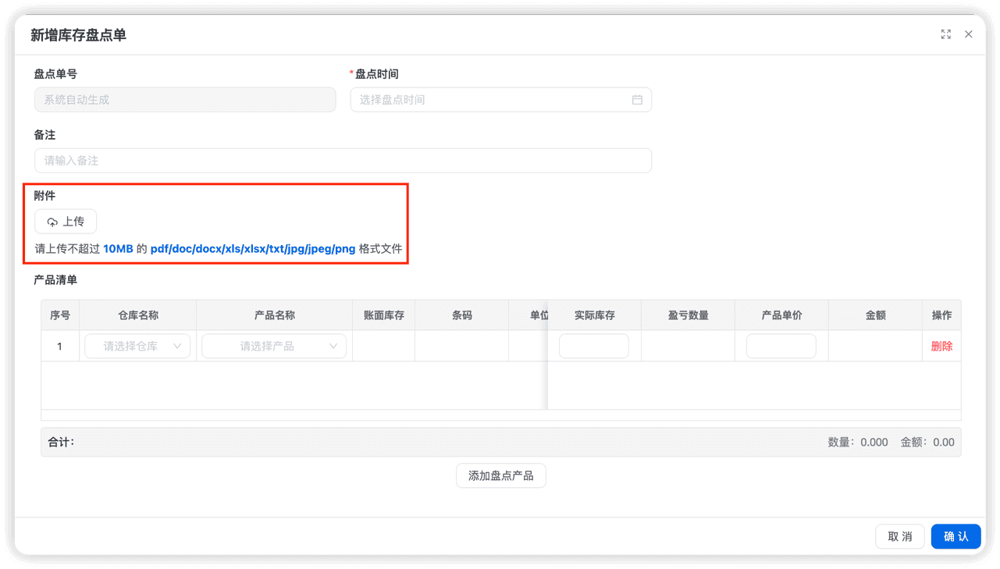 
- antd 版本：[apps/web-antd/src/views/erp/stock/check/data.ts (opens new window)](https://github.com/yudaocode/yudao-ui-admin-vben/blob/master/apps/web-antd/src/views/erp/stock/check/data.ts) 的 `fileUrl` 字段
- ele 版本：[apps/web-ele/src/views/erp/stock/check/data.ts (opens new window)](https://github.com/yudaocode/yudao-ui-admin-vben/blob/master/apps/web-ele/src/views/erp/stock/check/data.ts) 的 `fileUrl` 字段
实战案例（图片 ImageUpload）：
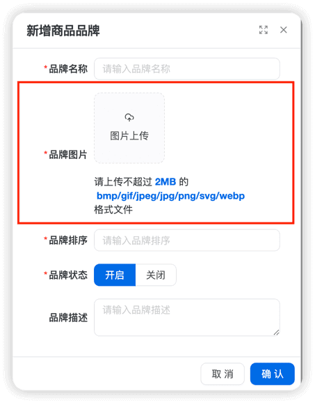 
- antd 版本：[apps/web-antd/src/views/mall/product/brand/data.ts (opens new window)](https://github.com/yudaocode/yudao-ui-admin-vben/blob/master/apps/web-antd/src/views/mall/product/brand/data.ts) 的 `picUrl` 字段
- ele 版本：[apps/web-ele/src/views/mall/product/brand/data.ts (opens new window)](https://github.com/yudaocode/yudao-ui-admin-vben/blob/master/apps/web-ele/src/views/mall/product/brand/data.ts) 的 `picUrl` 字段
### # 1.9 TinyMCE 富文本编辑器
基于 TinyMCE 的富文本编辑器组件。
- 源码位置： antd 版本：[apps/web-antd/src/components/tinymce (opens new window)](https://github.com/yudaocode/yudao-ui-admin-vben/tree/master/apps/web-antd/src/components/tinymce)
- ele 版本：[apps/web-ele/src/components/tinymce (opens new window)](https://github.com/yudaocode/yudao-ui-admin-vben/tree/master/apps/web-ele/src/components/tinymce)
实战案例：
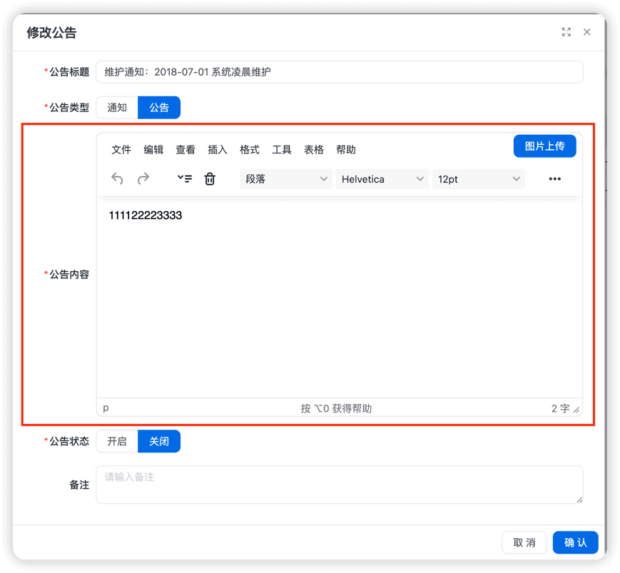 
- antd 版本：[apps/web-antd/src/views/system/notice/data.ts (opens new window)](https://github.com/yudaocode/yudao-ui-admin-vben/blob/master/apps/web-antd/src/views/system/notice/data.ts) 的 `content 字段（对应 RichTextarea 组件）
- ele 版本：[apps/web-ele/src/views/system/notice/data.ts (opens new window)](https://github.com/yudaocode/yudao-ui-admin-vben/blob/master/apps/web-ele/src/views/system/notice/data.ts) 的 `content 字段（对应 RichTextarea 组件）
### # 1.10 Vben Alert 轻量提示框
Vben 提供的一些用于轻量提示的弹窗，仅使用 js 代码即可快速动态创建提示，而不需要在 template 写任何代码。
- 源码位置：`@vben/common-ui` 中的 `VbenAlert`
- Vben 文档：[Vben Alert 轻量提示框 (opens new window)](https://doc.vben.pro/components/common-ui/vben-alert.html)
- Vben 示例：[playground/src/views/examples/alert (opens new window)](https://github.com/vbenjs/vue-vben-admin/tree/main/playground/src/views/examples/alert)
- 实战案例（`confirm` 提示）： 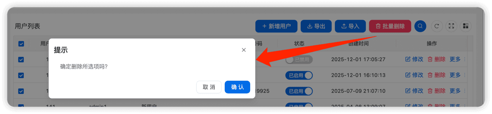 antd 版本：[apps/web-antd/src/views/system/user/index.vue (opens new window)](https://github.com/yudaocode/yudao-ui-admin-vben/blob/master/apps/web-antd/src/views/system/user/index.vue) 的 `handleDeleteBatch` 方法
- ele 版本：[apps/web-ele/src/views/system/user/index.vue (opens new window)](https://github.com/yudaocode/yudao-ui-admin-vben/blob/master/apps/web-ele/src/views/system/user/index.vue) 的 `handleDeleteBatch` 方法
实战案例（`alert` 提示）：不太使用，基本还是用 antd、ele 自带的。 
### # 1.11 OperateLog 操作日志
用于展示操作日志的组件。
- 源码位置： antd 版本：[apps/web-antd/src/components/operate-log (opens new window)](https://github.com/yudaocode/yudao-ui-admin-vben/tree/master/apps/web-antd/src/components/operate-log)
- ele 版本：[apps/web-ele/src/components/operate-log (opens new window)](https://github.com/yudaocode/yudao-ui-admin-vben/tree/master/apps/web-ele/src/components/operate-log)
实战案例：
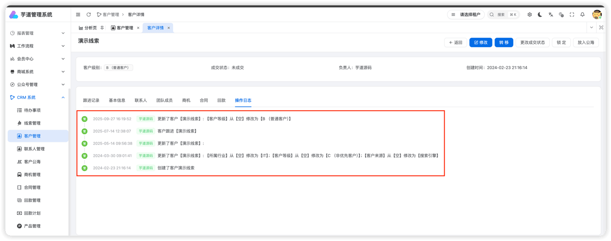 
- antd 版本：[apps/web-antd/src/views/crm/customer/detail/index.vue (opens new window)](https://github.com/yudaocode/yudao-ui-admin-vben/blob/master/apps/web-antd/src/views/crm/customer/detail/index.vue) 的 OperateLog 部分
- ele 版本：[apps/web-ele/src/views/crm/customer/detail/index.vue (opens new window)](https://github.com/yudaocode/yudao-ui-admin-vben/blob/master/apps/web-ele/src/views/crm/customer/detail/index.vue) 的 OperateLog 部分
### # 1.12 ECharts 图表
基于 Vben 提供的 ECharts 插件，用于展示各类图表。
- 源码位置：`@vben/plugins/echarts` 中的 `EchartsUI`、`useEcharts`
- Vben 文档：[Vben ECharts (opens new window)](https://doc.vben.pro/guide/in-depth/features.html#echarts-%E5%9B%BE%E8%A1%A8)
- 实战案例： 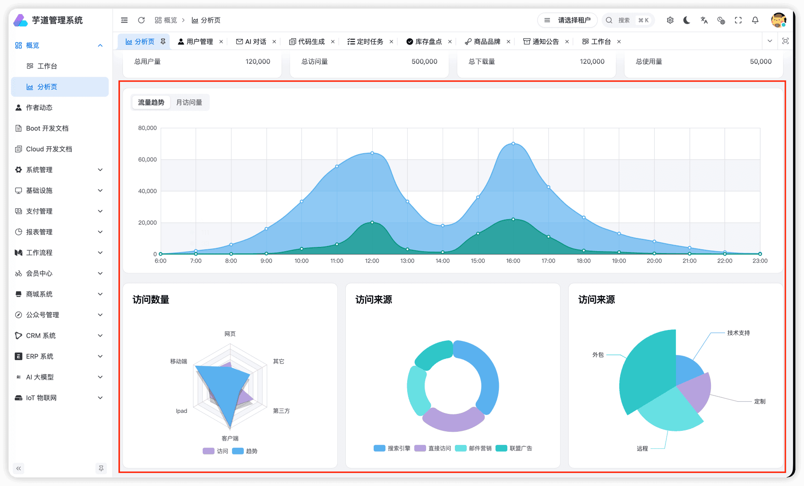 antd 版本：[apps/web-antd/src/views/dashboard/analytics/analytics-trends.vue (opens new window)](https://github.com/yudaocode/yudao-ui-admin-vben/blob/master/apps/web-antd/src/views/dashboard/analytics/analytics-trends.vue)
- ele 版本：[apps/web-ele/src/views/mall/statistics/trade/modules/trend-card.vue (opens new window)](https://github.com/yudaocode/yudao-ui-admin-vben/blob/master/apps/web-ele/src/views/mall/statistics/trade/modules/trend-card.vue)
ps：ERP、CRM、MALL 等等模块，也有很多 ECharts 例子，也可以参考下！
## # 2. 不常用组件
### # 2.1 form-create 动态表单生成器
动态表单生成器，支持通过 JSON 配置生成表单。
- 官方文档：[form-create (opens new window)](http://www.form-create.com/) antd 版本：[apps/web-antd/src/components/form-create (opens new window)](https://github.com/yudaocode/yudao-ui-admin-vben/tree/master/apps/web-antd/src/components/form-create)
- ele 版本：[apps/web-ele/src/components/form-create (opens new window)](https://github.com/yudaocode/yudao-ui-admin-vben/tree/master/apps/web-ele/src/components/form-create)
实战案例（FcDesigner 表单设计器）：
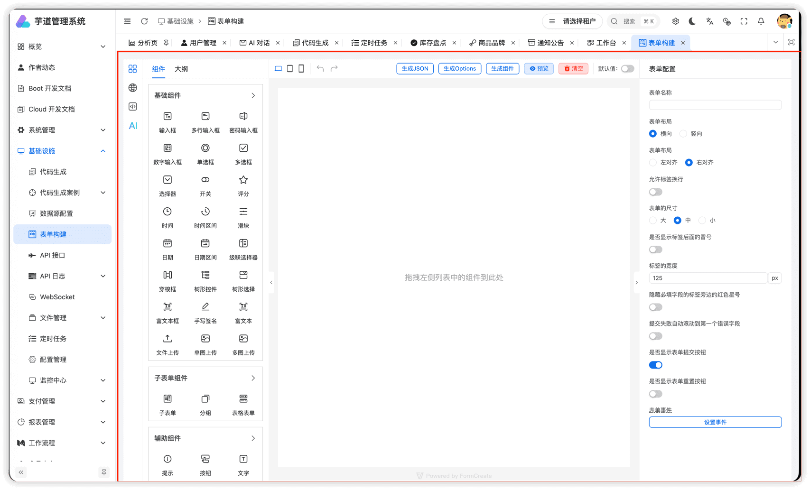 
- antd 版本：[apps/web-antd/src/views/infra/build/index.vue (opens new window)](https://github.com/yudaocode/yudao-ui-admin-vben/blob/master/apps/web-antd/src/views/infra/build/index.vue)
- ele 版本：[apps/web-ele/src/views/infra/build/index.vue (opens new window)](https://github.com/yudaocode/yudao-ui-admin-vben/blob/master/apps/web-ele/src/views/infra/build/index.vue)
实战案例（FormCreate 表单渲染）：
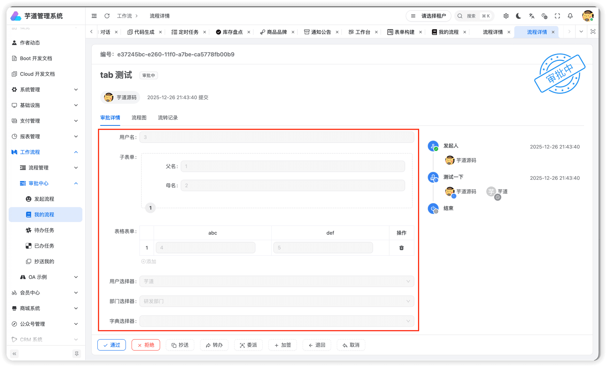 
- antd 版本：[apps/web-antd/src/views/bpm/processInstance/detail/index.vue (opens new window)](https://github.com/yudaocode/yudao-ui-admin-vben/blob/master/apps/web-antd/src/views/bpm/processInstance/detail/index.vue)
- ele 版本：[apps/web-ele/src/views/bpm/processInstance/detail/index.vue (opens new window)](https://github.com/yudaocode/yudao-ui-admin-vben/blob/master/apps/web-ele/src/views/bpm/processInstance/detail/index.vue)
ps：表单管理，可以看看 [工作流程 -> 流程管理 -> 流程表单] 菜单。
### # 2.2 bpmn-js 工作流组件
基于 bpmn-js 的工作流设计和展示组件。
- 官方文档：[bpmn-js (opens new window)](https://bpmn.io/toolkit/bpmn-js/)
- 源码位置（流程设计器 MyProcessDesigner）： antd 版本：[apps/web-antd/src/views/bpm/components/bpmn-process-designer/package/designer (opens new window)](https://github.com/yudaocode/yudao-ui-admin-vben/tree/master/apps/web-antd/src/views/bpm/components/bpmn-process-designer/package/designer)
- ele 版本：[apps/web-ele/src/views/bpm/components/bpmn-process-designer/package/designer (opens new window)](https://github.com/yudaocode/yudao-ui-admin-vben/tree/master/apps/web-ele/src/views/bpm/components/bpmn-process-designer/package/designer)
源码位置（流程查看器 MyProcessViewer）：
- antd 版本：[apps/web-antd/src/views/bpm/components/bpmn-process-designer/package/designer/index2.ts (opens new window)](https://github.com/yudaocode/yudao-ui-admin-vben/blob/master/apps/web-antd/src/views/bpm/components/bpmn-process-designer/package/designer/index2.ts)
- ele 版本：[apps/web-ele/src/views/bpm/components/bpmn-process-designer/package/designer/index2.ts (opens new window)](https://github.com/yudaocode/yudao-ui-admin-vben/blob/master/apps/web-ele/src/views/bpm/components/bpmn-process-designer/package/designer/index2.ts)
实战案例（MyProcessDesigner 流程设计器：使用 MyProcessDesigner、MyProcessPenal 组件）：
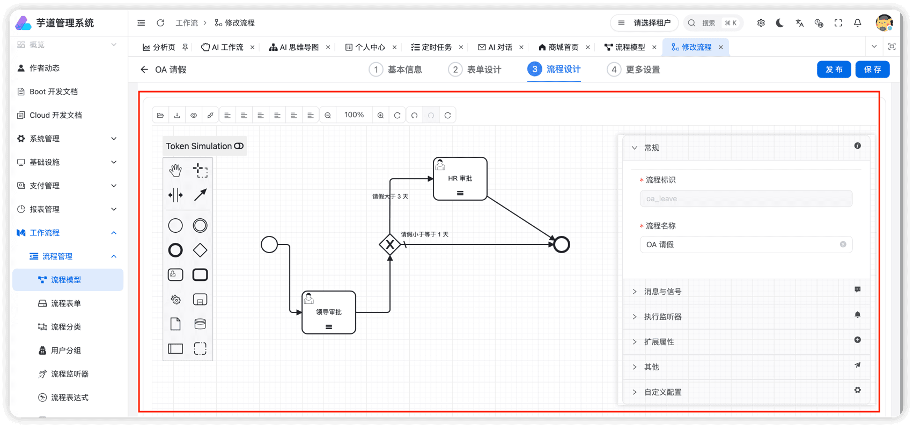 
- antd 版本：[apps/web-antd/src/views/bpm/model/form/modules/bpm-model-editor.vue (opens new window)](https://github.com/yudaocode/yudao-ui-admin-vben/blob/master/apps/web-antd/src/views/bpm/model/form/modules/bpm-model-editor.vue)
- ele 版本：[apps/web-ele/src/views/bpm/model/form/modules/bpm-model-editor.vue (opens new window)](https://github.com/yudaocode/yudao-ui-admin-vben/blob/master/apps/web-ele/src/views/bpm/model/form/modules/bpm-model-editor.vue)
实战案例（MyProcessViewer 流程查看器：流程实例详情页的流程图查看）：
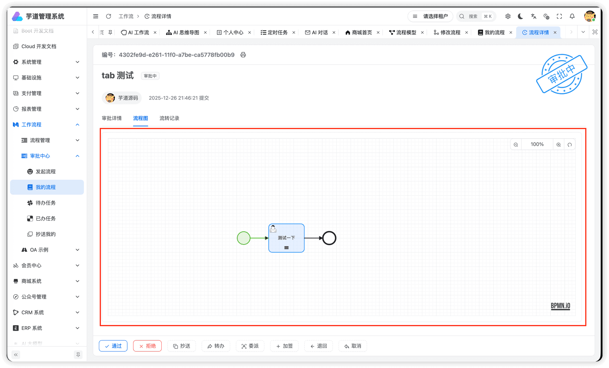 
- antd 版本：[apps/web-antd/src/views/bpm/processInstance/detail/modules/bpm-viewer.vue (opens new window)](https://github.com/yudaocode/yudao-ui-admin-vben/blob/master/apps/web-antd/src/views/bpm/processInstance/detail/modules/bpm-viewer.vue)
- ele 版本：[apps/web-ele/src/views/bpm/processInstance/detail/modules/bpm-viewer.vue (opens new window)](https://github.com/yudaocode/yudao-ui-admin-vben/blob/master/apps/web-ele/src/views/bpm/processInstance/detail/modules/bpm-viewer.vue)
TODO @芋艿：截图
### # 2.1 Vben CountToAnimator 数字动画
数字动画组件，用于展示数字的动画效果。
- 源码位置：`@vben/common-ui` 中的 `CountToAnimator`
- Vben 文档：[Vben CountToAnimator (opens new window)](https://doc.vben.pro/components/common-ui/vben-count-to-animator.html)
- Vben 示例：[playground/src/views/examples/count-to-animator (opens new window)](https://github.com/vbenjs/vue-vben-admin/tree/main/playground/src/views/examples/count-to-animator)
- 实战案例（AnalysisOverview 组件，内部使用 CountToAnimator））： 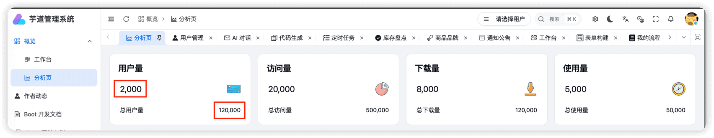 antd 版本：[apps/web-antd/src/views/dashboard/analytics/index.vue (opens new window)](https://github.com/yudaocode/yudao-ui-admin-vben/blob/master/apps/web-antd/src/views/dashboard/analytics/index.vue)
- ele 版本：[apps/web-ele/src/views/dashboard/analytics/index.vue (opens new window)](https://github.com/yudaocode/yudao-ui-admin-vben/blob/master/apps/web-ele/src/views/dashboard/analytics/index.vue)
### # 2.2 Vben EllipsisText 省略文本
文本省略组件，用于展示超长文本。
- 源码位置：`@vben/common-ui` 中的 `EllipsisText`
- Vben 文档：[Vben EllipsisText (opens new window)](https://doc.vben.pro/components/common-ui/vben-ellipsis-text.html)
- Vben 示例：[playground/src/views/examples/ellipsis (opens new window)](https://github.com/vbenjs/vue-vben-admin/tree/main/playground/src/views/examples/ellipsis)
- 实战案例：暂未使用
### # 2.3 MarkdownView Markdown 预览
Markdown 内容预览组件。
- 源码位置： antd 版本：[apps/web-antd/src/components/markdown-view (opens new window)](https://github.com/yudaocode/yudao-ui-admin-vben/tree/master/apps/web-antd/src/components/markdown-view)
- ele 版本：[apps/web-ele/src/components/markdown-view (opens new window)](https://github.com/yudaocode/yudao-ui-admin-vben/tree/master/apps/web-ele/src/components/markdown-view)
实战案例（AI 对话消息渲染）：
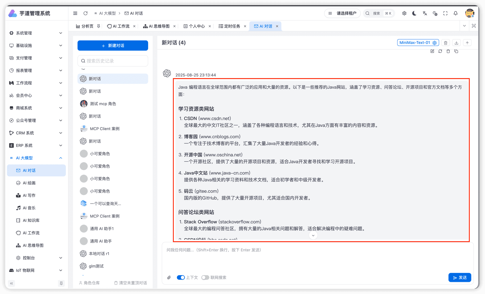 
- antd 版本：[apps/web-antd/src/views/ai/chat/index/modules/message/list.vue (opens new window)](https://github.com/yudaocode/yudao-ui-admin-vben/blob/master/apps/web-antd/src/views/ai/chat/index/modules/message/list.vue)
- ele 版本：[apps/web-ele/src/views/ai/chat/index/modules/message/list.vue (opens new window)](https://github.com/yudaocode/yudao-ui-admin-vben/blob/master/apps/web-ele/src/views/ai/chat/index/modules/message/list.vue)
### # 2.4 ShortcutDateRangePicker 快捷日期范围选择
快捷日期范围选择组件，提供预设的日期范围选项。
- 源码位置： antd 版本：[apps/web-antd/src/components/shortcut-date-range-picker (opens new window)](https://github.com/yudaocode/yudao-ui-admin-vben/tree/master/apps/web-antd/src/components/shortcut-date-range-picker)
- ele 版本：[apps/web-ele/src/components/shortcut-date-range-picker (opens new window)](https://github.com/yudaocode/yudao-ui-admin-vben/tree/master/apps/web-ele/src/components/shortcut-date-range-picker)
实战案例（商品统计的时间筛选）：
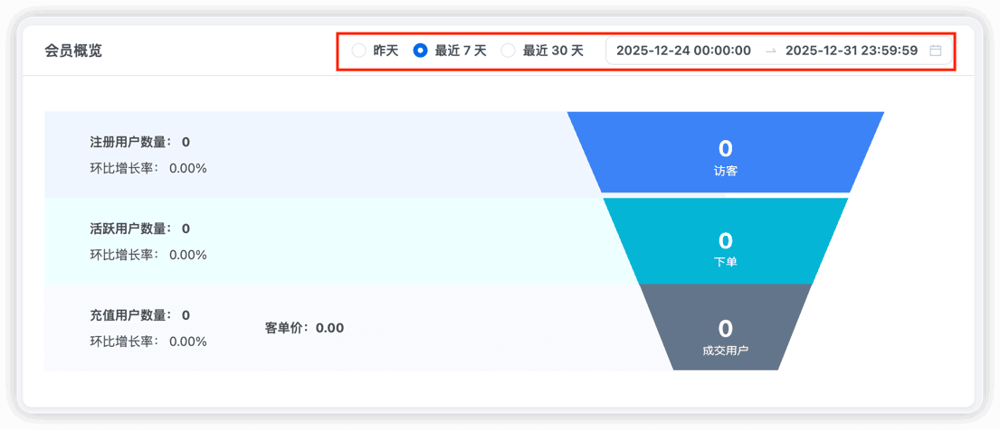 
- antd 版本：[apps/web-antd/src/views/mall/statistics/product/modules/summary-card.vue (opens new window)](https://github.com/yudaocode/yudao-ui-admin-vben/blob/master/apps/web-antd/src/views/mall/statistics/product/modules/summary-card.vue)
- ele 版本：[apps/web-ele/src/views/mall/statistics/product/modules/summary-card.vue (opens new window)](https://github.com/yudaocode/yudao-ui-admin-vben/blob/master/apps/web-ele/src/views/mall/statistics/product/modules/summary-card.vue)
### # 2.5 CronTab Cron 表达式编辑
Cron 表达式可视化编辑组件。
- 源码位置： antd 版本：[apps/web-antd/src/components/cron-tab (opens new window)](https://github.com/yudaocode/yudao-ui-admin-vben/tree/master/apps/web-antd/src/components/cron-tab)
- ele 版本：[apps/web-ele/src/components/cron-tab (opens new window)](https://github.com/yudaocode/yudao-ui-admin-vben/tree/master/apps/web-ele/src/components/cron-tab)
实战案例：
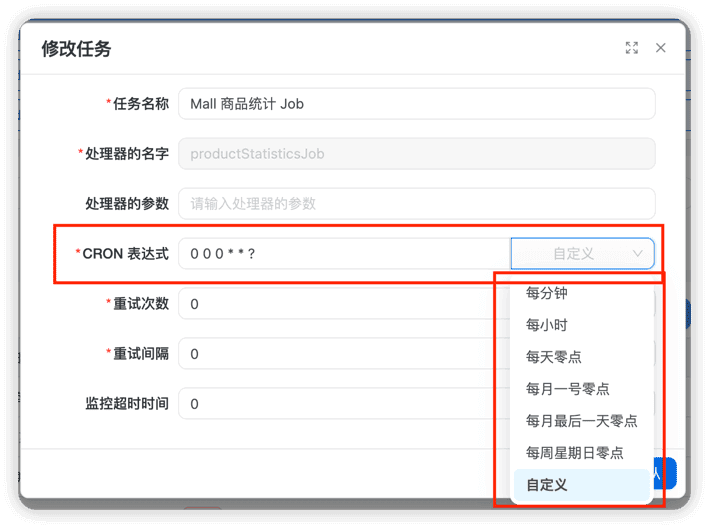 
- antd 版本：[apps/web-antd/src/views/infra/job/data.ts (opens new window)](https://github.com/yudaocode/yudao-ui-admin-vben/blob/master/apps/web-antd/src/views/infra/job/data.ts) 的 `cronExpression` 字段
- ele 版本：[apps/web-ele/src/views/infra/job/data.ts (opens new window)](https://github.com/yudaocode/yudao-ui-admin-vben/blob/master/apps/web-ele/src/views/infra/job/data.ts) 的 `cronExpression` 字段
### # 2.6 Cropper 图片裁剪
图片裁剪组件，支持旋转、缩放等操作。
- 源码位置： antd 版本：[apps/web-antd/src/components/cropper (opens new window)](https://github.com/yudaocode/yudao-ui-admin-vben/tree/master/apps/web-antd/src/components/cropper)
- ele 版本：[apps/web-ele/src/components/cropper (opens new window)](https://github.com/yudaocode/yudao-ui-admin-vben/tree/master/apps/web-ele/src/components/cropper)
实战案例（个人中心头像上传，使用 CropperAvatar 组件）：
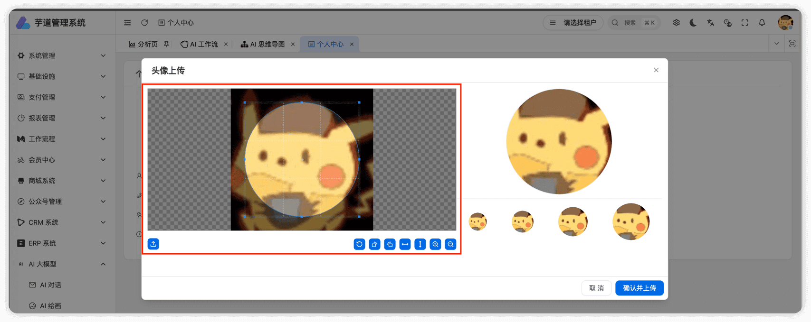 
- antd 版本：[apps/web-antd/src/views/_core/profile/modules/profile-user.vue (opens new window)](https://github.com/yudaocode/yudao-ui-admin-vben/blob/master/apps/web-antd/src/views/_core/profile/modules/profile-user.vue)
- ele 版本：[apps/web-ele/src/views/_core/profile/modules/profile-user.vue (opens new window)](https://github.com/yudaocode/yudao-ui-admin-vben/blob/master/apps/web-ele/src/views/_core/profile/modules/profile-user.vue)
### # 2.7 CodeEditor 代码编辑器
基于 Code Mirror 的代码编辑器组件。
- 源码位置：`@vben/plugins/code-editor`
- Vben 示例：[playground/src/views/examples/code-editor (opens new window)](https://github.com/vbenjs/vue-vben-admin/tree/main/playground/src/views/examples/code-editor)
- 实战案例（代码生成器预览）： 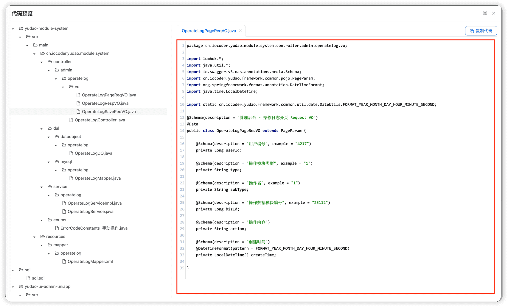 antd 版本：[apps/web-antd/src/views/infra/codegen/modules/preview-code.vue (opens new window)](https://github.com/yudaocode/yudao-ui-admin-vben/blob/master/apps/web-antd/src/views/infra/codegen/modules/preview-code.vue)
- ele 版本：[apps/web-ele/src/views/infra/codegen/modules/preview-code.vue (opens new window)](https://github.com/yudaocode/yudao-ui-admin-vben/blob/master/apps/web-ele/src/views/infra/codegen/modules/preview-code.vue)
### # 2.8 Markmap 思维导图
基于 Markmap 的思维导图组件。
- 源码位置：`@vben/plugins/markmap`
- Vben 示例：[playground/src/views/examples/markmap (opens new window)](https://github.com/vbenjs/vue-vben-admin/tree/main/playground/src/views/examples/markmap)
- 实战案例（AI 思维导图）： 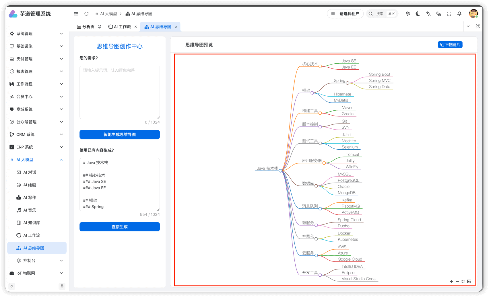 antd 版本：[apps/web-antd/src/views/ai/mindmap/index/modules/right.vue (opens new window)](https://github.com/yudaocode/yudao-ui-admin-vben/blob/master/apps/web-antd/src/views/ai/mindmap/index/modules/right.vue)
- ele 版本：[apps/web-ele/src/views/ai/mindmap/index/modules/right.vue (opens new window)](https://github.com/yudaocode/yudao-ui-admin-vben/blob/master/apps/web-ele/src/views/ai/mindmap/index/modules/right.vue)
### # 2.9 Captcha 验证码
Vben 提供的验证码组件，支持滑块验证、点选验证等多种验证方式。
- 源码位置：`@vben/common-ui` 中的 `SliderCaptcha`、`PointSelectionCaptcha`、`Verification` 等
- Vben 文档：[Vben Captcha 验证码 (opens new window)](https://doc.vben.pro/components/common-ui/vben-captcha.html)
- Vben 示例：[playground/src/views/examples/captcha (opens new window)](https://github.com/vbenjs/vue-vben-admin/tree/main/playground/src/views/examples/captcha)
- 实战案例（登录页验证码，使用 Verification 组件）： 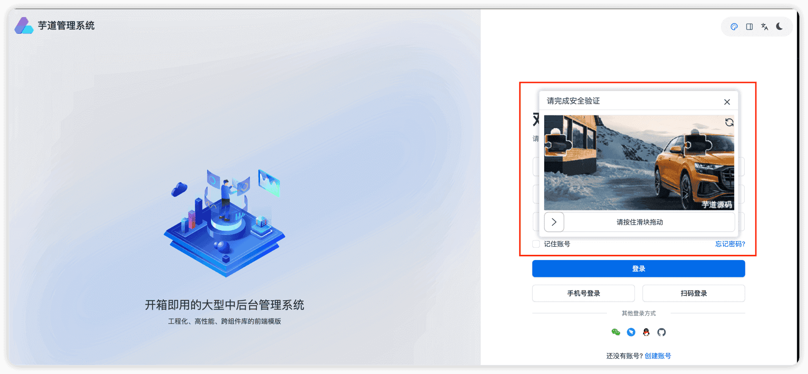 antd 版本：[apps/web-antd/src/views/_core/authentication/login.vue (opens new window)](https://github.com/yudaocode/yudao-ui-admin-vben/blob/master/apps/web-antd/src/views/_core/authentication/login.vue)
- ele 版本：[apps/web-ele/src/views/_core/authentication/login.vue (opens new window)](https://github.com/yudaocode/yudao-ui-admin-vben/blob/master/apps/web-ele/src/views/_core/authentication/login.vue)
### # 2.10 JsonViewer JSON 查看器
JSON 数据可视化查看组件，支持折叠展开、复制等功能。
- 源码位置：`@vben/common-ui` 中的 `JsonViewer`
- Vben 示例：[playground/src/views/examples/json-viewer (opens new window)](https://github.com/vbenjs/vue-vben-admin/tree/main/playground/src/views/examples/json-viewer)
- 实战案例：暂未使用
## # 3. 其他组件
- [《外部模块》 (opens new window)](https://doc.vben.pro/guide/essentials/external-module.html)【依赖安装】
- [《Vite Config》 (opens new window)](https://doc.vben.pro/guide/project/vite.html)
- [《全局 Loading》 (opens new window)](https://doc.vben.pro/guide/in-depth/loading.html)
- [《登录》 (opens new window)](https://doc.vben.pro/guide/in-depth/login.html)
- [《组件库切换》 (opens new window)](https://doc.vben.pro/guide/in-depth/ui-framework.html)
.pageB img{width:80px!important;}
.wwads-horizontal .wwads-text, .wwads-content .wwads-text{line-height:1;}
[字典数据](/vben5/dict/) [通用方法](/vben5/util/) 
←
[字典数据](/vben5/dict/) [通用方法](/vben5/util/)→
 
Theme by
[Vdoing](https://github.com/xugaoyi/vuepress-theme-vdoing) 
| Copyright © 2019-2026
芋道源码 | MIT License   
- 跟随系统
- 浅色模式
- 深色模式
- 阅读模式
× 
.windowRB{ padding: 0;}
.windowRB .wwads-img{margin-top: 10px;}
.windowRB .wwads-content{margin: 0 10px 10px 10px;}
.custom-html-window-rb .close-but{
display: none;
}