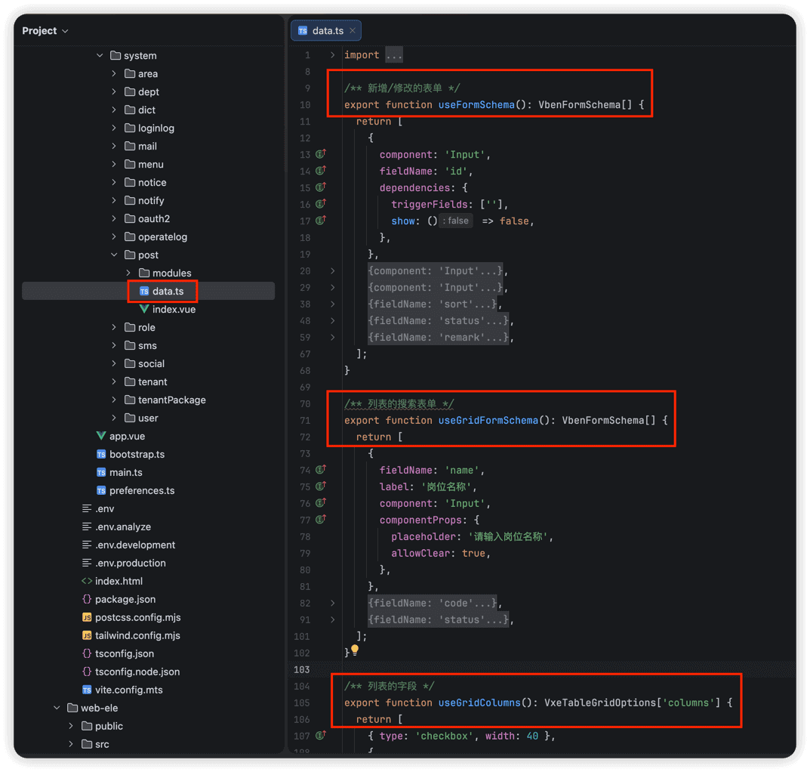
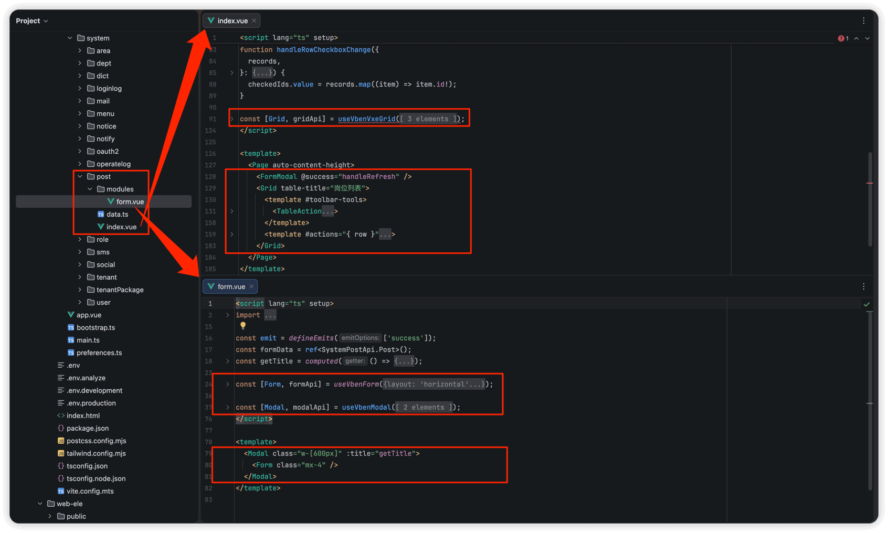
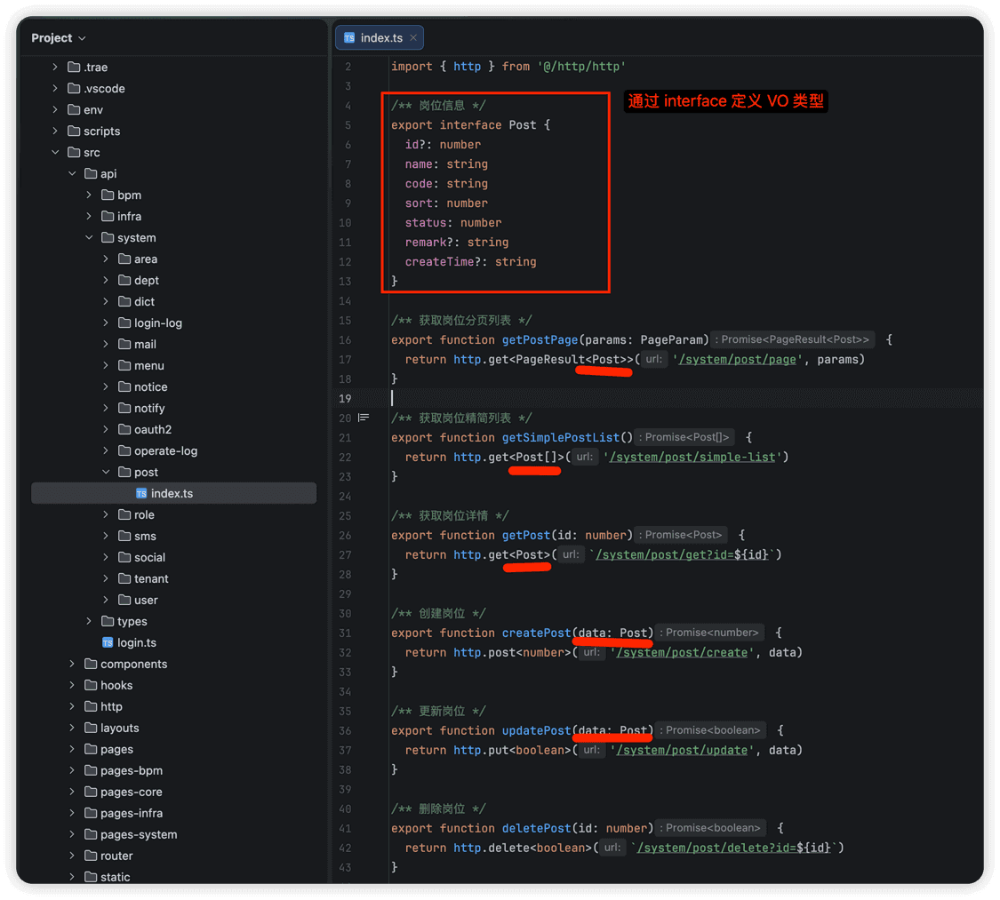

# 开发规范

本项目基于 [Vben Admin 5.x](https://github.com/vbenjs/vue-vben-admin) 进行二次开发，采用 Vue 3 + TypeScript + Vite 技术栈，支持 Ant Design Vue（antd）、Element Plus（ele）、Naive 等主流 UI 库。
官方文档
强烈建议先阅读 Vben Admin 官方文档，了解框架的基础概念和使用方式：
- [《关于 Vben Admin》](https://doc.vben.pro/guide/introduction/vben.html) - 了解框架特点、浏览器支持、如何参与贡献等
- [《为什么选择我们?》](https://doc.vben.pro/guide/introduction/why.html) - 了解框架历程、单元测试、代码质量与规范等
- [《基础概念》](https://doc.vben.pro/guide/essentials/concept.html) - 了解大仓、应用、包、别名等核心概念
- [《本地开发》](https://doc.vben.pro/guide/essentials/development.html) - 了解如何启动和开发项目
- [《配置》](https://doc.vben.pro/guide/essentials/settings.html) - 了解环境变量配置、生产环境动态配置、偏好设置等
## # 0. 实战案例
本小节，提供大家开发管理后台的功能时，最常用的分页列表、树形列表、新增与修改的表单弹窗、详情表单弹窗的实战案例。
### # 0.1 分页列表
可参考 [系统管理 -> 岗位管理] 菜单：
| 文件类型 | antd 版本 | ele 版本 |
| --- | --- | --- |
| API 接口 | [`apps/web-antd/src/api/system/post/index.ts`](https://github.com/yudaocode/yudao-ui-admin-vben/blob/master/apps/web-antd/src/api/system/post/index.ts) | [`apps/web-ele/src/api/system/post/index.ts`](https://github.com/yudaocode/yudao-ui-admin-vben/blob/master/apps/web-ele/src/api/system/post/index.ts) |
| 列表界面 | [`apps/web-antd/src/views/system/post/index.vue`](https://github.com/yudaocode/yudao-ui-admin-vben/blob/master/apps/web-antd/src/views/system/post/index.vue) | [`apps/web-ele/src/views/system/post/index.vue`](https://github.com/yudaocode/yudao-ui-admin-vben/blob/master/apps/web-ele/src/views/system/post/index.vue) |
| 表单界面 | [`apps/web-antd/src/views/system/post/modules/form.vue`](https://github.com/yudaocode/yudao-ui-admin-vben/blob/master/apps/web-antd/src/views/system/post/modules/form.vue) | [`apps/web-ele/src/views/system/post/modules/form.vue`](https://github.com/yudaocode/yudao-ui-admin-vben/blob/master/apps/web-ele/src/views/system/post/modules/form.vue) |
| 数据配置 | [`apps/web-antd/src/views/system/post/data.ts`](https://github.com/yudaocode/yudao-ui-admin-vben/blob/master/apps/web-antd/src/views/system/post/data.ts) | [`apps/web-ele/src/views/system/post/data.ts`](https://github.com/yudaocode/yudao-ui-admin-vben/blob/master/apps/web-ele/src/views/system/post/data.ts) |
为什么界面拆成列表和表单两个 Vue 文件？
每个 Vue 文件，只实现一个功能，更简洁，维护性更好，Git 代码冲突概率低。
具体可见本文的「3.3 页面级组件」。
其中，`data.ts` 用于定义表格列配置、搜索表单配置、新增/修改表单配置等，将配置与业务逻辑分离，提高代码可维护性。整体结构，如下图所示：
 
- [Vben Vxe Table 表格](https://doc.vben.pro/components/common-ui/vben-vxe-table.html)
- [Vben Form 表单](https://doc.vben.pro/components/common-ui/vben-form.html)
- [Vben Modal 模态框](https://doc.vben.pro/components/common-ui/vben-modal.html)
另外，项目在 `src/adapter` 目录下对表单和表格进行了扩展配置：
| 文件类型 | antd 版本 | ele 版本 |
| --- | --- | --- |
| 表单适配器 | [`apps/web-antd/src/adapter/form.ts`](https://github.com/yudaocode/yudao-ui-admin-vben/blob/master/apps/web-antd/src/adapter/form.ts) | [`apps/web-ele/src/adapter/form.ts`](https://github.com/yudaocode/yudao-ui-admin-vben/blob/master/apps/web-ele/src/adapter/form.ts) |
| 表格适配器 | [`apps/web-antd/src/adapter/vxe-table.ts`](https://github.com/yudaocode/yudao-ui-admin-vben/blob/master/apps/web-antd/src/adapter/vxe-table.ts) | [`apps/web-ele/src/adapter/vxe-table.ts`](https://github.com/yudaocode/yudao-ui-admin-vben/blob/master/apps/web-ele/src/adapter/vxe-table.ts) |
① `form.ts` 中定义了自定义校验规则，可在表单 Schema 的 `rules` 属性中使用：
- `required` - 输入项必填校验
- `selectRequired` - 选择项必填校验
- `mobile` - 手机号格式校验（非必填）
- `mobileRequired` - 手机号格式校验（必填）
② `vxe-table.ts` 中定义了自定义单元格渲染器和格式化器：
单元格渲染器（`cellRender`）：
- `CellImage` - 图片渲染
- `CellImages` - 多图片渲染
- `CellLink` - 链接按钮
- `CellTag` - 标签渲染
- `CellTags` - 多标签渲染
- `CellDict` - 字典标签渲染，如 `cellRender: { name: 'CellDict', props: { type: 'system_user_sex' } }`
- `CellSwitch` - 开关渲染，支持异步切换
- `CellOperation` - 操作按钮渲染，如 `cellRender: { name: 'CellOperation', options: ['edit', 'delete'] }`
格式化器（`formatter`）：
- `formatPast2` - 相对时间格式化（如"3 天前"）
- `formatAmount3` - 数量格式化，保留 3 位小数
- `formatAmount2` - 数量格式化，保留 2 位小数
- `formatFenToYuanAmount` - 分转元格式化
- `formatFileSize` - 文件大小格式化
### # 0.2 树形列表
可参考 [系统管理 -> 部门管理] 菜单：
| 文件类型 | antd 版本 | ele 版本 |
| --- | --- | --- |
| API 接口 | [`apps/web-antd/src/api/system/dept/index.ts`](https://github.com/yudaocode/yudao-ui-admin-vben/blob/master/apps/web-antd/src/api/system/dept/index.ts) | [`apps/web-ele/src/api/system/dept/index.ts`](https://github.com/yudaocode/yudao-ui-admin-vben/blob/master/apps/web-ele/src/api/system/dept/index.ts) |
| 列表界面 | [`apps/web-antd/src/views/system/dept/index.vue`](https://github.com/yudaocode/yudao-ui-admin-vben/blob/master/apps/web-antd/src/views/system/dept/index.vue) | [`apps/web-ele/src/views/system/dept/index.vue`](https://github.com/yudaocode/yudao-ui-admin-vben/blob/master/apps/web-ele/src/views/system/dept/index.vue) |
| 表单界面 | [`apps/web-antd/src/views/system/dept/modules/form.vue`](https://github.com/yudaocode/yudao-ui-admin-vben/blob/master/apps/web-antd/src/views/system/dept/modules/form.vue) | [`apps/web-ele/src/views/system/dept/modules/form.vue`](https://github.com/yudaocode/yudao-ui-admin-vben/blob/master/apps/web-ele/src/views/system/dept/modules/form.vue) |
| 数据配置 | [`apps/web-antd/src/views/system/dept/data.ts`](https://github.com/yudaocode/yudao-ui-admin-vben/blob/master/apps/web-antd/src/views/system/dept/data.ts) | [`apps/web-ele/src/views/system/dept/data.ts`](https://github.com/yudaocode/yudao-ui-admin-vben/blob/master/apps/web-ele/src/views/system/dept/data.ts) |
### # 0.3 详情弹窗
可参考 [基础设施 -> API 日志 -> 访问日志] 菜单：
| 文件类型 | antd 版本 | ele 版本 |
| --- | --- | --- |
| 列表界面 | [`apps/web-antd/src/views/infra/apiAccessLog/index.vue`](https://github.com/yudaocode/yudao-ui-admin-vben/blob/master/apps/web-antd/src/views/infra/apiAccessLog/index.vue) | [`apps/web-ele/src/views/infra/apiAccessLog/index.vue`](https://github.com/yudaocode/yudao-ui-admin-vben/blob/master/apps/web-ele/src/views/infra/apiAccessLog/index.vue) |
| 详情弹窗 | [`apps/web-antd/src/views/infra/apiAccessLog/modules/detail.vue`](https://github.com/yudaocode/yudao-ui-admin-vben/blob/master/apps/web-antd/src/views/infra/apiAccessLog/modules/detail.vue) | [`apps/web-ele/src/views/infra/apiAccessLog/modules/detail.vue`](https://github.com/yudaocode/yudao-ui-admin-vben/blob/master/apps/web-ele/src/views/infra/apiAccessLog/modules/detail.vue) |
| 数据配置 | [`apps/web-antd/src/views/infra/apiAccessLog/data.ts`](https://github.com/yudaocode/yudao-ui-admin-vben/blob/master/apps/web-antd/src/views/infra/apiAccessLog/data.ts) | [`apps/web-ele/src/views/infra/apiAccessLog/data.ts`](https://github.com/yudaocode/yudao-ui-admin-vben/blob/master/apps/web-ele/src/views/infra/apiAccessLog/data.ts) |
详情弹窗，使用 `useVbenModal` 和 `useDescription` 组合实现，`data.ts` 中通过 `useDetailSchema()` 定义详情字段的展示配置。
## # 1. view 页面
在 [`apps/web-antd/src/views`](https://github.com/yudaocode/yudao-ui-admin-vben/tree/master/apps/web-antd/src/views) 或 [`apps/web-ele/src/views`](https://github.com/yudaocode/yudao-ui-admin-vben/tree/master/apps/web-ele/src/views) 目录下，每个模块对应一个目录，它的所有功能的 `.vue` 都放在该目录里。
 一般来说，一个路由对应一个 `index.vue` 文件，表单弹窗等组件放在 `modules` 子目录下。
## # 2. api 请求
在 [`apps/web-antd/src/api`](https://github.com/yudaocode/yudao-ui-admin-vben/tree/master/apps/web-antd/src/api) 目录下，每个模块对应一个目录，包含该模块的所有 API 文件。
 每个 API 文件通常包含：
- API 方法：调用 `requestClient` 发起对后端 RESTful API 的请求
- `interface` 类型：定义 API 的请求参数和返回结果的类型，对应后端的 VO 类型
### # 2.1 请求封装
项目使用 `@vben/request` 包进行请求封装，配置文件位于 [`apps/web-antd/src/api/request.ts`](https://github.com/yudaocode/yudao-ui-admin-vben/blob/master/apps/web-antd/src/api/request.ts)。
官方文档
详细的请求配置和使用方式，请参考：[服务端交互与数据 Mock](https://doc.vben.pro/guide/essentials/server.html)
请求封装中包含了以下核心功能：
- 租户支持：自动在请求头中添加 `tenant-id` 租户编号
- 访问令牌：自动在请求头中添加 `Authorization` Bearer Token
- 刷新令牌：当访问令牌过期时，自动使用 `refreshToken` 刷新令牌
- API 加密：支持请求数据加密和响应数据解密
- 错误处理：统一的错误消息提示和 401 未登录处理
## # 3. component 组件
### # 3.1 全局组件
① Vben Admin 5.x 提供了丰富的通用组件，位于 `packages/effects/common-ui` 目录下，常用组件包括 VbenVxeTable（表格）、VbenForm（表单）、VbenModal（弹窗）等等。
② 每个 UI 库（antd、ele、naive）也有自己的全局组件，放在各自应用的 `src/components` 目录下，例如：
- antd 版本：[`apps/web-antd/src/components`](https://github.com/yudaocode/yudao-ui-admin-vben/tree/master/apps/web-antd/src/components)
- ele 版本：[`apps/web-ele/src/components`](https://github.com/yudaocode/yudao-ui-admin-vben/tree/master/apps/web-ele/src/components)
这些组件包括：字典标签（dict-tag）、文件上传（upload）、富文本编辑器（tinymce）、图片裁剪（cropper）等，可供整个应用使用。
更多说明，可见 [系统组件](/vben5/component/) 文档。
### # 3.2 模块级组件
每个模块可以有自己的 `components` 目录，用于存放可被该模块下多个页面复用的组件。例如：
| 组件目录 | antd 版本 | ele 版本 |
| --- | --- | --- |
| 部门组件 | [`apps/web-antd/src/views/system/dept/components`](https://github.com/yudaocode/yudao-ui-admin-vben/tree/master/apps/web-antd/src/views/system/dept/components) | [`apps/web-ele/src/views/system/dept/components`](https://github.com/yudaocode/yudao-ui-admin-vben/tree/master/apps/web-ele/src/views/system/dept/components) |
| 用户组件 | [`apps/web-antd/src/views/system/user/components`](https://github.com/yudaocode/yudao-ui-admin-vben/tree/master/apps/web-antd/src/views/system/user/components) | [`apps/web-ele/src/views/system/user/components`](https://github.com/yudaocode/yudao-ui-admin-vben/tree/master/apps/web-ele/src/views/system/user/components) |
### # 3.3 页面内组件
每个页面的私有组件，放在 `views` 目录下对应页面的 `modules` 目录下，仅供当前页面使用，不对外暴露。
| 组件示例 | antd 版本 | ele 版本 |
| --- | --- | --- |
| 岗位表单 | [`apps/web-antd/src/views/system/post/modules/form.vue`](https://github.com/yudaocode/yudao-ui-admin-vben/blob/master/apps/web-antd/src/views/system/post/modules/form.vue) | [`apps/web-ele/src/views/system/post/modules/form.vue`](https://github.com/yudaocode/yudao-ui-admin-vben/blob/master/apps/web-ele/src/views/system/post/modules/form.vue) |
| 日志详情 | [`apps/web-antd/src/views/infra/apiAccessLog/modules/detail.vue`](https://github.com/yudaocode/yudao-ui-admin-vben/blob/master/apps/web-antd/src/views/infra/apiAccessLog/modules/detail.vue) | [`apps/web-ele/src/views/infra/apiAccessLog/modules/detail.vue`](https://github.com/yudaocode/yudao-ui-admin-vben/blob/master/apps/web-ele/src/views/infra/apiAccessLog/modules/detail.vue) |
## # 4. style 样式
项目使用 [Tailwind CSS](https://tailwindcss.com/) 作为主要的样式方案，可参考如下文档：
- [《Vben 官方文档 —— 样式》](https://doc.vben.pro/guide/essentials/styles.html)
- [《Vben 官方文档 —— Tailwind CSS》](https://doc.vben.pro/guide/project/tailwindcss.html)
## # 5. 项目规范
可参考 [《Vben 官方文档 —— 规范》](https://doc.vben.pro/guide/project/standard.html)
.pageB img{width:80px!important;}
.wwads-horizontal .wwads-text, .wwads-content .wwads-text{line-height:1;}
[代码格式化](/vue3/format/) [菜单路由](/vben5/route/) 
←
[代码格式化](/vue3/format/) [菜单路由](/vben5/route/)→
 
Theme by
[Vdoing](https://github.com/xugaoyi/vuepress-theme-vdoing) 
| Copyright © 2019-2026
芋道源码 | MIT License   
- 跟随系统
- 浅色模式
- 深色模式
- 阅读模式
× 
.windowRB{ padding: 0;}
.windowRB .wwads-img{margin-top: 10px;}
.windowRB .wwads-content{margin: 0 10px 10px 10px;}
.custom-html-window-rb .close-but{
display: none;
}