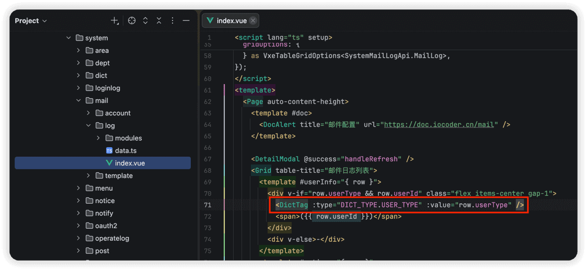
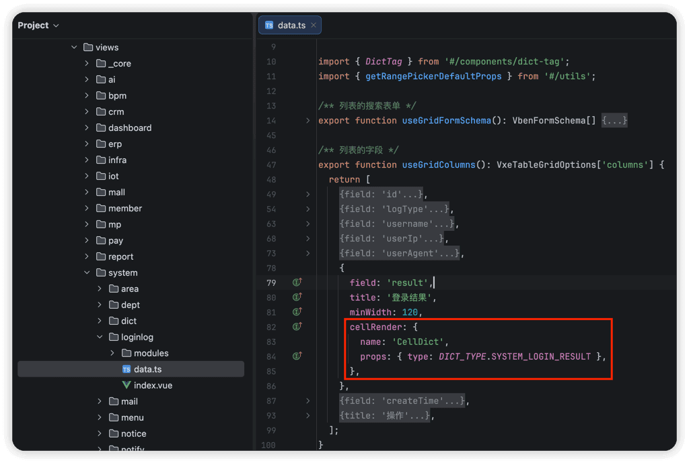
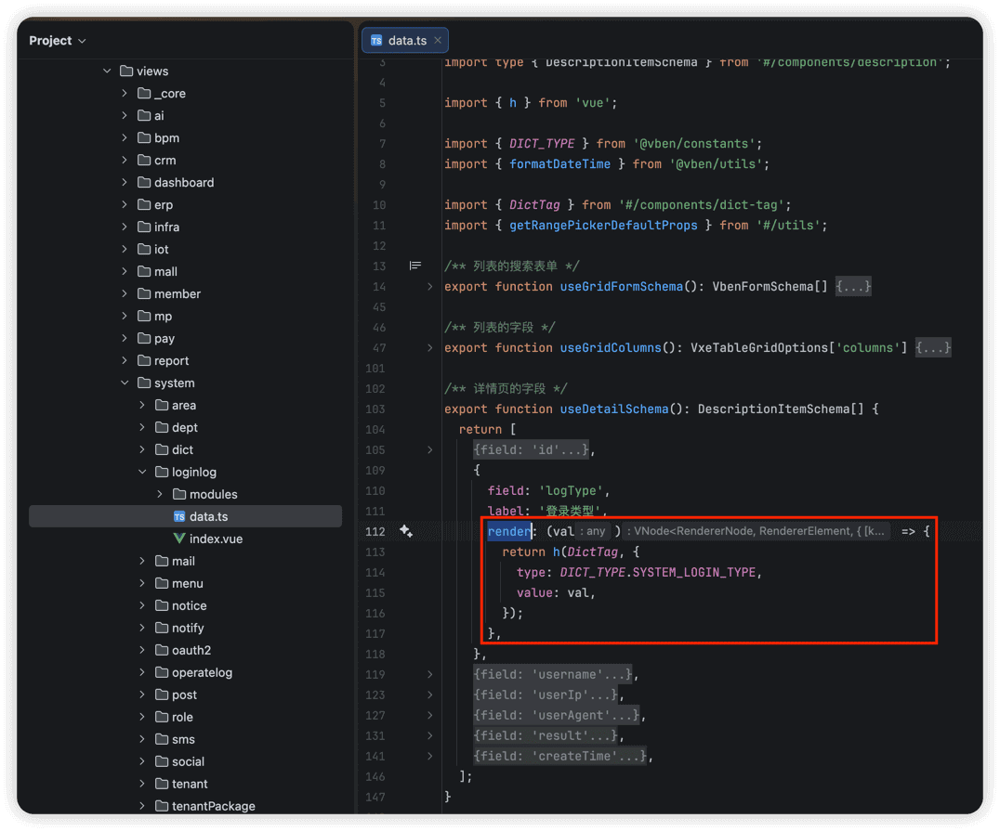

# 字典数据

本小节，讲解前端如何使用 [系统管理 -> 字典管理] 菜单的字典数据，例如说字典数据的下拉框、单选 / 多选按钮、高亮展示等等。
 
## # 1. 全局缓存
用户登录成功后，前端会从后端获取到全量的字典数据，缓存在 store 中。如下图所示：
 这样，前端在使用到字典数据时，无需重复请求后端，提升用户体验。
不过，缓存暂时未提供刷新，所以在字典数据发生变化时，需要用户刷新浏览器，进行重新加载。
## # 2. DICT_TYPE
在 [`dict-enum.ts`](https://github.com/yudaocode/yudao-ui-admin-vben/blob/master/packages/constants/src/dict-enum.ts) 文件中，使用 `DICT_TYPE` 枚举了字典的 KEY。如下图所示：
 后续如果有新的字典 KEY，需要你自己进行添加。
## # 3. DictTag 字典标签
① `` 组件，翻译字段对应的字典展示文本，并根据 `colorType`、`cssClass` 进行高亮。
- 源码位置： antd 版本：[apps/web-antd/src/components/dict-tag](https://github.com/yudaocode/yudao-ui-admin-vben/tree/master/apps/web-antd/src/components/dict-tag)
- ele 版本：[apps/web-ele/src/components/dict-tag](https://github.com/yudaocode/yudao-ui-admin-vben/tree/master/apps/web-ele/src/components/dict-tag)
使用示例如下：
 ② 对于 Grid（schema） 列表场景，通过 `cellRender` 属性为 `CellDict` 即可。如下图所示：
 ③ 对于 Description（schema） 描述场景，通过 `render` 为 `` 组件。如下图所示：
 ④ 对于 Form（schema） 表单场景，继续往下看「4. 字典工具类」。
## # 4. 字典工具类
在 [`use-dict.ts`](https://github.com/yudaocode/yudao-ui-admin-vben/blob/master/packages/effects/hooks/src/use-dict.ts) 文件中，提供了字典工具类，方法如下：
// 获取字典标签
export function getDictLabel(dictType: string, value: any) { /** 省略代码 */ }
// 获取字典对象
export function getDictObj(dictType: string, value: any) { /** 省略代码 */ }
// 获取字典数组 用于 select radio 等
// valueType 可选值：'string' | 'number' | 'boolean'，默认 'string'
export function getDictOptions(dictType: string, valueType: 'boolean' | 'number' | 'string' = 'string') { /** 省略代码 */ }
结合 Vben Form 表单组件，使用示例如下：
import type { VbenFormSchema } from '#/adapter/form';
import { DICT_TYPE } from '@vben/constants';
import { getDictOptions } from '@vben/hooks';
export function useFormSchema(): VbenFormSchema[] {
return [
// radio 单选框
{
fieldName: 'sex',
label: '用户性别',
component: 'RadioGroup',
componentProps: {
options: getDictOptions(DICT_TYPE.SYSTEM_USER_SEX, 'number'),
buttonStyle: 'solid',
optionType: 'button',
},
},
// select 下拉框
{
fieldName: 'status',
label: '用户状态',
component: 'Select',
componentProps: {
options: getDictOptions(DICT_TYPE.COMMON_STATUS, 'number'),
placeholder: '请选择用户状态',
},
},
];
}
- 实战案例（antd）：[apps/web-antd/src/views/system/user/data.ts](https://github.com/yudaocode/yudao-ui-admin-vben/blob/master/apps/web-antd/src/views/system/user/data.ts)
- 实战案例（ele）：[apps/web-ele/src/views/system/user/data.ts](https://github.com/yudaocode/yudao-ui-admin-vben/blob/master/apps/web-ele/src/views/system/user/data.ts)
.pageB img{width:80px!important;}
.wwads-horizontal .wwads-text, .wwads-content .wwads-text{line-height:1;}
[图标、主题、国际化](/vben5/icon-theme/) [系统组件](/vben5/components/) 
←
[图标、主题、国际化](/vben5/icon-theme/) [系统组件](/vben5/components/)→
 
Theme by
[Vdoing](https://github.com/xugaoyi/vuepress-theme-vdoing) 
| Copyright © 2019-2026
芋道源码 | MIT License   
- 跟随系统
- 浅色模式
- 深色模式
- 阅读模式
× 
.windowRB{ padding: 0;}
.windowRB .wwads-img{margin-top: 10px;}
.windowRB .wwads-content{margin: 0 10px 10px 10px;}
.custom-html-window-rb .close-but{
display: none;
}