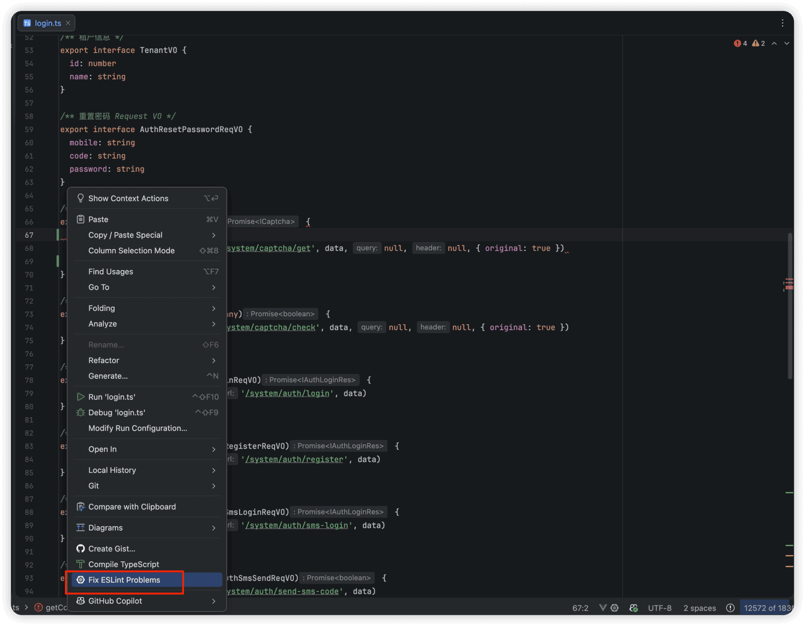
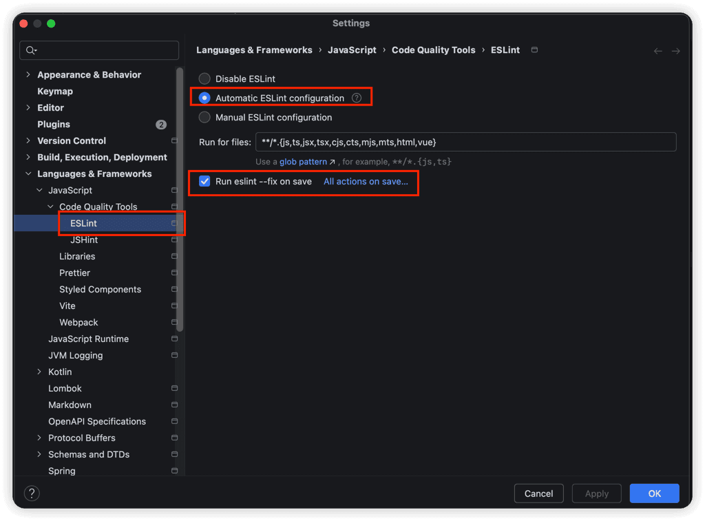
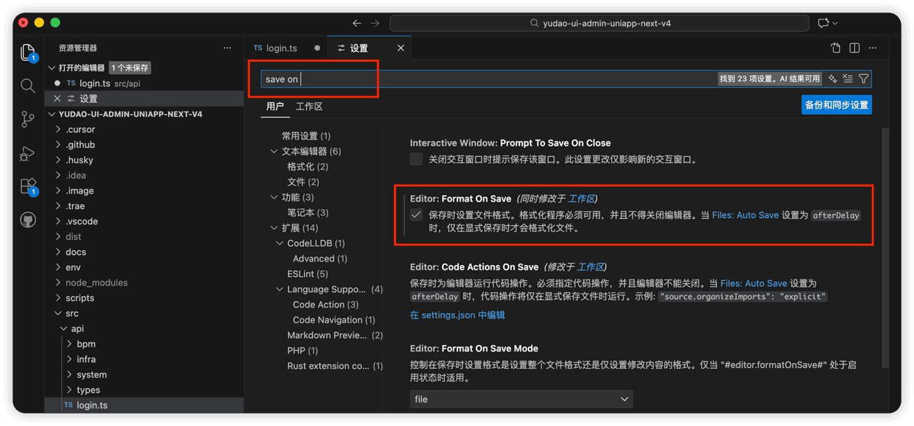

# 代码格式化

友情提示
强烈建议先阅读 Vben Admin 官方文档，了解框架的基础概念和使用方式：
- [《规范》 (opens new window)](https://doc.vben.pro/guide/project/standard.html)
项目的 lint 配置文件位于 [internal/lint-configs (opens new window)](https://github.com/yudaocode/yudao-ui-admin-vben/tree/master/internal/lint-configs) 目录下：
| 目录 | 说明 |
| --- | --- |
| `eslint-config` | ESLint 配置 |
| `prettier-config` | Prettier 配置 |
| `stylelint-config` | Stylelint 配置 |
| `commitlint-config` | Commitlint 配置 |
项目内集成了以下几种代码校验工具：
- [ESLint (opens new window)](https://eslint.org/)：用于 JavaScript/TypeScript 代码检查
- [Stylelint (opens new window)](https://stylelint.io/)：用于 CSS/SCSS 样式检查
- [Prettier (opens new window)](https://prettier.io/)：用于代码格式化
- [Commitlint (opens new window)](https://commitlint.js.org/)：用于 Git 提交信息规范检查
我们可以使用 IDE 自带的 Linter 功能，实现代码的格式化（自动检查和修复）。
友情提示：
如果你想使用 Prettier 插件，可参考 [《代码格式化（Prettier）》](//vue3/format) 文档。
## # 1. JetBrains 端
参考 [《JetBrains 官方文档》 (opens new window)](https://www.jetbrains.com/help/idea/linters.html) 操作即可。
① 【手动修复】右键文件，选择 `Fix ESLint Problems` 即可。如下图所示：
 ② 【自动修复】可在 JetBrains 设置界面的 ESLint 选项中，勾选上 `Run eslint --fix on save` 选项，如下图所示：
 之后，保存页面，页面代码自动格式化。
## # 2. VS Code 端
参考 [《VS Code 官方文档》 (opens new window)](https://code.visualstudio.com/docs/languages/javascript#_linters) 操作即可。
【自动修复】打开 VS Code 配置，搜索 save 后，勾选上 `Format On Save` 选项。如下图所示：
 之后，保存页面，页面代码自动格式化。
.pageB img{width:80px!important;}
.wwads-horizontal .wwads-text, .wwads-content .wwads-text{line-height:1;}
[IDE 调试](/vben5/debugger/) [开发规范](/vue2/dev-spec/) 
←
[IDE 调试](/vben5/debugger/) [开发规范](/vue2/dev-spec/)→
 
Theme by
[Vdoing](https://github.com/xugaoyi/vuepress-theme-vdoing) 
| Copyright © 2019-2026
芋道源码 | MIT License   
- 跟随系统
- 浅色模式
- 深色模式
- 阅读模式
× 
.windowRB{ padding: 0;}
.windowRB .wwads-img{margin-top: 10px;}
.windowRB .wwads-content{margin: 0 10px 10px 10px;}
.custom-html-window-rb .close-but{
display: none;
}