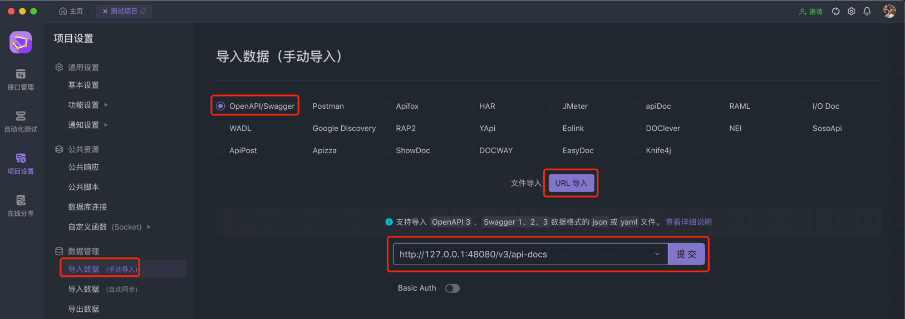
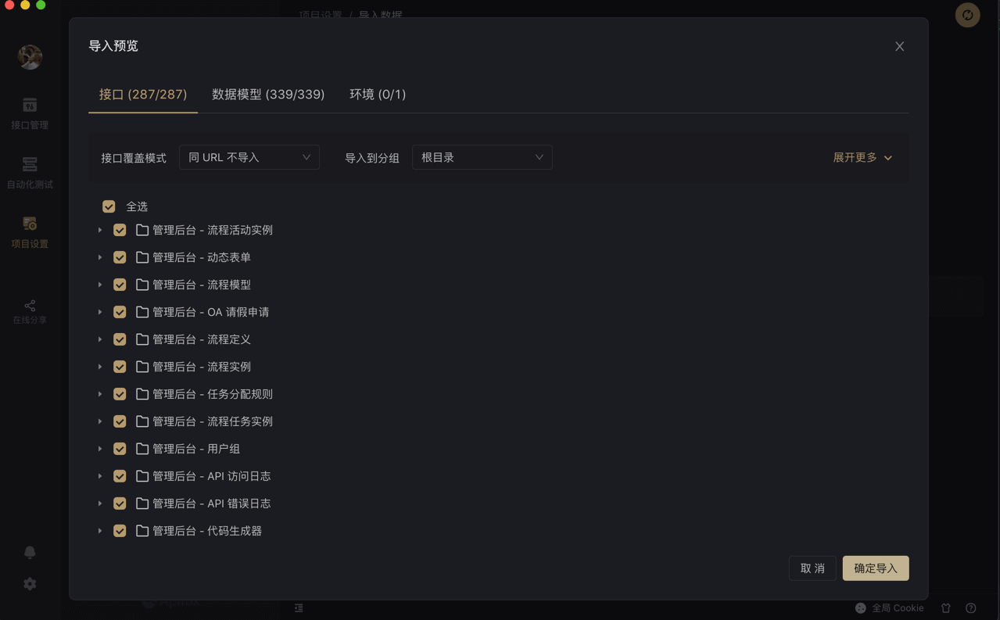
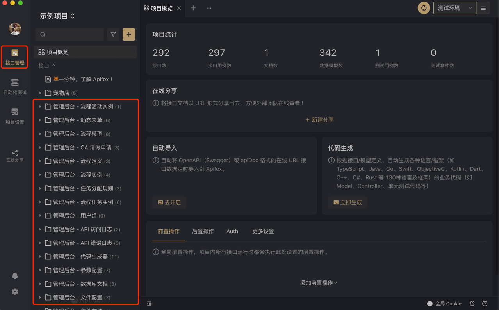
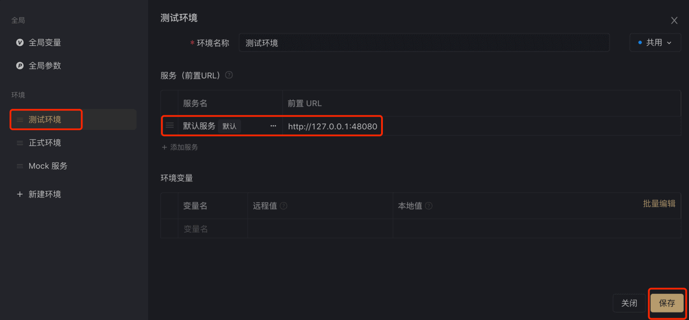
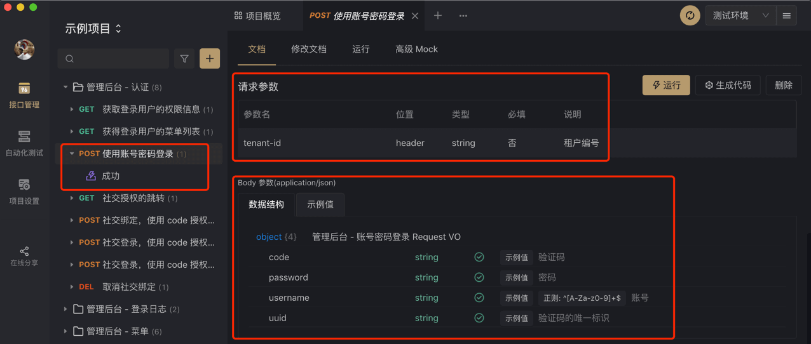
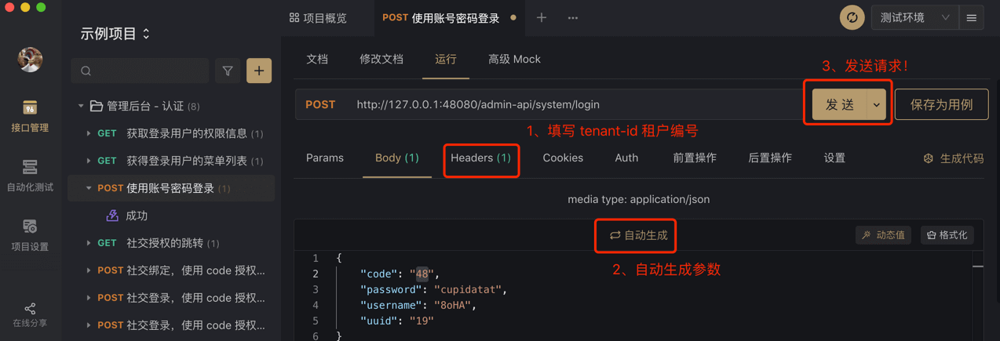
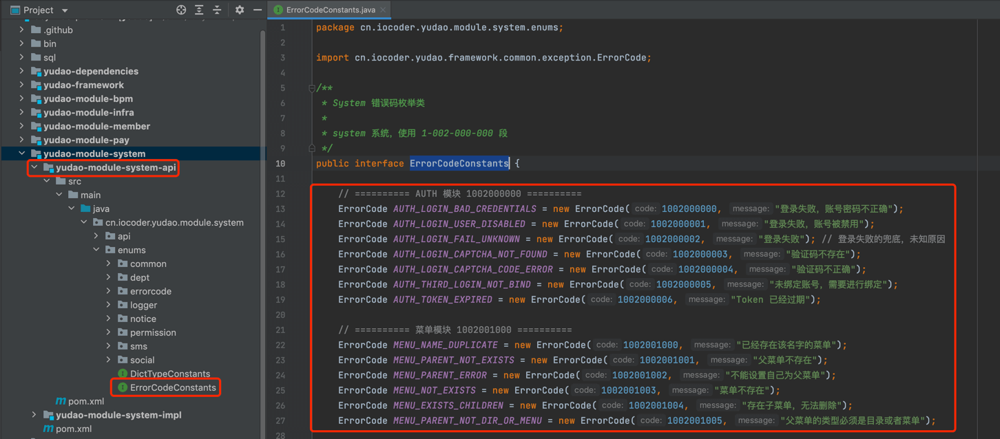

# 系统组件

## # 1. 引入三方组件
除了 Element UI 组件以及项目内置的系统组件，有时还需要引入其它[三方组件 (opens new window)](https://www.npmjs.com/)。
### # 1.1 如何安装
这里，以引入 [vue-count-to (opens new window)](https://www.npmjs.com/package/vue-count-to) 为例。在终端输入下面的命令完成安装：
## 加上 --save 参数，会自动添加依赖到 package.json 中去。
npm install vue-count-to --save
### # 1.2 如何注册
Vue 注册组件有两种方式：全局注册、局部注册。
#### # 1.2.1 局部注册
在对应的 Vue 页面中，使用 `components` 属性来注册组件。代码如下：
import countTo from 'vue-count-to';
export default {
components: { countTo }, // components 属性
data () {
return {
startVal: 0,
endVal: 2017
}
}
}
#### # 1.2.2 全局注册
① 在 [`main.js` (opens new window)](https://github.com/yudaocode/yudao-ui-admin-vue2/blob/master/src/main.js) 中，全局注册组件。代码如下：
import countTo from 'vue-count-to'
Vue.component('countTo', countTo)
② 在对应的 Vue 页面中，直接使用组件，无需注册。代码如下：
## # 2. 系统组件
项目使用到的相关组件。
### # 2.1 基础框架组件
[`element-ui` (opens new window)](https://github.com/ElemeFE/element)
[`vue-element-admin` (opens new window)](https://github.com/PanJiaChen/vue-element-admin)
### # 2.2 树形选择组件
[`vue-treeselect` (opens new window)](https://github.com/riophae/vue-treeselect)
在 [`menu/index.vue` (opens new window)](https://github.com/yudaocode/yudao-ui-admin-vue2/blob/master/src/views/system/menu/index.vue#L68-L71) 的使用案例：
 
### # 2.3 表格分页组件
[`el-pagination` (opens new window)](https://element.eleme.io/#/zh-CN/component/pagination)，二次封装成 [`pagination` (opens new window)](https://github.com/yudaocode/yudao-ui-admin-vue2/blob/master/src/components/Pagination/index.vue) 组件。
在 [`notice/index.vue` (opens new window)](https://github.com/yudaocode/yudao-ui-admin-vue2/blob/master/src/views/system/notice/index.vue#L57-L60) 的使用案例：
0" :total="total" :page.sync="queryParams.pageNo" :limit.sync="queryParams.pageSize"
@pagination="getList"/>
 
### # 2.4 工具栏右侧组件
[`right-toolbar` (opens new window)](https://github.com/yudaocode/yudao-ui-admin-vue2/blob/master/src/components/RightPanel/index.vue)
在 [`notice/index.vue` (opens new window)](https://github.com/yudaocode/yudao-ui-admin-vue2/blob/master/src/views/system/notice/index.vue#L26) 的使用案例：
 
### # 2.5 文件上传组件
[`file-upload` (opens new window)](https://github.com/yudaocode/yudao-ui-admin-vue2/blob/master/src/components/FileUpload/index.vue)
### # 2.6 图片上传组件
图片上传组件 [`image-upload` (opens new window)](https://github.com/yudaocode/yudao-ui-admin-vue2/blob/master/src/components/ImageUpload/index.vue)
图片预览组件 [`image-preview` (opens new window)](https://github.com/yudaocode/yudao-ui-admin-vue2/blob/master/src/components/ImagePreview/index.vue)
### # 2.7 富文本编辑器
[`quill` (opens new window)](https://github.com/quilljs/quill)，二次封装成 [Editor (opens new window)](https://github.com/yudaocode/yudao-ui-admin-vue2/blob/master/src/components/Editor/index.vue) 组件。
在 [`notice/index.vue` (opens new window)](https://github.com/yudaocode/yudao-ui-admin-vue2/blob/master/src/views/system/notice/index.vue#L94-L96) 的使用案例：
 
### # 2.8 表单设计组件
① 表单设计组件 [`form-generator` (opens new window)](https://github.com/JakHuang/form-generator)
在 [`build/index.vue` (opens new window)](https://github.com/yudaocode/yudao-ui-admin-vue2/blob/master/src/views/infra/build/index.vue) 中使用，效果如下图：
 ② 表单展示组件 [`parser` (opens new window)](https://github.com/yudaocode/yudao-ui-admin-vue2/blob/master/src/components/parser/Parser.vue)，基于 [`form-generator` (opens new window)](https://github.com/JakHuang/form-generator) 封装。
在 [`processInstance/create.vue` (opens new window)](https://github.com/yudaocode/yudao-ui-admin-vue2/blob/master/src/views/system/notice/index.vue#L94-L96) 的使用案例：
 
### # 2.9 工作流组件
[`bpmn-process-designer` (opens new window)](https://gitee.com/MiyueSC/bpmn-process-designer)，二次封装成 [`bpmnProcessDesigner` (opens new window)](https://github.com/yudaocode/yudao-ui-admin-vue2/blob/master/src/components/bpmnProcessDesigner/) 工作流设计组件
① 工作流设计组件 [`my-process-designer` (opens new window)](https://github.com/yudaocode/yudao-ui-admin-vue2/blob/master/src/components/bpmnProcessDesigner/package/designer/ProcessDesigner.vue)，在 [`bpm/model/modelEditor.vue` (opens new window)](https://github.com/yudaocode/yudao-ui-admin-vue2/blob/master/src/views/bpm/model/modelEditor.vue) 中使用案例：
 ② 工作流展示组件 [`my-process-viewer` (opens new window)](https://github.com/yudaocode/yudao-ui-admin-vue2/blob/master/src/components/bpmnProcessDesigner/package/designer/ProcessViewer.vue)，在 [`bpm/model/modelEditor.vue` (opens new window)](https://github.com/yudaocode/yudao-ui-admin-vue2/blob/master/src/views/bpm/processInstance/detail.vue#L84-L85) 中使用案例：
 
### # 2.10 Cron 表达式组件
[`vue-crontab` (opens new window)](https://github.com/small-stone/vCrontab)，二次封装成 [`crontab` (opens new window)](https://github.com/yudaocode/yudao-ui-admin-vue2/blob/master/src/components/Crontab/index.vue) 组件。
在 [`job/index.vue` (opens new window)](https://github.com/yudaocode/yudao-ui-admin-vue2/blob/master/src/views/infra/job/index.vue#L122-L124) 的使用案例：
 
### # 2.11 内容复制组件
[`clipboard` (opens new window)](https://github.com/zenorocha/clipboard.js)，使用可见 [文档 (opens new window)](https://panjiachen.github.io/vue-element-admin-site/zh/feature/component/clipboard.html)。
在 [`codegen/index.vue` (opens new window)](https://github.com/yudaocode/yudao-ui-admin-vue2/blob/master/src/views/infra/codegen/index.vue#L70-L78) 的使用案例：
复制
 
## # 3. 其它推荐组件
推荐一些其它组件，可自己引入后使用。
- Tree Table 树形表格：[使用文档 (opens new window)](https://panjiachen.github.io/vue-element-admin-site/zh/feature/component/tree-table.html)
- Excel 前端直接导出：[使用文档 (opens new window)](https://panjiachen.github.io/vue-element-admin-site/zh/feature/component/excel.html)
- CodeMirror 代码编辑器：[使用文档 (opens new window)](https://github.com/codemirror/CodeMirror)
- wangEditor 文本编辑器：[使用文档 (opens new window)](https://www.wangeditor.com/)
- mavonEditor Markdown 编辑器：[使用文档 (opens new window)](https://github.com/hinesboy/mavonEditor)
## # 4. 自定义组件
在 [`@/components` (opens new window)](https://github.com/yudaocode/yudao-ui-admin-vue2/tree/master/src/components) 目录下，创建 `.vue` 文件，在通过 `components` 进行注册即可。
### # 4.1 创建使用
新建一个简单的 `a` 组件来举例子。
① 在 `@/components/` 目录下，创建 `test` 文件，再创建 `a.vue` 文件。代码如下：
这是a组件
② 在其它 Vue 页面，导入并注册后使用。代码如下：
测试页面
import a from "@/components/a"; // 1. 引入
export default {
components: { testa: a } // 2. 注册
};
### # 4.2 组件通信
基于上述的 `a` 示例组件，讲解父子组件如何通信。
① 子组件通过 `props` 属性，来接收父组件传递的值。代码如下：
这是a组件 name:{{ name }}
export default {
props: { // 1. props 的 name 进行接收
name: {
type: String,
default: ""
},
}
};
测试页面
import a from "@/components/a";
export default {
components: { testa: a },
data() {
return {
name: "芋道"
};
},
};
② 子组件通过 `$emit` 方法，让父组件监听到自定义事件。代码如下：
这是a组件 name:{{ name }}
发送
export default {
props: {
name: {
type: String,
default: ""
},
},
data() {
return {
message: "我是来自子组件的消息"
};
},
methods: {
click() {
this.$emit("ok", this.message); // 1. $emit 方法，通知 ok 事件，message 是参数
},
},
};
测试页面
子组件传来的值 : {{ message }}
import a from "@/components/a";
export default {
components: { testa: a },
data() {
return {
name: "芋道",
message: ""
};
},
methods: {
ok(message) { // 2. 声明 ok 方法，监听 ok 自定义事件
this.message = message;
},
},
};
.pageB img{width:80px!important;}
.wwads-horizontal .wwads-text, .wwads-content .wwads-text{line-height:1;}
[字典数据](/vue2/dict/) [通用方法](/vue2/util/) 
←
[字典数据](/vue2/dict/) [通用方法](/vue2/util/)→
 
Theme by
[Vdoing](https://github.com/xugaoyi/vuepress-theme-vdoing) 
| Copyright © 2019-2026
芋道源码 | MIT License   
- 跟随系统
- 浅色模式
- 深色模式
- 阅读模式
× 
.windowRB{ padding: 0;}
.windowRB .wwads-img{margin-top: 10px;}
.windowRB .wwads-content{margin: 0 10px 10px 10px;}
.custom-html-window-rb .close-but{
display: none;
}