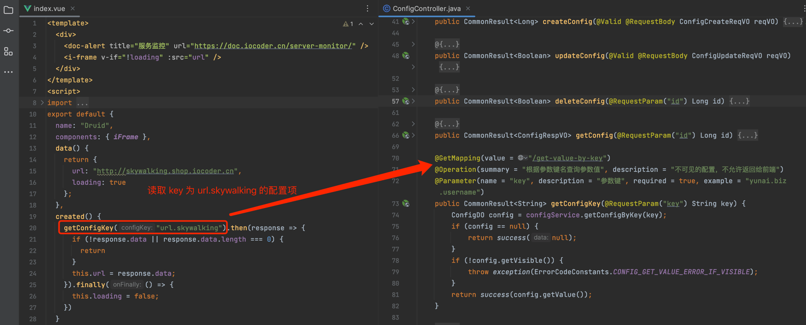

# 配置读取

在 [基础设施 -> 配置管理] 菜单，可以动态修改配置，无需重启服务器即可生效。
 提示
对应 [《后端手册 —— 配置中心》](/config-center/) 文档。
## # 1. 读取配置
前端调用 [`/@api/infra/config` (opens new window)](https://github.com/yudaocode/yudao-ui-admin-vue2/blob/master/src/api/infra/config.js#L20-L26) 的 `#getConfigKey(configKey)` 方法，获取指定 key 对应的配置的值。代码如下：
export function getConfigKey(configKey) {
return request({
url: '/infra/config/get-value-by-key?key=' + configKey,
method: 'get'
})
}
## # 2. 实战案例
在 [`src/views/infra/server/index.vue` (opens new window)](https://github.com/yudaocode/yudao-ui-admin-vue2/blob/master/src/views/infra/server/index.vue) 页面中，获取 key 为 `"url.skywalking"` 的配置的值。代码如下：
 
.pageB img{width:80px!important;}
.wwads-horizontal .wwads-text, .wwads-content .wwads-text{line-height:1;}
[通用方法](/vue2/util/) [开发规范](/admin-uniapp/dev-spec/) 
←
[通用方法](/vue2/util/) [开发规范](/admin-uniapp/dev-spec/)→
 
Theme by
[Vdoing](https://github.com/xugaoyi/vuepress-theme-vdoing) 
| Copyright © 2019-2026
芋道源码 | MIT License   
- 跟随系统
- 浅色模式
- 深色模式
- 阅读模式
× 
.windowRB{ padding: 0;}
.windowRB .wwads-img{margin-top: 10px;}
.windowRB .wwads-content{margin: 0 10px 10px 10px;}
.custom-html-window-rb .close-but{
display: none;
}