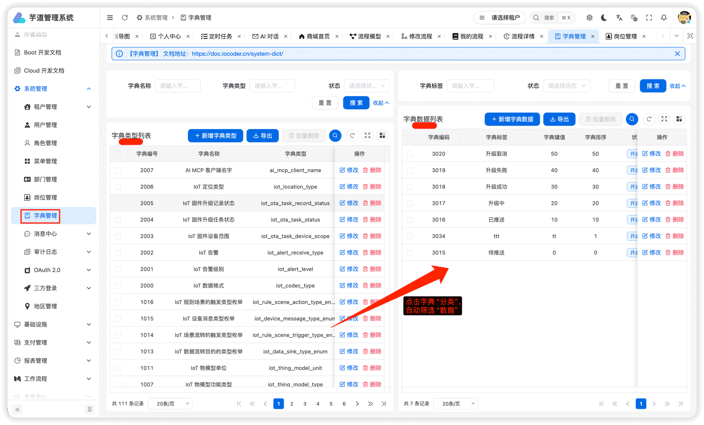
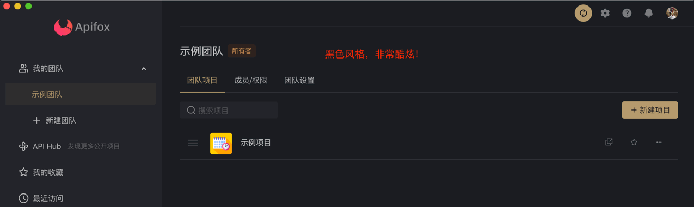
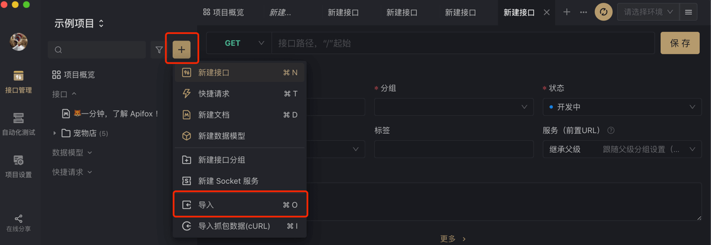

# 字典数据

本小节，讲解前端如何使用 [系统管理 -> 字典管理] 菜单的字典数据，例如说字典数据的下拉框、单选 / 多选按钮、高亮展示等等。

## # 1. 全局缓存
用户登录成功后，前端会从后端获取到全量的字典数据，缓存在 store 中。如下图所示：

这样，前端在使用到字典数据时，无需重复请求后端，提升用户体验。
不过，缓存暂时未提供刷新，所以在字典数据发生变化时，需要用户刷新浏览器，进行重新加载。
## # 2. DICT_TYPE
在 [`dict.js` (opens new window)](https://github.com/yudaocode/yudao-ui-admin-vue2/blob/master/src/utils/dict.js#L8-L58) 文件中，使用 `DICT_TYPE` 枚举了字典的 KEY。如下图所示：

后续如果有新的字典 KEY，需要你自己进行添加。
## # 3. DictTag 字典标签
[`DictTag` (opens new window)](https://github.com/yudaocode/yudao-ui-admin-vue2/blob/master/src/components/DictTag/index.vue) 组件，翻译字段对应的字典展示文本，并根据 `colorType`、`cssClass` 进行高亮。使用示例如下：
```vue
<DictTag :value="status" dictType="system_user_common_status" />
```
## # 4. 字典工具类
在 [`dict.js` (opens new window)](https://github.com/yudaocode/yudao-ui-admin-vue2/blob/master/src/utils/dict.js#L8-L58) 文件中，提供了字典工具类，方法如下：
```javascript
// 获取 dictType 对应的数据字典数组
export function getDictDatas(dictType) { /** 省略代码 */ }
// 获得 dictType + value 对应的字典展示文本
export function getDictDataLabel(dictType, value) { /** 省略代码 */ }
```
结合 Element UI 的表单组件，使用示例如下：
```vue
<template>
  <el-select v-model="value">
    <el-option
      v-for="dict in getDictDatas('system_user_common_status')"
      :key="dict.value"
      :label="dict.label"
      :value="dict.value"
    />
  </el-select>
</template>
```
