# 系统组件

## # 1. 常用组件
### # 1.1 Editor 富文本组件
基于 [wangEditor (opens new window)](https://www.wangeditor.com/) 封装
- Editor 组件：位于 [src/components/Editor (opens new window)](https://github.com/yudaocode/yudao-ui-admin-vue3/blob/master/src/components/Editor/index.ts) 内
- 详细文档：[vue-element-plus-admin-doc/components/editor.html (opens new window)](https://element-plus-admin-doc.cn/components/editor.html)
- 实战案例：[src/views/system/notice/NoticeForm.vue (opens new window)](https://github.com/yudaocode/yudao-ui-admin-vue3/blob/master/src/views/system/notice/NoticeForm.vue#L13-L15)
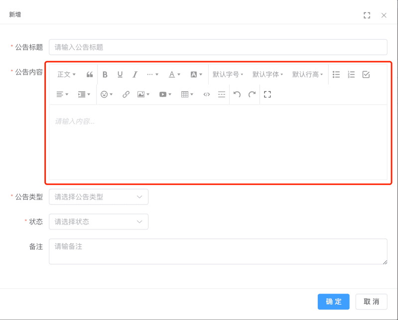 
### # 1.2 Dialog 弹窗组件
对 Element Plus 的 Dialog 组件进行封装，支持最大化、最大高度等特性
- Dialog 组件：位于 [src/components/Dialog (opens new window)](https://github.com/yudaocode/yudao-ui-admin-vue3/blob/master/src/components/Dialog/index.ts) 内
- 详细文档：[vue-element-plus-admin-doc/components/dialog.html (opens new window)](https://element-plus-admin-doc.cn/components/dialog.html)
- 实战案例：[src/views/system/dept/DeptForm.vue (opens new window)](https://github.com/yudaocode/yudao-ui-admin-vue3/blob/master/src/views/system/dept/DeptForm.vue#L2)
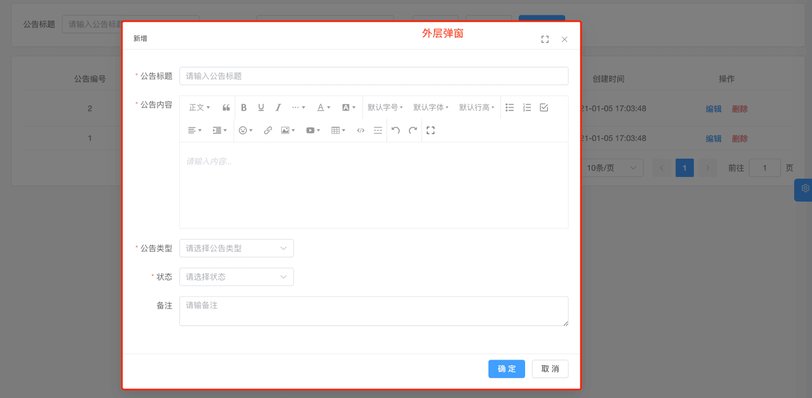 
### # 1.3 ContentWrap 包裹组件
对 Element Plus 的 ElCard 组件进行封装，自带标题、边距
- ContentWrap 组件：位于 [src/components/ContentWrap (opens new window)](https://github.com/yudaocode/yudao-ui-admin-vue3/blob/master/src/components/ContentWrap/index.ts) 内
- 实战案例：[src/views/system/post/index.vue (opens new window)](https://github.com/yudaocode/yudao-ui-admin-vue3/blob/master/src/views/system/post/index.vue#L2)
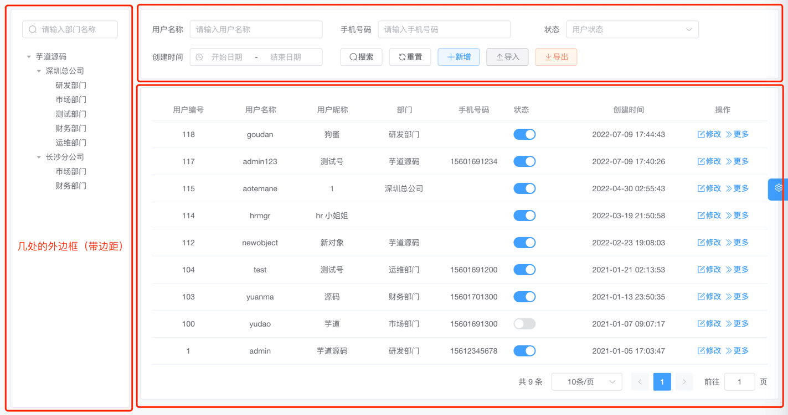 
### # 1.4 Pagination 分页组件
对 Element Plus 的 [Pagination (opens new window)](https://element-plus.org/zh-CN/component/pagination.html) 组件进行封装
- Pagination 组件：位于 [src/components/Pagination (opens new window)](https://github.com/yudaocode/yudao-ui-admin-vue3/blob/master/src/components/Pagination/index.vue) 内
- 实战案例：[src/views/system/post/index.vue (opens new window)](https://github.com/yudaocode/yudao-ui-admin-vue3/blob/master/src/views/system/post/index.vue#L101-L107)
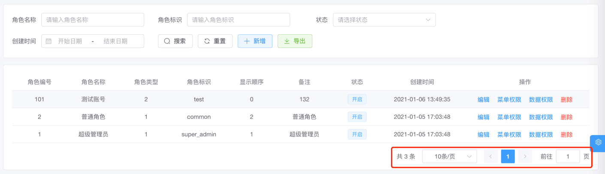 
### # 1.5 UploadFile 上传文件组件
对 Element Plus 的 [Upload (opens new window)](https://element-plus.org/zh-CN/component/upload.html) 组件进行封装，上传文件到文件服务
- UploadFile 组件：位于 [src/components/UploadFile/src/UploadFile.vue (opens new window)](https://github.com/yudaocode/yudao-ui-admin-vue3/blob/master/src/components/UploadFile/src/UploadFile.vue) 内
- 实战案例：暂无
### # 1.6 UploadImg 上传图片组件
对 Element Plus 的 [Upload (opens new window)](https://element-plus.org/zh-CN/component/upload.html) 组件进行封装，上传图片到文件服务
- UploadImg 组件：位于 [src/components/UploadFile/src/UploadImg.vue (opens new window)](https://github.com/yudaocode/yudao-ui-admin-vue3/blob/master/src/components/UploadFile/src/UploadImg.vue) 内
- 实战案例：[src/views/system/oauth2/client/ClientForm.vue (opens new window)](https://github.com/yudaocode/yudao-ui-admin-vue3/blob/master/src/views/system/oauth2/client/ClientForm.vue#L20)
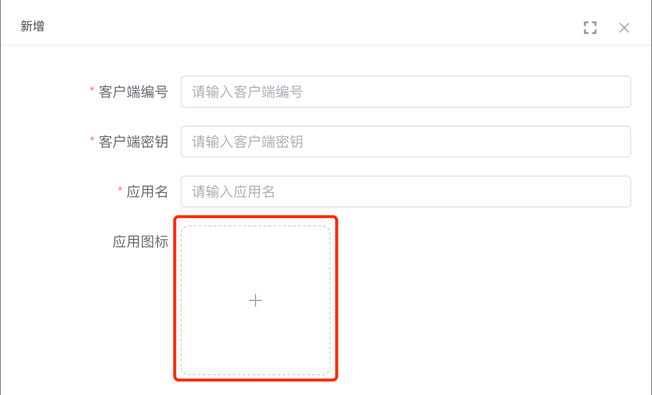 
## # 2. 不常用组件
### # 2.1 EChart 图表组件
基于 [Apache ECharts (opens new window)](https://echarts.apache.org/zh/index.html) 封装，自适应窗口大小
- EChart 组件：位于 [src/components/EChart (opens new window)](https://github.com/yudaocode/yudao-ui-admin-vue3/blob/master/src/components/Echart/index.ts) 内
- 详细文档：[vue-element-plus-admin-doc/components/echart.html (opens new window)](https://element-plus-admin-doc.cn/components/echart.html)
- 实战案例：[src/views/mp/statistics/index.vue (opens new window)](https://github.com/yudaocode/yudao-ui-admin-vue3/blob/master/src/views/mp/statistics/index.vue#L49)
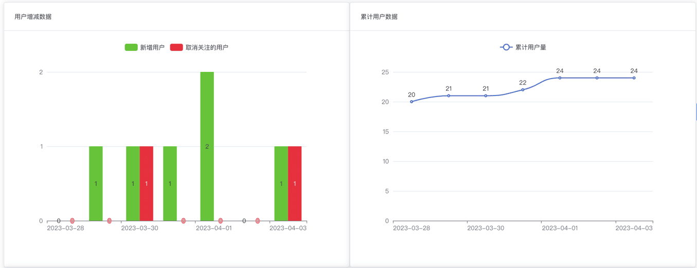 
### # 2.2 InputPassword 密码输入框
对 Element Plus 的 Input 组件进行封装
- InputPassword 组件：位于 [src/components/InputPassword (opens new window)](https://github.com/yudaocode/yudao-ui-admin-vue3/blob/master/src/components/InputPassword/index.ts) 内
- 详细文档：[vue-element-plus-admin-doc/components/input-password.html (opens new window)](https://element-plus-admin-doc.cn/components/input-password.html)
- 实战案例：[src/views/Profile/components/ResetPwd.vue (opens new window)](https://github.com/yudaocode/yudao-ui-admin-vue3/blob/master/src/views/Profile/components/ResetPwd.vue)
### # 2.3 ContentDetailWrap 详情包裹组件
用于展示详情，自带返回按钮。
- ContentDetailWrap 组件：位于 [src/components/ContentDetailWrap (opens new window)](https://github.com/yudaocode/yudao-ui-admin-vue3/blob/master/src/components/ContentDetailWrap/index.ts) 内
- 详细文档：[vue-element-plus-admin-doc/components/content-detail-wrap.html (opens new window)](https://element-plus-admin-doc.cn/components/content-detail-wrap.html)
- 实战案例：暂无
### # 2.4 ImageViewer 图片预览组件
将 Element Plus 的 [ImageViewer (opens new window)](https://element-plus.org/zh-CN/component/image.html#image-viewer-attributes) 组件函数化，通过函数方便创建组件
- ImageViewer 组件：位于 [src/components/ImageViewer (opens new window)](https://github.com/yudaocode/yudao-ui-admin-vue3/blob/master/src/components/ImageViewer/index.ts) 内
- 详细文档：[vue-element-plus-admin-doc/components/image-viewer.html (opens new window)](https://element-plus-admin-doc.cn/components/image-viewer.html)
- 实战案例：暂无
### # 2.5 Qrcode 二维码组件
基于 [qrcode (opens new window)](https://www.npmjs.com/package/qrcode) 封装
- Qrcode 组件：位于 [src/components/Qrcode (opens new window)](https://github.com/yudaocode/yudao-ui-admin-vue3/blob/master/src/components/Qrcode/index.ts) 内
- 详细文档：[vue-element-plus-admin-doc/components/qrcode.html (opens new window)](https://element-plus-admin-doc.cn/components/qrcode.html)
- 实战案例：暂无
 
### # 2.6 Highlight 高亮组件
- Highlight 组件：位于 [src/components/Highlight (opens new window)](https://github.com/yudaocode/yudao-ui-admin-vue3/blob/master/src/components/Highlight/index.ts) 内
- 详细文档：[vue-element-plus-admin-doc/components/highlight.html (opens new window)](https://element-plus-admin-doc.cn/components/highlight.html)
- 实战案例：暂无
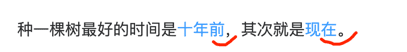 
#### # 2.6.1 Infotip 信息提示组件
基于 Highlight 组件封装
- Infotip 组件：位于 [src/components/Infotip (opens new window)](https://github.com/yudaocode/yudao-ui-admin-vue3/blob/master/src/components/Infotip/index.ts) 内
- 详细文档：[vue-element-plus-admin-doc/components/infotip.html (opens new window)](https://element-plus-admin-doc.cn/components/infotip.html)
- 实战案例：暂无
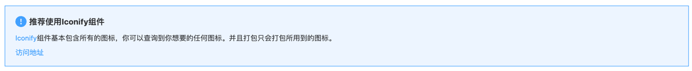 
### # 2.7 Error 缺省组件
用于各种占位图组件，如 404、403、500 等错误页面。
- Error 组件：位于 [src/components/Error (opens new window)](https://github.com/yudaocode/yudao-ui-admin-vue3/blob/master/src/components/Error/index.ts) 内
- 详细文档：[vue-element-plus-admin-doc/components/error.html (opens new window)](https://element-plus-admin-doc.cn/components/error.html)
- 实战案例：[403.vue (opens new window)](https://github.com/yudaocode/yudao-ui-admin-vue3/blob/master/src/views/Error/403.vue)、[404.vue (opens new window)](https://github.com/yudaocode/yudao-ui-admin-vue3/blob/master/src/views/Error/404.vue)、[500.vue (opens new window)](https://github.com/yudaocode/yudao-ui-admin-vue3/blob/master/src/views/Error/500.vue)
### # 2.8 Sticky 黏性组件
- Sticky 组件：位于 [src/components/Sticky (opens new window)](https://github.com/yudaocode/yudao-ui-admin-vue3/blob/master/src/components/Sticky/index.ts) 内
- 详细文档：[vue-element-plus-admin-doc/components/sticky.html (opens new window)](https://element-plus-admin-doc.cn/components/sticky.html)
- 实战案例：暂无
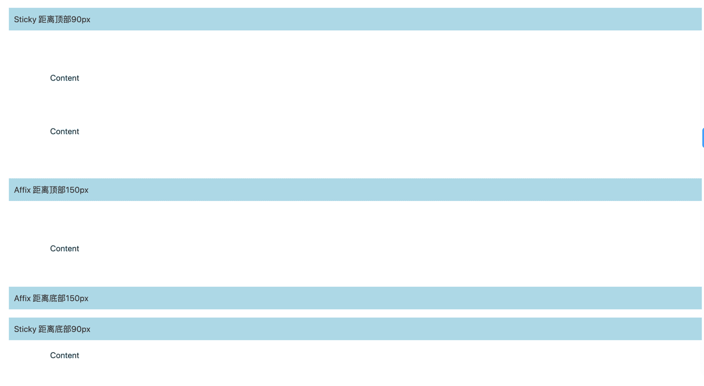 
### # 2.9 CountTo 数字动画组件
- CountTo 组件：位于 [src/components/CountTo (opens new window)](https://github.com/yudaocode/yudao-ui-admin-vue3/blob/master/src/components/CountTo/index.ts) 内
- 详细文档：[vue-element-plus-admin-doc/components/count-to.html (opens new window)](https://element-plus-admin-doc.cn/components/count-to.html)
- 实战案例：暂无
### # 2.10 useWatermark 水印组件
为元素设置水印
- useWatermark 组件：位于 [src/hooks/web/useWatermark.ts (opens new window)](https://github.com/yudaocode/yudao-ui-admin-vue3/blob/master/src/hooks/web/useWatermark.ts) 内
- 详细文档：[vue-element-plus-admin-doc/hooks/useWatermark.html (opens new window)](https://element-plus-admin-doc.cn/hooks/useWatermark.html)
- 实战案例：暂无
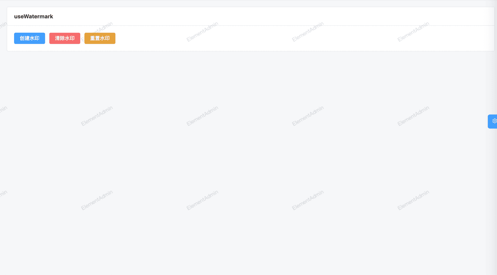 
### # 2.11 form-create 动态表单生成器
详细文档：[http://www.form-create.com/ (opens new window)](http://www.form-create.com/)
① 实战案例 - 表单设计：[src/views/infra/build/index.vue (opens new window)](https://github.com/yudaocode/yudao-ui-admin-vue3/blob/master/src/views/infra/build/index.vue)
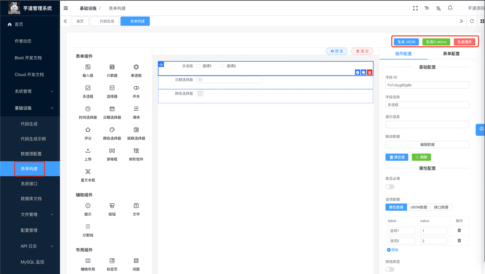 ② 实战案例 - 表单展示：[src/views/bpm/processInstance/detail/index.vue (opens new window)](https://github.com/yudaocode/yudao-ui-admin-vue3/blob/master/src/views/bpm/processInstance/detail/index.vue#L62-L67)
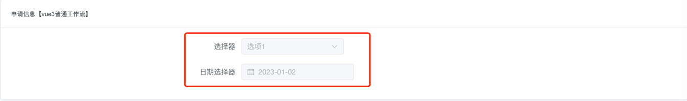 
### # 2.12 bpmn-js 工作流组件
核心是基于 [bpmn-js (opens new window)](https://bpmn.io/toolkit/bpmn-js/) 封装
#### # 2.12.1 MyProcessDesigner 流程设计组件
- MyProcessDesigner 组件：位于 [src/components/bpmnProcessDesigner/package/designer/index.ts (opens new window)](https://github.com/yudaocode/yudao-ui-admin-vue3/blob/master/src/components/bpmnProcessDesigner/package/designer/index.ts) 内，基于 [https://gitee.com/MiyueSC/bpmn-process-designer (opens new window)](https://gitee.com/MiyueSC/bpmn-process-designer) 项目适配
- 实战案例：[src/views/bpm/model/form/editor/index.vue (opens new window)](https://github.com/yudaocode/yudao-ui-admin-vue3/blob/master/src/views/bpm/model/form/editor/index.vue)
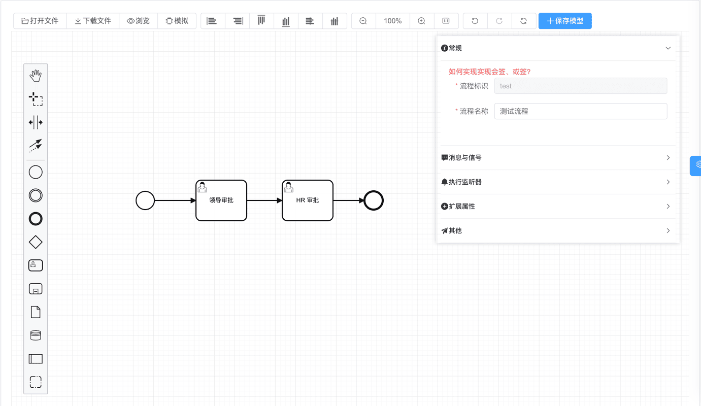 
#### # 2.12.2 MyProcessViewer 流程展示组件
- MyProcessViewer 组件：位于 [src/components/bpmnProcessDesigner/package/designer/index2.ts (opens new window)](https://github.com/yudaocode/yudao-ui-admin-vue3/blob/master/src/components/bpmnProcessDesigner/package/designer/index2.ts) 内
- 实战案例：[src/views/bpm/processInstance/detail/ProcessInstanceBpmnViewer.vue (opens new window)](https://github.com/yudaocode/yudao-ui-admin-vue3/blob/master/src/views/bpm/processInstance/detail/ProcessInstanceBpmnViewer.vue#L6-L14)
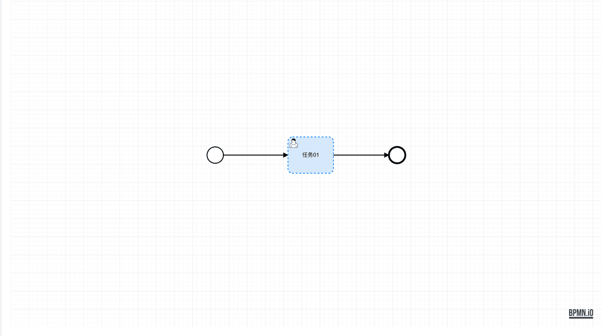 
## # 3. 组件注册
友情提示：
该小节，基于 [《vue element plus admin —— 组件注册 》 (opens new window)](https://element-plus-admin-doc.cn/guide/component.html) 的内容修改。
组件注册可以分成两种类型：按需引入、全局注册。
### # 3.1 按需引入
项目目前的组件注册机制是按需注册，是在需要用到的页面才引入。
import { ElBacktop } from 'element-plus'
import { useDesign } from '@/hooks/web/useDesign'
const { getPrefixCls, variables } = useDesign()
const prefixCls = getPrefixCls('backtop')
注意：**tsx 文件内不能使用全局注册组件**，需要手动引入组件使用。
### # 3.2 全局注册
如果觉得按需引入太麻烦，可以进行全局注册，在 [src/components/index.ts (opens new window)](https://github.com/yudaocode/yudao-ui-admin-vue3/blob/master/src/components/index.ts)，添加需要注册的组件。
以 `Icon` 组件进行了全局注册，举个例子：
import type { App } from 'vue'
import { Icon } from './Icon'
export const setupGlobCom = (app: App): void => {
app.component('Icon', Icon)
}
如果 Element Plus 的组件需要全局注册，在 [src/plugins/elementPlus/index.ts (opens new window)](https://github.com/yudaocode/yudao-ui-admin-vue3/blob/master/src/plugins/elementPlus/index.ts) 添加需要注册的组件。
以 Element Plus 中只有 `ElLoading` 与 `ElScrollbar` 进行全局注册，举个例子：
import type { App } from 'vue'
// 需要全局引入一些组件，如 ElScrollbar，不然一些下拉项样式有问题
import { ElLoading, ElScrollbar } from 'element-plus'
const plugins = [ElLoading]
const components = [ElScrollbar]
export const setupElementPlus = (app: App) => {
plugins.forEach((plugin) => {
app.use(plugin)
})
components.forEach((component) => {
app.component(component.name, component)
})
}
.pageB img{width:80px!important;}
.wwads-horizontal .wwads-text, .wwads-content .wwads-text{line-height:1;}
[字典数据](/vue3/dict/) [通用方法](/vue3/util/) 
←
[字典数据](/vue3/dict/) [通用方法](/vue3/util/)→
 
Theme by
[Vdoing](https://github.com/xugaoyi/vuepress-theme-vdoing) 
| Copyright © 2019-2026
芋道源码 | MIT License   
- 跟随系统
- 浅色模式
- 深色模式
- 阅读模式
× 
.windowRB{ padding: 0;}
.windowRB .wwads-img{margin-top: 10px;}
.windowRB .wwads-content{margin: 0 10px 10px 10px;}
.custom-html-window-rb .close-but{
display: none;
}