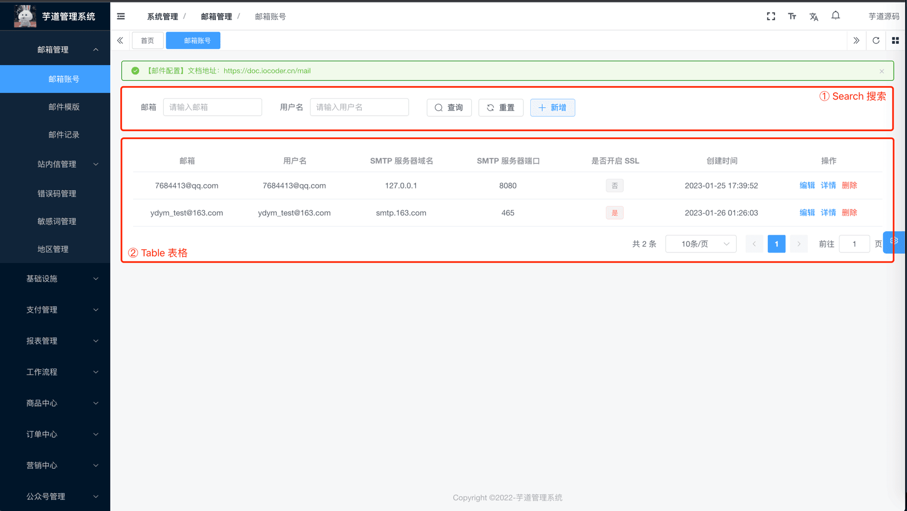
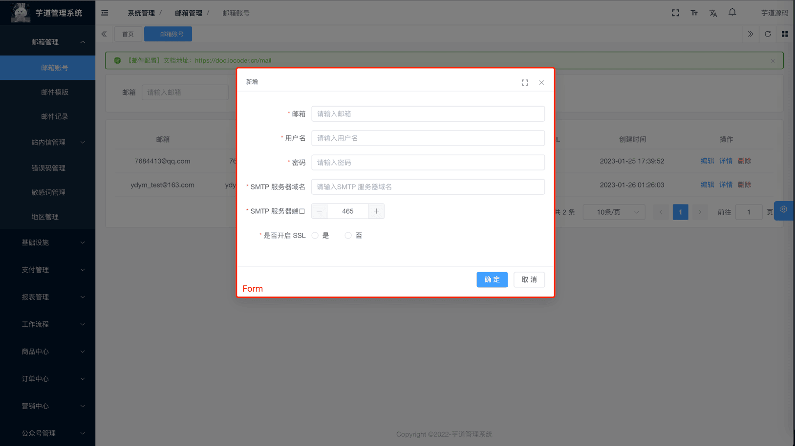
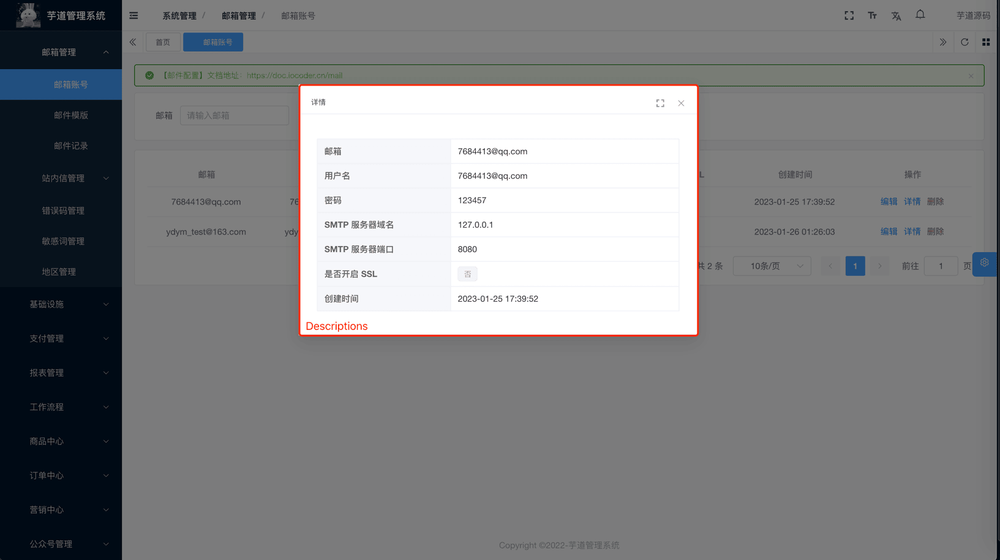
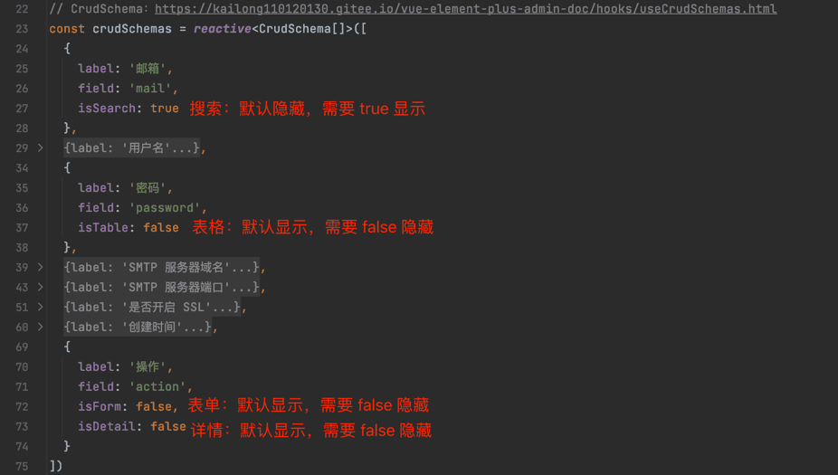
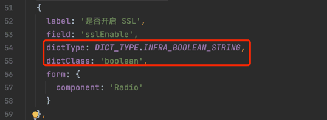
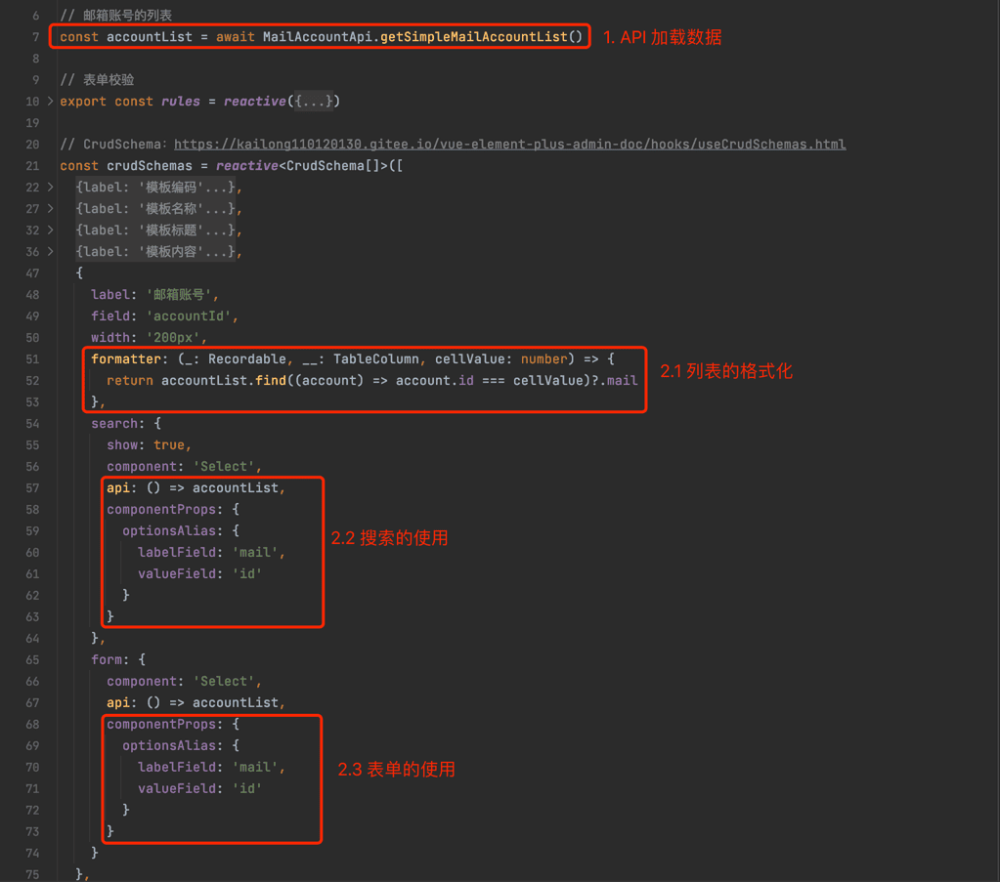
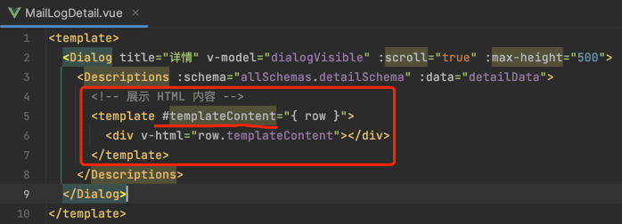

# CRUD 组件

友情提示：
CRUD 组件，比较适合开发简单的 CRUD 功能。如果是复杂的功能，使用起来会比较困难。所以一般情况下，我们还是建议使用 Element Plus 的原生组件。
管理后台的功能，一般就是 CRUD 增删改查，可以拆分 3 个部分：“列表”、“新增/修改”、“详情”，如下图所示：
| 部分 | 组件 | 示例 |
| --- | --- | --- |
| 列表 | Search + Table |  新增 / 修改 | Form |  详情 | Descriptions |  ## # 1. 基础组件 涉及到 4 个前端基础组件，如下所示： 组件 | 文档 |
| [Search (opens new window)](https://github.com/yudaocode/yudao-ui-admin-vue3/blob/master/src/components/Search/src/Search.vue) | [查询组件 (opens new window)](https://element-plus-admin-doc.cn/components/search.html) |
| [Table (opens new window)](https://github.com/yudaocode/yudao-ui-admin-vue3/blob/master/src/components/Table/src/Table.vue) | [表格组件 (opens new window)](https://element-plus-admin-doc.cn/components/table.html) |
| [Form (opens new window)](https://github.com/yudaocode/yudao-ui-admin-vue3/blob/master/src/components/Form/src/Form.vue) | [表单组件 (opens new window)](https://element-plus-admin-doc.cn/components/form.html) |
| [Descriptions (opens new window)](https://github.com/yudaocode/yudao-ui-admin-vue3/blob/master/src/components/Descriptions/src/Descriptions.vue) | [描述组件 (opens new window)](https://element-plus-admin-doc.cn/components/descriptions.html) |
## # 2. CRUD 组件
由于以上 4 个组件都需要 Schema 或者 `columns` 的字段，如果每个组件都写一遍的话，会造成大量重复代码，所以提供 useCrudSchemas 来进行统一的数据生成。
① useCrudSchemas：位于 [src/hooks/web/useCrudSchemas.ts (opens new window)](https://github.com/yudaocode/yudao-ui-admin-vue3/blob/master/src/hooks/web/useCrudSchemas.ts) 内
② useCrudSchemas 可以理解成一个 JSON 配置，示例如下：
useCrudSchemas 示例 
import { CrudSchema, useCrudSchemas } from '@/hooks/web/useCrudSchemas'
const crudSchemas = reactive([
{
field: 'index',
label: t('tableDemo.index'),
type: 'index',
form: {
show: false
},
detail: {
show: false
}
},
{
field: 'title',
label: t('tableDemo.title'),
search: {
show: true
},
form: {
colProps: {
span: 24
}
},
detail: {
span: 24
}
},
{
field: 'author',
label: t('tableDemo.author')
},
{
field: 'display_time',
label: t('tableDemo.displayTime'),
form: {
component: 'DatePicker',
componentProps: {
type: 'datetime',
valueFormat: 'YYYY-MM-DD HH:mm:ss'
}
}
},
{
field: 'importance',
label: t('tableDemo.importance'),
formatter: (_: Recordable, __: TableColumn, cellValue: number) => {
return h(
ElTag,
{
type: cellValue === 1 ? 'success' : cellValue === 2 ? 'warning' : 'danger'
},
() =>
cellValue === 1
? t('tableDemo.important')
: cellValue === 2
? t('tableDemo.good')
: t('tableDemo.commonly')
)
},
form: {
component: 'Select',
componentProps: {
options: [
{
label: '重要',
value: 3
},
{
label: '良好',
value: 2
},
{
label: '一般',
value: 1
}
]
}
}
},
{
field: 'pageviews',
label: t('tableDemo.pageviews'),
form: {
component: 'InputNumber',
value: 0
}
},
{
field: 'content',
label: t('exampleDemo.content'),
table: {
show: false
},
form: {
component: 'Editor',
colProps: {
span: 24
}
},
detail: {
span: 24
}
},
{
field: 'action',
width: '260px',
label: t('tableDemo.action'),
form: {
show: false
},
detail: {
show: false
}
}
])
const { allSchemas } = useCrudSchemas(crudSchemas)
③ 字段的详细说明，可见 [useCrudSchemas 文档 (opens new window)](https://element-plus-admin-doc.cn/hooks/useCrudSchemas.html)。
## # 3. 实战案例
项目的 [系统管理 -> 邮箱管理] 相关的功能，都使用 CRUD 实现，你可以自己去学习。
| 功能 | 代码 |
| --- | --- |
| 邮箱账号 | [src/views/system/mail/account (opens new window)](https://github.com/yudaocode/yudao-ui-admin-vue3/blob/master/src/views/system/mail/account/) |
| 邮箱模版 | [src/views/system/mail/template (opens new window)](https://github.com/yudaocode/yudao-ui-admin-vue3/blob/master/src/views/system/mail/template/) |
| 邮箱记录 | [src/views/system/mail/log (opens new window)](https://github.com/yudaocode/yudao-ui-admin-vue3/blob/master/src/views/system/mail/log/) |
## # 4. 常见问题
### # 4.1 如何隐藏某个字段？
如 `formSchema` 不需要 `field` 为 `createTime` 的字段，可以使用 `form: { show: false }` 或 `isForm: false` 进行过滤，其他组件同理。
 
### # 4.2 如何使用数据字典？
设置 `dictType` 字典的类型，和 `dictClass` 字典的数据类型。
 
### # 4.3 如何使用 API 获取数据？
使用 `api` 来获取接口数据，需要主动 `return` 数据。
 
### # 4.4 如何结合 Slot 自定义？
如果想要自定义，可以结合 Slot 来实现。具体有哪些 Slot，阅读对应基础组件的文档。
 
.pageB img{width:80px!important;}
.wwads-horizontal .wwads-text, .wwads-content .wwads-text{line-height:1;}
[配置读取](/vue3/config-center/) [国际化](/vue3/i18n/) 
←
[配置读取](/vue3/config-center/) [国际化](/vue3/i18n/)→
 
Theme by
[Vdoing](https://github.com/xugaoyi/vuepress-theme-vdoing) 
| Copyright © 2019-2026
芋道源码 | MIT License   
- 跟随系统
- 浅色模式
- 深色模式
- 阅读模式
× 
.windowRB{ padding: 0;}
.windowRB .wwads-img{margin-top: 10px;}
.windowRB .wwads-content{margin: 0 10px 10px 10px;}
.custom-html-window-rb .close-but{
display: none;
}