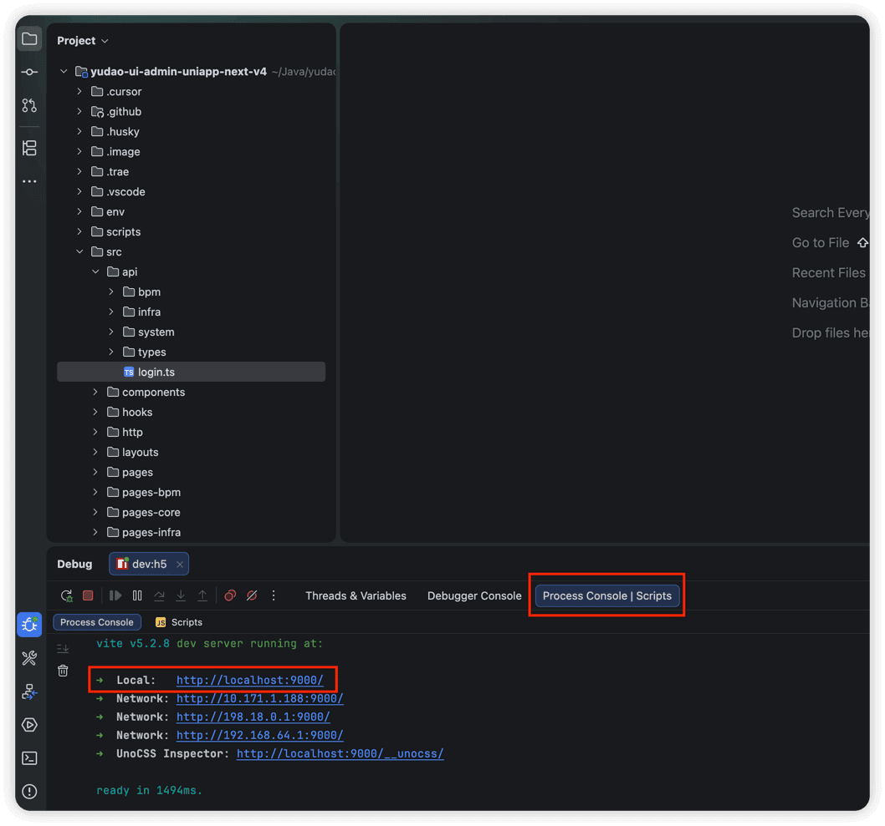
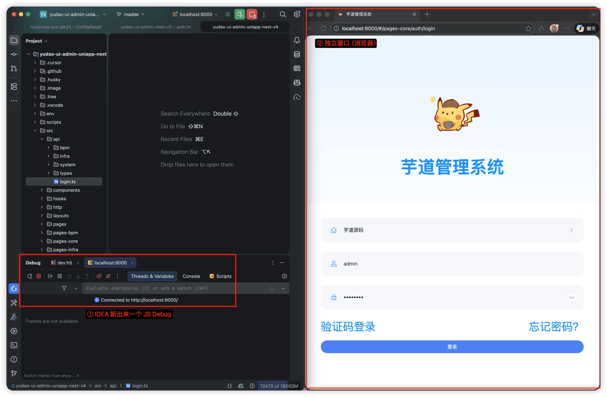
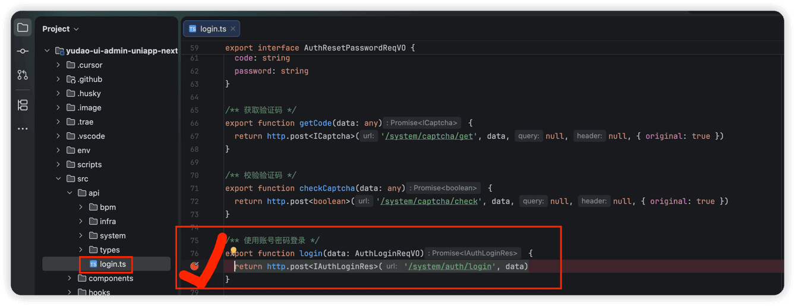
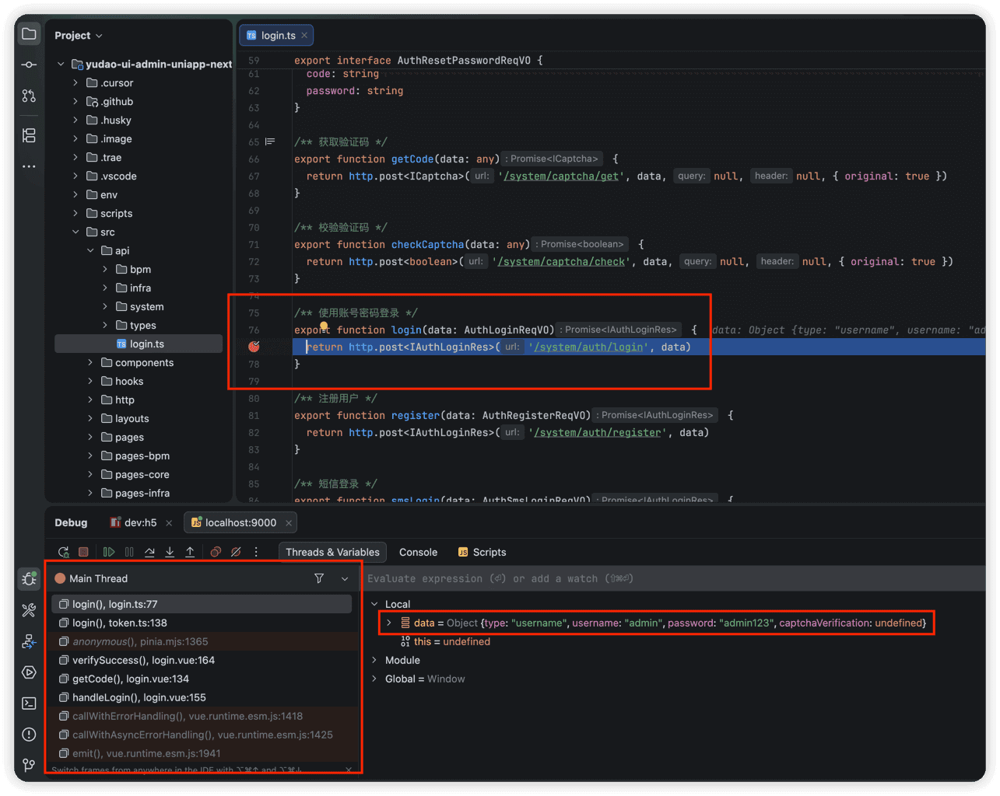
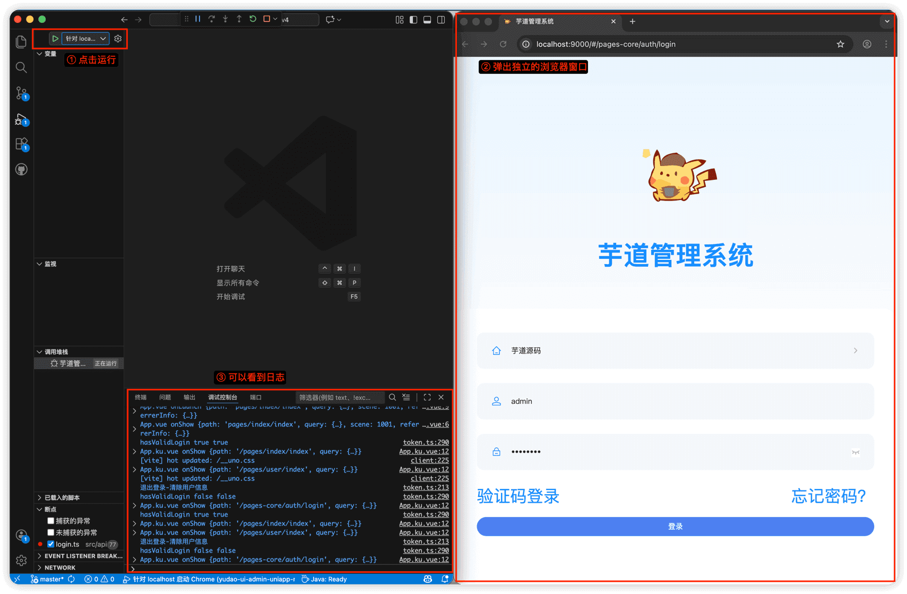
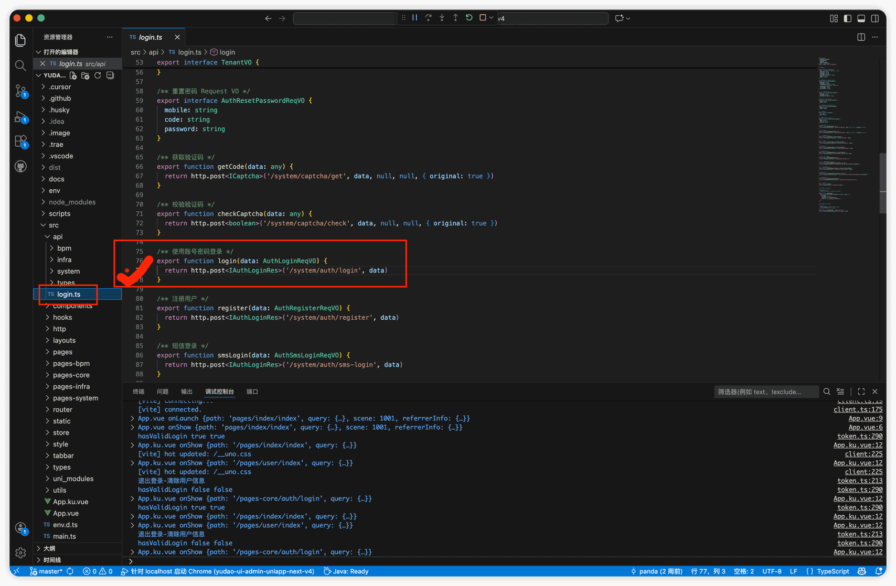
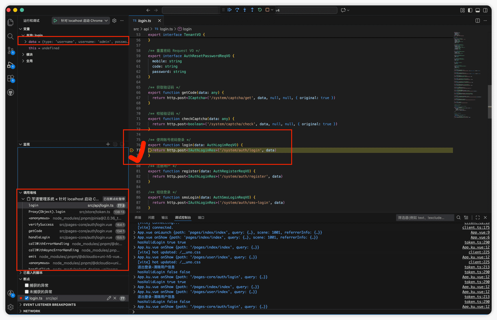

# IDE 调试

除了使用 Chrome 调试 JS 代码外，我们也可以使用 IDEA / WebStorm 或 VS Code 进行代码的调试。
## # 1. IDEA 调试
友情提示：WebStorm 也支持。
① 使用 npm 命令将前端项目运行起来，例如说 `npm run dev`。耐心等待项目启动成功~
② 点击链接，Windows 需按住 Ctrl + Shift + 鼠标左键，MacOS 需要按住 Shift + Command + 鼠标左键。如下图所示：
 ③ 点击后，会跳出一个独立的 Chrome 窗口。如下图所示：
 ④ 打个断点，例如说 `/src/api/login/index.ts` 的登录接口。如下图所示：
 ⑤ 使用管理后台进行登录，可以看到成功进入断点。如下图所示：
 
## # 2. VS Code 调试
① 使用 npm 命令将前端项目运行起来，例如说 `npm run dev`。耐心等待项目启动成功~
② 点击 VS Code 左侧的运行和调试，然后启动 Launch，之后会跳出一个独立的 Edge 窗口。如下图所示：
 ③ 打个断点，例如说 `/src/api/login/index.ts` 的登录接口。如下图所示：
 ④ 使用管理后台进行登录，可以看到成功进入断点。如下图所示：
 
.pageB img{width:80px!important;}
.wwads-horizontal .wwads-text, .wwads-content .wwads-text{line-height:1;}
[国际化](/vue3/i18n/) [代码格式化](/vue3/format/) 
←
[国际化](/vue3/i18n/) [代码格式化](/vue3/format/)→
 
Theme by
[Vdoing](https://github.com/xugaoyi/vuepress-theme-vdoing) 
| Copyright © 2019-2026
芋道源码 | MIT License   
- 跟随系统
- 浅色模式
- 深色模式
- 阅读模式
× 
.windowRB{ padding: 0;}
.windowRB .wwads-img{margin-top: 10px;}
.windowRB .wwads-content{margin: 0 10px 10px 10px;}
.custom-html-window-rb .close-but{
display: none;
}