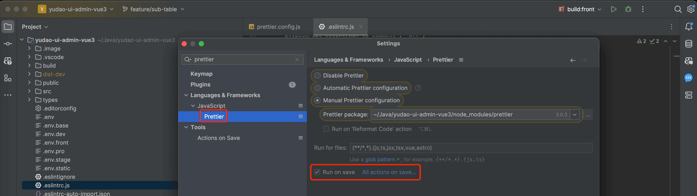
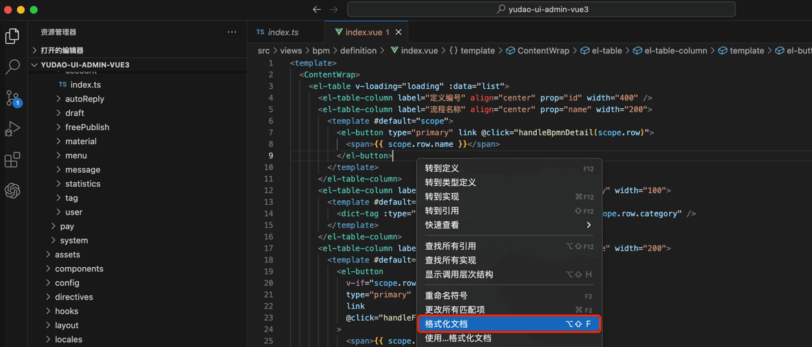

# 代码格式化

项目使用 [Prettier](https://prettier.io/) 进行代码格式化，配置文件在 [`prettier.config.js`](https://github.com/yudaocode/yudao-ui-admin-vue3/blob/master/prettier.config.js)。
## # 1. 如何开启？
考虑到 Prettier 在检测到格式不正确时，会弹窗错误提示，影响大家开发效率，所以目前 **默认关闭** 。
如果想要开启，只修改修改 [`.eslintrc.js`](https://github.com/yudaocode/yudao-ui-admin-vue3/blob/master/.eslintignore) 文件，将 `'prettier/prettier': 'off'` 删除即可。
## # 2. 自动格式化
JetBrains 和 VS Code 可以通过安装 Prettier 插件，实现按照 Prettier 自动格式化。这样，无论 Prettier 无论是否开启，都可以保证格式化的一致性。
### # 2.1 JetBrains 端
① 安装 [Prettier 插件](https://plugins.jetbrains.com/plugin/10456-prettier)。默认 IDEA 和 WebStorm 已经安装，所以这步可以省略。
② 打开 Prettier 配置，勾选上 `Run on save` 选项。如下图所示：
 之后，保存页面，页面代码自动格式化。
## # 2.2 VS Code 端
① 安装 [Prettier 插件](https://marketplace.visualstudio.com/items?itemName=esbenp.prettier-vscode)。需要手动安装！
② 打开 VS Code 配置，搜索 save 后，勾选上 `Format On Save` 选项。如下图所示：
 ③ 随便打开一个 Vue 文件，右键选择 `Format Document` 或者 `格式化文档`，然后选择 Prettier 即可。如下图所示：
 之后，保存页面，页面代码自动格式化。
.pageB img{width:80px!important;}
.wwads-horizontal .wwads-text, .wwads-content .wwads-text{line-height:1;}
[IDE 调试](/vue3/debugger/) [开发规范](/vben5/dev-spec/) 
←
[IDE 调试](/vue3/debugger/) [开发规范](/vben5/dev-spec/)→
 
Theme by
[Vdoing](https://github.com/xugaoyi/vuepress-theme-vdoing) 
| Copyright © 2019-2026
芋道源码 | MIT License   
- 跟随系统
- 浅色模式
- 深色模式
- 阅读模式
× 
.windowRB{ padding: 0;}
.windowRB .wwads-img{margin-top: 10px;}
.windowRB .wwads-content{margin: 0 10px 10px 10px;}
.custom-html-window-rb .close-but{
display: none;
}