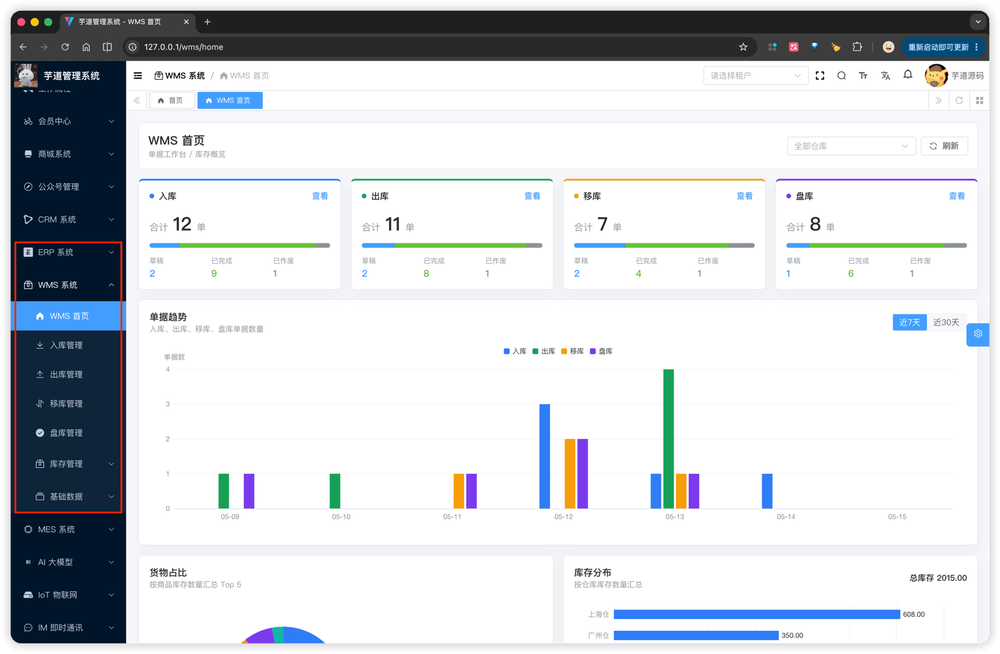

# 功能开启

进度说明：
- 管理后台，请使用 [https://gitee.com/yudaocode/yudao-ui-admin-vue3](https://gitee.com/yudaocode/yudao-ui-admin-vue3) 仓库的 `master` 分支
- 后端项目，请使用 [https://gitee.com/zhijiantianya/ruoyi-vue-pro](https://gitee.com/zhijiantianya/ruoyi-vue-pro) 仓库的 `master`（JDK8） 或 `master-jdk17`（JDK17/21） 分支
WMS 系统，后端由 `yudao-module-wms` 模块实现，前端由 `yudao-ui-admin-vue3` 的 `wms` 目录实现。
考虑到编译速度，默认 `yudao-module-wms` 模块是关闭的，需要手动开启。步骤如下：
- 第一步，开启 `yudao-module-wms` 模块
- 第二步，导入 WMS 系统的 SQL 数据库脚本
- 第三步，重启后端项目，确认功能是否生效
## # 1. 第一步，开启模块
① 修改根目录的 [`pom.xml`](https://github.com/YunaiV/ruoyi-vue-pro/blob/master/pom.xml) 文件，取消 `yudao-module-wms` 模块的注释。如下图所示：
 ② 修改 `yudao-server` 目录的 [`pom.xml`](https://github.com/YunaiV/ruoyi-vue-pro/blob/master/yudao-server/pom.xml) 文件，引入 `yudao-module-wms` 模块。如下图所示：
 ③ 点击 IDEA 右上角的【Reload All Maven Projects】，刷新 Maven 依赖。如下图所示：
 
## # 2. 第二步，导入 SQL
点击 [`wms.sql.zip`](https://t.zsxq.com/bq609) 下载附件，解压出 SQL 文件，然后导入到数据库中。如下图所示：
友情提示：↑↑↑ wms.sql 是可以点击下载的！ ↑↑↑
重要说明：该 SQL 仅芋道星球成员可使用和商用，否则视为侵权（索赔 100 万，永久追溯）【下载即视为同意】。
 以 `wms_` 作为前缀的表，就是 WMS 模块的表，一共 **16** 张，按业务模块分为：
| 子前缀 | 模块 | 表数量 |
| --- | --- | --- |
| `wms_warehouse` / `wms_item*` / `wms_merchant` | 基础数据 | 6 |
| `wms_inventory*` | 库存管理 | 2 |
| `wms_receipt_order*` | 入库单 | 2 |
| `wms_shipment_order*` | 出库单 | 2 |
| `wms_movement_order*` | 移库单 | 2 |
| `wms_check_order*` | 盘库单 | 2 |
## # 3. 第三步，重启项目
重启后端项目，然后访问前端的 WMS 菜单，确认功能是否生效。如下图所示：
 至此，我们就成功开启了 WMS 的功能 🙂
## # 4. 全局说明
① 入库 / 出库 / 移库 / 盘库四类业务单据的**单据编号**，由前端在新增时按 `前缀 + 月日 + 4 位随机数` 默认生成（入库 `RK`、出库 `CK`、移库 `YK`、盘库 `PK`，如 `RK05151234`），允许用户手动修改，由后端校验唯一性。
② 上述四类单据均为「**主子表**」结构。先新增主表记录，保存后弹窗自动切换为编辑模式，再在弹窗中维护明细子表。
③ 单据统一采用「**草稿 → 已完成 / 已作废**」两阶段状态流转：草稿阶段为单据起草，可自由编辑；**"完成"操作**才触发库存事务，将变更写入 `wms_inventory`（当前库存）与 `wms_inventory_history`（流水），同时把单据状态置为"已完成"。
④ 首页基础报表（`WMS 系统 -> 首页`）由 WmsHomeStatisticsController 提供，**直接聚合** `wms_inventory` 与 `wms_inventory_history` 的关键指标输出，不写入新表。
.pageB img{width:80px!important;}
.wwads-horizontal .wwads-text, .wwads-content .wwads-text{line-height:1;}
[WMS 演示](/wms-preview/) [【基础】仓库](/wms/md/warehouse/) 
←
[WMS 演示](/wms-preview/) [【基础】仓库](/wms/md/warehouse/)→
 
Theme by
[Vdoing](https://github.com/xugaoyi/vuepress-theme-vdoing) 
| Copyright © 2019-2026
芋道源码 | MIT License   
- 跟随系统
- 浅色模式
- 深色模式
- 阅读模式
× 
.windowRB{ padding: 0;}
.windowRB .wwads-img{margin-top: 10px;}
.windowRB .wwads-content{margin: 0 10px 10px 10px;}
.custom-html-window-rb .close-but{
display: none;
}