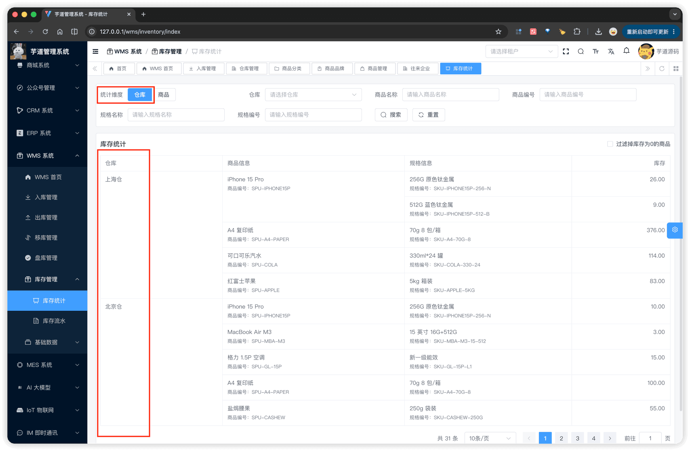
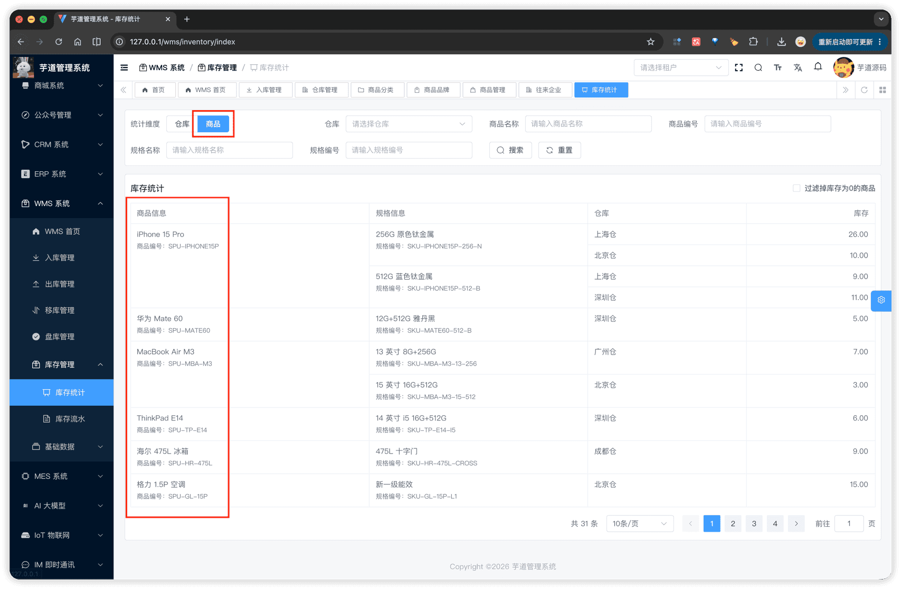
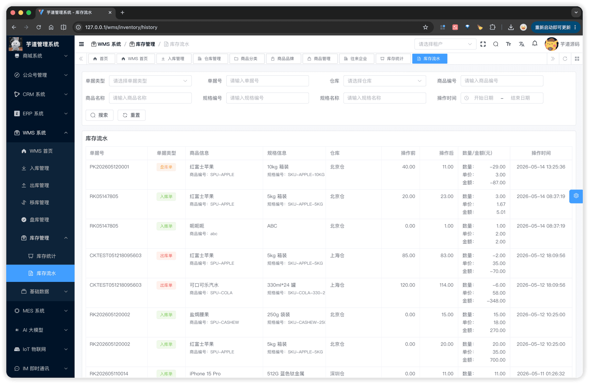
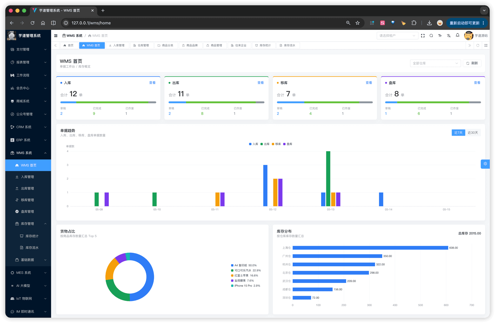

# 【库存】库存记录、流水、统计

库存模块由 **2 张数据表** + 1 个事务服务组成，对应下文 3 节：
- §1 **库存记录**（`wms_inventory` 表）：按 `仓库 + SKU` 聚合的**实时**数量。用户**只读**，无直接 CRUD 接口。
- §2 **库存流水**（`wms_inventory_history` 表）：每次库存变更明细，记录变化前 / 后 / 差量 + 来源单据。
- §3 **库存事务**（WmsInventoryServiceImpl）：统一封装库存变更逻辑，对外暴露两个核心方法 `changeInventory` 与 `checkInventory`，被入库 / 出库 / 移库 / 盘库各类单据完成时调用，**同事务**写库存记录 + 流水。
库存模块由 `yudao-module-wms` 后端模块的 `inventory` 与 `home` 包实现，前端实现在 `@/views/wms/inventory` 与 `@/views/wms/home` 目录。文末另有 §4 [首页统计](#_4-%E9%A6%96%E9%A1%B5%E7%BB%9F%E8%AE%A1)，基于上述两张表聚合输出 dashboard 指标，不写入新表。
## # 1. 库存记录
库存记录，由 WmsInventoryController 提供接口（`/wms/inventory`）。仅暴露 `/page` 与 `/list` 两个**只读**查询接口，没有 create / update / delete —— 库存数量统一由库存事务在单据完成时写入。
### # 1.1 表结构
省略 creator/create_time/updater/update_time/deleted/tenant_id 等通用字段
CREATE TABLE `wms_inventory` (
`id` bigint NOT NULL AUTO_INCREMENT COMMENT '编号',
`sku_id` bigint NOT NULL COMMENT '商品 SKU 编号',
`warehouse_id` bigint NOT NULL COMMENT '仓库编号',
`quantity` decimal(14,3) NOT NULL DEFAULT '0.000' COMMENT '库存数量',
`remark` varchar(255) DEFAULT NULL COMMENT '备注',
PRIMARY KEY (`id`),
UNIQUE KEY `uk_sku_warehouse` (`sku_id`, `warehouse_id`)
) ENGINE=InnoDB COMMENT='WMS 库存';
① `sku_id` + `warehouse_id` 组合**唯一索引**：每个 SKU 在每个仓库下只有一行库存记录。首次出现的组合，由库存事务自动插入 `quantity = 0` 的行（详见 [§3 库存事务](#_3-%E5%BA%93%E5%AD%98%E4%BA%8B%E5%8A%A1)）。
② `quantity` 库存数量，**系统自动维护**，用户无法直接修改。仅由库存事务在单据完成时批量更新。
### # 1.2 管理后台
对应 [WMS 系统 -> 库存管理] 菜单，对应 `yudao-ui-admin-vue3` 项目的 `@/views/wms/inventory/index` 目录。
页面提供「仓库」「商品」两种**统计维度**切换（`el-radio-group`），切换后列表的列顺序随之调整：
- **仓库维度**：仓库 → 商品 → 规格 → 库存（合并仓库 / 商品的重复单元格）。
- **商品维度**：商品 → 规格 → 仓库 → 库存。
支持按仓库、商品名 / 编号、规格名 / 编号筛选，并提供「过滤掉库存为 0 的商品」复选框（接口参数 `onlyPositiveQuantity`）。
  
### # 1.3 库存选择器
`InventorySelect.vue`（`@/views/wms/inventory/components/InventorySelect.vue`）是**出库 / 移库**单据明细行选择"可用库存"的统一弹窗组件（宽 80% Dialog）。与商品 SKU 选择器（[§1.4 SKU 选择器](/wms/md/item/#_1-4-sku-选择器)）的关键差异：
| 维度 | SKU 选择器（`ItemSkuSelect.vue`） | 库存选择器（`InventorySelect.vue`） |
| --- | --- | --- |
| 数据源 | `wms_item_sku`（全量 SKU） | `wms_inventory`（按 `仓库 + SKU` 的库存行，且仅取 `quantity > 0`） |
| 使用场景 | 入库（加库存）、盘库（手工添加首次出现的 SKU 行） | 出库、移库 —— 必须基于现有库存的"扣减 / 转移"类操作 |
| props | 无强制依赖 | `warehouseId` **必填**，未传则提示"请先选择仓库" |
| 返回字段 | SKU 全属性 | SKU + 仓库 + `availableQuantity`（可用库存） |
盘库另有「**导入仓库库存**」按钮（调 `InventoryApi.getInventoryList`）一次性拉取仓库全部余额作为账面快照，详见 [《【单据】盘库》§1.4 新增](/wms/order/check/#新增)。
出库 / 移库篇文档不再重复说明此组件。
## # 2. 库存流水
库存流水，由 WmsInventoryHistoryController 提供接口。每次库存变更（无论入 / 出 / 移 / 盘）都会写一条流水；盘库无盈亏时**不写流水**。
### # 2.1 表结构
省略 creator/create_time/updater/update_time/deleted/tenant_id 等通用字段
CREATE TABLE `wms_inventory_history` (
`id` bigint NOT NULL AUTO_INCREMENT COMMENT '编号',
`warehouse_id` bigint NOT NULL COMMENT '仓库编号',
`sku_id` bigint NOT NULL COMMENT '商品 SKU 编号',
`quantity` decimal(14,3) NOT NULL COMMENT '库存变化数量',
`before_quantity` decimal(14,3) NOT NULL COMMENT '变化前数量',
`after_quantity` decimal(14,3) NOT NULL COMMENT '变化后数量',
`price` decimal(14,2) DEFAULT NULL COMMENT '单价',
`total_price` decimal(14,2) DEFAULT NULL COMMENT '变化金额',
`remark` varchar(255) DEFAULT NULL COMMENT '备注',
`order_id` bigint NOT NULL COMMENT '单据编号',
`order_no` varchar(64) NOT NULL COMMENT '单据号',
`order_type` tinyint NOT NULL COMMENT '单据类型',
PRIMARY KEY (`id`)
) ENGINE=InnoDB COMMENT='WMS 库存流水';
① **库存维度**字段：`warehouse_id` + `sku_id` 锁定变更目标；`quantity` 为本次变化量（出库为负、入库为正），`before_quantity` / `after_quantity` 为变化前后数量，方便审计与对账。
② **单价备注**字段：`price` 是本次变更时的单价（入库取采购价、出库取销售价等，由单据传入），`total_price` 是本次变更金额（`price × quantity`），便于聚合金额维度报表。
③ **来源单据**字段：`order_id` / `order_no` / `order_type` 三元组定位流水来自哪张单据。`order_type` 枚举 `WmsOrderTypeEnum`（1 = 入库，2 = 出库，3 = 移库，4 = 盘库）。**移库**单据完成时会写**两条**流水（OUT 源仓库 + IN 目标仓库），通过相同的 `order_id` 关联。
### # 2.2 管理后台
对应 [WMS 系统 -> 库存管理 -> 库存流水] 菜单，对应 `@/views/wms/inventory/history` 目录。
支持按单据类型、单据号、仓库、商品名 / 编号、规格名 / 编号、操作时间范围筛选；列表展示单据号、单据类型、商品 / 规格信息、仓库、变化前后数量、单价、金额。
 
## # 3. 库存事务
库存事务是 WMS 的核心机制，所有库存变更都必须经过它，保证「库存记录」与「库存流水」**强一致**。由 WmsInventoryServiceImpl 统一实现，对外暴露两个方法：
- `changeInventory(reqDTO)`：通用变更，被入库 / 出库 / 移库单据完成时调用。
- `checkInventory(reqDTO)`：盘库专用调整，被盘库单据完成时调用。
两个方法都在 `@Transactional` 内执行，单据完成 / 库存写入 / 流水追加同一事务保证原子性。
### # 3.1 通用变更：`changeInventory`
入库 / 出库 / 移库的单据明细统一打包为 `WmsInventoryChangeReqDTO`（含 `orderId` / `orderNo` / `orderType` + 明细列表），明细传入正负 `quantity`（入库为正、出库为负）。流程：
1. **库存行按需创建**（`getOrCreateInventoryList`）：按明细的 `(sku_id, warehouse_id)` 去重后，查询已存在的库存行；缺失的行执行 `INSERT quantity = 0`，并发冲突（`DuplicateKeyException` 命中唯一索引）时回查已存在的行。
1. **行锁加锁**（`SELECT ... FOR UPDATE`）：按库存行 `id` 批量加锁，避免 `quantity` 并发计算错乱。
1. **内存计算 + 充足校验**：逐条 `afterQuantity = beforeQuantity + quantity`，若结果 `
移库单据是**同一次调用**传入两条明细：源仓库 `quantity` 为负 + 目标仓库 `quantity` 为正，因此自然写两条流水。
### # 3.2 盘库调整：`checkInventory`
盘库单据"完成"时，将实物盘点数量调整为账面新值。流程：
1. **账面快照校验**：盘库明细在草稿阶段已抓取的账面 `quantity`，完成时通过 `SELECT ... FOR UPDATE` 重新读取，对比传入的快照值。如果账面在草稿期间被其他单据改动过，抛 `CHECK_ORDER_INVENTORY_CHANGED`，提示用户重新盘库（避免覆盖期间他人正常入 / 出的差量）。
1. **无盈亏跳过**：`beforeQuantity == checkQuantity` 时不更新库存、也不写流水。
1. **有盈亏写流水**：`afterQuantity = checkQuantity`，差量 `quantity = afterQuantity - beforeQuantity` 写入 `wms_inventory_history`（`order_type = 4`），同时批量 `UPDATE` 库存为新值。
## # 4. 首页统计
「首页统计」是 [WMS 系统 -> WMS 首页] 的 dashboard 报表，基于 §1 §2 两张表聚合输出，**不写入新表**；与左侧「库存管理」菜单的 `wms_inventory` 列表查询不是同一个东西。
首页统计由 WmsHomeStatisticsController 提供（`/wms/home-statistics`），对应 `@/views/wms/home` 目录。页面顶部提供仓库下拉（`WarehouseSelect.vue`）+ 刷新按钮，下方分 3 块组件展示。
 
### # 4.1 单据汇总
接口 `/wms/home-statistics/order-summary?warehouseId=`，按入库 / 出库 / 移库 / 盘库 4 类单据汇总当日 / 当月数量。前端组件 `WmsHomeOrderSummaryCards.vue`，渲染为 4 张卡片。
### # 4.2 单据趋势
接口 `/wms/home-statistics/order-trend?days=7&warehouseId=`，参数 `days` 校验范围 `[1, 90]`，默认 7。返回每天每种单据的完成数量。前端组件 `WmsHomeOrderTrendChart.vue`，渲染为多折线图。
### # 4.3 库存汇总
接口 `/wms/home-statistics/inventory-summary?goodsLimit=5&warehouseLimit=8&warehouseId=`，参数 `goodsLimit`（默认 5，范围 `[1, 20]`）控制商品 TOP N，`warehouseLimit`（默认 8，范围 `[1, 20]`）控制仓库 TOP N。前端组件 `WmsHomeInventoryCharts.vue`，渲染为两张图（商品 TOP / 仓库 TOP）。
.pageB img{width:80px!important;}
.wwads-horizontal .wwads-text, .wwads-content .wwads-text{line-height:1;}
[【基础】往来企业（供应商、客户）](/wms/md/merchant/) [【单据】入库](/wms/order/receipt/) 
←
[【基础】往来企业（供应商、客户）](/wms/md/merchant/) [【单据】入库](/wms/order/receipt/)→
 
Theme by
[Vdoing](https://github.com/xugaoyi/vuepress-theme-vdoing) 
| Copyright © 2019-2026
芋道源码 | MIT License   
- 跟随系统
- 浅色模式
- 深色模式
- 阅读模式
× 
.windowRB{ padding: 0;}
.windowRB .wwads-img{margin-top: 10px;}
.windowRB .wwads-content{margin: 0 10px 10px 10px;}
.custom-html-window-rb .close-but{
display: none;
}