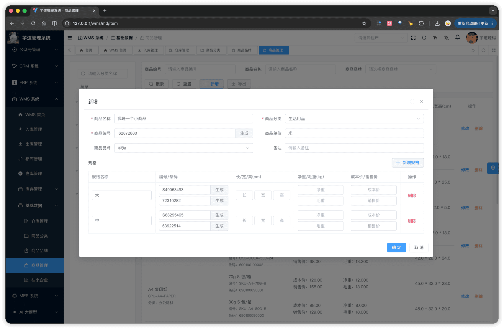
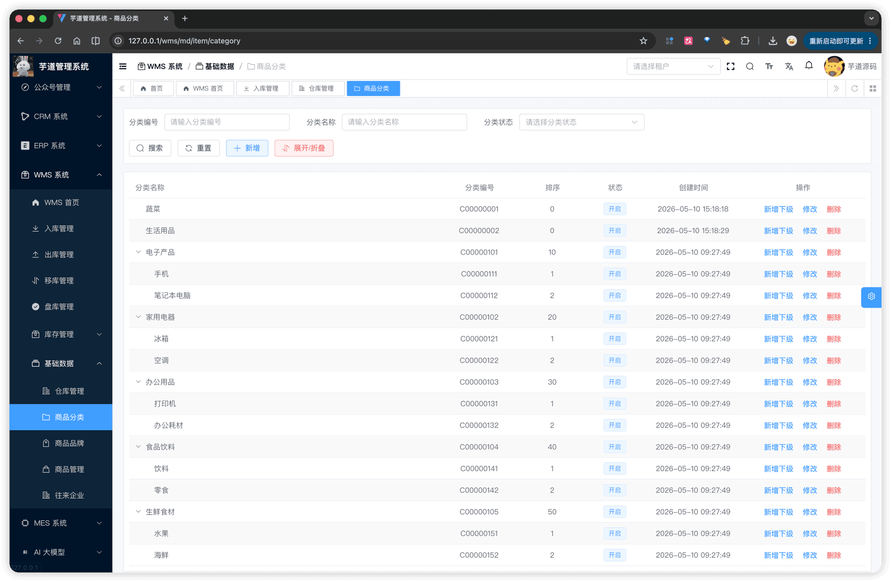
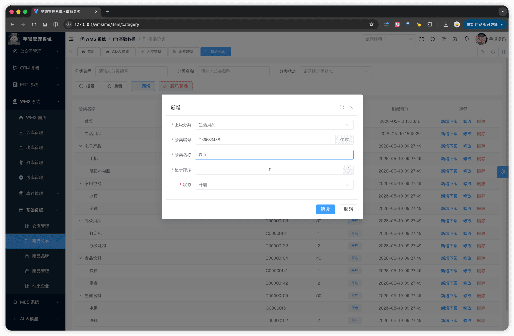
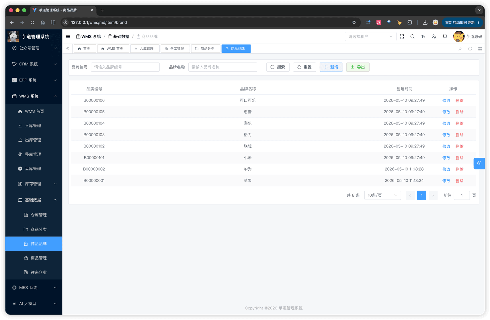
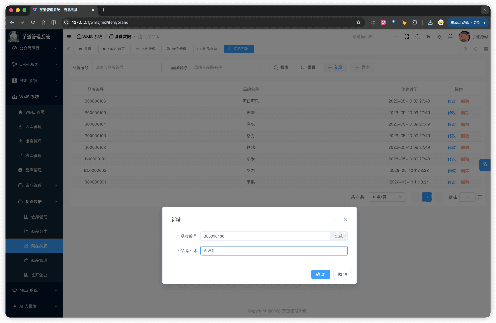

# 【基础】商品、SKU、分类、品牌

WMS 物料体系由 4 张表组成，对应 3 个独立菜单 + 1 张子表：
- **商品**（`wms_item`）+ **SKU**（`wms_item_sku`，子表）：一个商品对应至少 1 个 SKU，在商品管理弹窗中同步维护。
- **商品分类**（`wms_item_category`）：树形结构，作为商品左侧筛选树和分类下拉来源。
- **商品品牌**（`wms_item_brand`）：单表 CRUD，作为商品下拉来源。
物料体系模块由 `yudao-module-wms` 后端模块的 `md.item` 包实现，前端实现在 `@/views/wms/md/item` 目录。
## # 1. 商品 与 SKU
商品由 WmsItemController 提供接口，SKU 子表由 WmsItemSkuController 提供接口。SKU 没有独立菜单，统一在商品管理弹窗下方的子表中维护。
### # 1.1 商品表结构
省略 creator/create_time/updater/update_time/deleted/tenant_id 等通用字段
CREATE TABLE `wms_item` (
`id` bigint NOT NULL AUTO_INCREMENT COMMENT '编号',
`code` varchar(20) NOT NULL COMMENT '商品编号',
`name` varchar(60) NOT NULL COMMENT '商品名称',
`unit` varchar(20) DEFAULT NULL COMMENT '商品单位',
`category_id` bigint NOT NULL COMMENT '商品分类编号',
`brand_id` bigint DEFAULT NULL COMMENT '商品品牌编号',
`remark` varchar(255) DEFAULT NULL COMMENT '备注',
PRIMARY KEY (`id`)
) ENGINE=InnoDB COMMENT='WMS 商品';
① `code` 商品编号，**全局唯一**。前端表单提供【生成】按钮，调用 `generateWmsCode('I')` 按 `I + 8 位随机数字` 默认填充（如 `I12345678`），允许手动修改。
② `name` 商品名称，**全局唯一**。
③ `category_id` 关联 `wms_item_category` 表，**必填**；`brand_id` 关联 `wms_item_brand` 表，**可空**。两者均在保存时由 WmsItemServiceImpl 校验存在。
该表包含一个子表：
- `wms_item_sku`（SKU 子表）：在新增 / 编辑弹窗中同步维护，**每个商品至少 1 个 SKU**（由 WmsItemSkuServiceImpl 的 `validateItemSkuList` 强校验）。
### # 1.2 SKU 子表表结构
CREATE TABLE `wms_item_sku` (
`id` bigint NOT NULL AUTO_INCREMENT COMMENT '编号',
`item_id` bigint NOT NULL COMMENT '商品编号',
`name` varchar(255) NOT NULL COMMENT '规格名称',
`code` varchar(64) DEFAULT NULL COMMENT '规格编号',
`bar_code` varchar(64) DEFAULT NULL COMMENT '条码',
`length` decimal(10,2) DEFAULT NULL COMMENT '长（cm）',
`width` decimal(10,2) DEFAULT NULL COMMENT '宽（cm）',
`height` decimal(10,2) DEFAULT NULL COMMENT '高（cm）',
`gross_weight` decimal(14,3) DEFAULT NULL COMMENT '毛重（kg）',
`net_weight` decimal(14,3) DEFAULT NULL COMMENT '净重（kg）',
`cost_price` decimal(14,2) DEFAULT NULL COMMENT '成本价（元）',
`selling_price` decimal(14,2) DEFAULT NULL COMMENT '销售价（元）',
PRIMARY KEY (`id`)
) ENGINE=InnoDB COMMENT='WMS 商品 SKU';
① `item_id` 关联 `wms_item` 表的 `id` 字段。
② `name` 规格名称（如"黑色 / XL"），**同一商品下不重复**（由 `validateItemSkuList` 校验）。
③ `code` 规格编号，前端【生成】按钮调 `generateWmsCode('S')`（如 `S12345678`）；`bar_code` 条码可选，前端【生成】按钮调 `generateWmsCode()`（无前缀，纯 8 位随机数字，符合条码业务习惯）。
④ 长 / 宽 / 高 / 毛重 / 净重 / 成本价 / 销售价均**可空**，未填值则列表中该字段不展示。
### # 1.3 管理后台
对应 [WMS 系统 -> 基础数据 -> 商品管理] 菜单，对应 `yudao-ui-admin-vue3` 项目的 `@/views/wms/md/item` 目录。
页面左侧是商品分类树（`ItemCategoryTree.vue`），点击节点筛选**该分类及其所有子分类**下的商品（递归收集分类 id 由 WmsItemCategoryServiceImpl 的 `getSelfAndChildItemCategoryIdList` 实现）；右侧是搜索栏 + 列表。支持按「商品编号」「商品名称」「商品品牌」筛选。
列表按 **SKU** 维度展开 —— 同一商品的多个 SKU 共享同一行的"商品信息"列（通过前端 `spanMethod` 合并单元格），便于一眼看清单个商品下的全部规格、价格、尺寸。
 
#### # 新增 / 修改
新增 / 修改通过弹窗 `ItemForm.vue` 完成（宽 1200px）：上半部分是商品基础信息（名称、分类、编号 + 生成、单位、品牌、备注），下半部分是**可增删的 SKU 子表**（每行：规格名称、编号 + 生成、条码 + 生成、长宽高、毛净重、成本价 / 销售价）。整单提交时，WmsItemServiceImpl 在同一事务内处理商品与 SKU：
- **新增**：先插入商品主表，再批量插入 SKU 列表。
- **修改**：先更新商品主表，再用 `diffList` 对比新老 SKU 列表，分别执行新增 / 修改 / 删除。
 无论是用户在弹窗里删 SKU 行、还是整商品被删除，WmsItemSkuServiceImpl 的 `validateItemSkuUnused` 都会校验 SKU 未被库存或入库 / 出库 / 移库 / 盘库单据明细引用，否则拒绝删除。
### # 1.4 SKU 选择器
`ItemSkuSelect.vue`（`@/views/wms/md/item/sku/components/ItemSkuSelect.vue`）是入库 / 出库 / 盘库单据明细行选择 SKU 的**统一弹窗组件**（不是下拉，而是宽 80% 的 Dialog 表格），通过 `/wms/item-sku/page` 接口服务端分页 + 服务端筛选加载，支持按"商品名称 / 商品编号 / 规格名称 / 规格编号 / 条码"5 个字段搜索。
打开方式：`open(selectedIds, options)`，其中：
- `selectedIds`：已在业务明细中使用的 SKU 编号数组，**勾选框置灰禁用**，避免重复添加同一 SKU 到同一单据。
- `options.multiple`：`true`（默认）多选；`false` 单选 —— 单选时双击行直接 emit 并关闭弹窗。
- `options.preselectDisabled`：是否回显已禁用 SKU 的勾选状态。
跨页勾选状态通过组件内部 `selectedMap` 维护，翻页 / 搜索后仍保留之前页面的勾选。入库 / 出库 / 盘库各篇文档不再重复说明此组件。
## # 2. 商品分类
商品分类是**树形**结构（自关联 `parent_id`），由 WmsItemCategoryController 提供接口。商品管理菜单左侧的分类树即来源于此。
### # 2.1 表结构
省略 creator/create_time/updater/update_time/deleted/tenant_id 等通用字段
CREATE TABLE `wms_item_category` (
`id` bigint NOT NULL AUTO_INCREMENT COMMENT '编号',
`parent_id` bigint NOT NULL DEFAULT '0' COMMENT '父级编号（0 = 根）',
`code` varchar(64) NOT NULL COMMENT '分类编号',
`name` varchar(64) NOT NULL COMMENT '分类名称',
`sort` int NOT NULL DEFAULT '0' COMMENT '排序',
`status` tinyint NOT NULL DEFAULT '0' COMMENT '状态',
PRIMARY KEY (`id`)
) ENGINE=InnoDB COMMENT='WMS 商品分类';
① `parent_id` 父级编号，`0` 表示根节点；递归层级不限。WmsItemCategoryServiceImpl 的 `validateParentCategory` 在保存时校验：不能把自己设为父分类、父分类必须存在、修改时不能让父分类变成自己的子分类（防止环路）。
② `code` 分类编号，**全局唯一**；`name` 分类名称，**同 `parent_id` 下唯一**（兄弟节点之间不重，跨父节点允许同名）。
③ 枚举 `status`（`CommonStatusEnum`：0 = 开启，1 = 关闭）。
### # 2.2 管理后台
对应 [WMS 系统 -> 基础数据 -> 商品分类] 菜单，对应 `@/views/wms/md/item/category` 目录。
支持按「分类编号」「分类名称」「分类状态」筛选。
 新增 / 修改通过弹窗 `ItemCategoryForm.vue` 完成，表单字段：上级分类、分类编号、分类名称、显示排序、状态。
 删除分类需同时满足：**无子分类** + **该分类下无商品**，否则拒绝删除。
### # 2.3 分类选择器与分类树
商品分类对外暴露两个前端组件，都通过 `/wms/item-category/simple-list` 接口加载全量数据并按 `parentId` 在前端构建树：
- `ItemCategorySelect.vue`（`@/views/wms/md/item/category/components/ItemCategorySelect.vue`）：树形**下拉**（`el-tree-select`），默认展开全部、`check-strictly` 允许只选父节点，用于**商品表单**选所属分类。
- `ItemCategoryTree.vue`（`@/views/wms/md/item/category/components/ItemCategoryTree.vue`）：左侧**树面板**（`el-tree`），带名称搜索框、支持点击同一节点取消选中、暴露 `reset` / `setCurrent` 方法，用于**商品列表**左侧筛选树。
两者均无需在使用方写额外加载代码，挂载即用。
## # 3. 商品品牌
商品品牌由 WmsItemBrandController 提供接口，是物料体系里最简单的基础数据：单表 3 个业务字段。
### # 3.1 表结构
省略 creator/create_time/updater/update_time/deleted/tenant_id 等通用字段
CREATE TABLE `wms_item_brand` (
`id` bigint NOT NULL AUTO_INCREMENT COMMENT '编号',
`code` varchar(64) NOT NULL COMMENT '品牌编号',
`name` varchar(64) NOT NULL COMMENT '品牌名称',
PRIMARY KEY (`id`)
) ENGINE=InnoDB COMMENT='WMS 商品品牌';
① `code` 品牌编号 与 `name` 品牌名称均**全局唯一**。
### # 3.2 管理后台
对应 [WMS 系统 -> 基础数据 -> 商品品牌] 菜单，对应 `@/views/wms/md/item/brand` 目录。
支持按「品牌编号」「品牌名称」筛选。
 新增 / 修改通过弹窗 `ItemBrandForm.vue` 完成，表单仅品牌编号（带【生成】按钮）、品牌名称 2 个字段。
 删除品牌时若有商品引用该品牌，拒绝删除。
### # 3.3 品牌选择器
`ItemBrandSelect.vue`（`@/views/wms/md/item/brand/components/ItemBrandSelect.vue`）是品牌下拉的**统一组件**（`el-select`），挂载时通过 `/wms/item-brand/simple-list` 加载全量品牌，本地按"品牌名称"模糊过滤。用于商品搜索栏、商品表单，以及后续入库 / 出库等单据搜索时的品牌筛选。
.pageB img{width:80px!important;}
.wwads-horizontal .wwads-text, .wwads-content .wwads-text{line-height:1;}
[【基础】仓库](/wms/md/warehouse/) [【基础】往来企业（供应商、客户）](/wms/md/merchant/) 
←
[【基础】仓库](/wms/md/warehouse/) [【基础】往来企业（供应商、客户）](/wms/md/merchant/)→
 
Theme by
[Vdoing](https://github.com/xugaoyi/vuepress-theme-vdoing) 
| Copyright © 2019-2026
芋道源码 | MIT License   
- 跟随系统
- 浅色模式
- 深色模式
- 阅读模式
× 
.windowRB{ padding: 0;}
.windowRB .wwads-img{margin-top: 10px;}
.windowRB .wwads-content{margin: 0 10px 10px 10px;}
.custom-html-window-rb .close-but{
display: none;
}