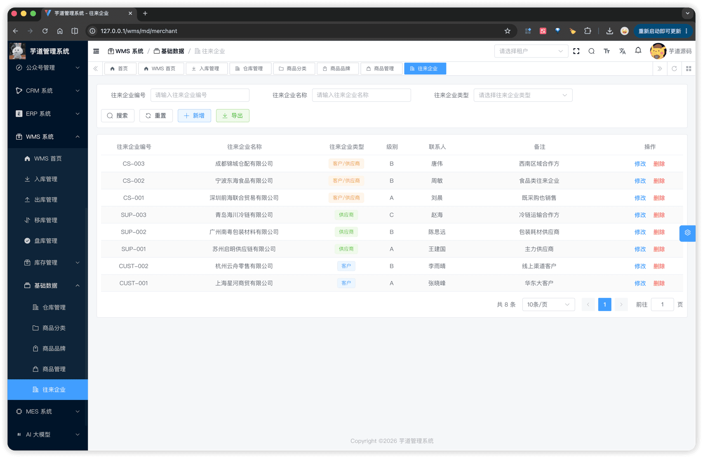
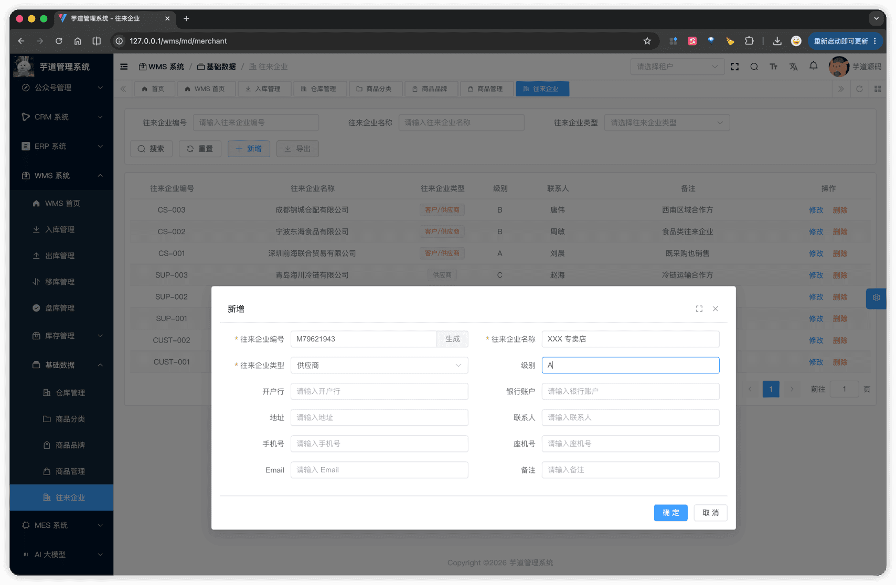

# 【基础】往来企业（供应商、客户）

往来企业是 WMS 与外部往来对象（供应商、客户）的统一主数据，由一张表承载两种角色：
- **入库**类单据（采购入库、退货入库等）关联**供应商**。
- **出库**类单据（销售出库等）关联**客户**。
- 实际业务中存在**既是客户又是供应商**的对象（如外协厂商），通过 `type` 字段第三个枚举值"客户/供应商"覆盖。
往来企业模块由 `yudao-module-wms` 后端模块的 `md.merchant` 包实现，前端实现在 `@/views/wms/md/merchant` 目录。
## # 1. 往来企业
往来企业，由 WmsMerchantController 提供接口。
### # 1.1 表结构
省略 creator/create_time/updater/update_time/deleted/tenant_id 等通用字段
CREATE TABLE `wms_merchant` (
`id` bigint NOT NULL AUTO_INCREMENT COMMENT '编号',
`code` varchar(20) NOT NULL COMMENT '往来企业编号',
`name` varchar(60) NOT NULL COMMENT '往来企业名称',
`type` tinyint NOT NULL COMMENT '往来企业类型',
`level` varchar(10) DEFAULT NULL COMMENT '级别',
`bank_name` varchar(255) DEFAULT NULL COMMENT '开户行',
`bank_account` varchar(40) DEFAULT NULL COMMENT '银行账户',
`address` varchar(200) DEFAULT NULL COMMENT '地址',
`contact` varchar(30) DEFAULT NULL COMMENT '联系人',
`mobile` varchar(13) DEFAULT NULL COMMENT '手机号',
`telephone` varchar(13) DEFAULT NULL COMMENT '座机号',
`email` varchar(50) DEFAULT NULL COMMENT 'Email',
`remark` varchar(255) DEFAULT NULL COMMENT '备注',
PRIMARY KEY (`id`)
) ENGINE=InnoDB COMMENT='WMS 往来企业';
① `code` 往来企业编号，**全局唯一**。前端表单提供【生成】按钮，调用 `generateWmsCode('M')` 按 `M + 8 位随机数字` 默认填充（如 `M12345678`），允许手动修改。
② `name` 往来企业名称，**全局唯一**。
③ 枚举 `WmsMerchantTypeEnum`（1 = 客户，2 = 供应商，3 = 客户/供应商）。`type = 3` 用于既是采购供应商又是销售客户的对象（如外协厂商）。
### # 1.2 管理后台
对应 [WMS 系统 -> 基础数据 -> 往来企业] 菜单，对应 `yudao-ui-admin-vue3` 项目的 `@/views/wms/md/merchant` 目录。
支持按「往来企业编号」「往来企业名称」「往来企业类型」筛选；列表展示编号、名称、类型、级别、联系人、备注，以及修改 / 删除操作。
 
#### # 新增 / 修改
新增 / 修改通过弹窗 `MerchantForm.vue` 完成（宽 1000px），按 6 行 × 2 列布局展示 12 个字段：往来企业编号（带【生成】按钮）、往来企业名称、往来企业类型、级别、开户行、银行账户、地址、联系人、手机号、座机号、Email、备注。除编号 / 名称 / 类型必填外，其余字段均可空。
 删除时若该企业被任何入库 / 出库单据引用过，拒绝删除（WmsMerchantServiceImpl 的 `validateMerchantUnused` 通过 `@Lazy` 反查 ReceiptOrderService / ShipmentOrderService）。
### # 1.3 往来企业选择器
`MerchantSelect.vue`（`@/views/wms/md/merchant/components/MerchantSelect.vue`）是单据选择往来企业的**统一下拉组件**，通过 `/wms/merchant/simple-list?types=` 接口加载可选列表，本地按"企业名称"模糊过滤。
通过 `supplier` / `customer` 两个 props 控制可选范围（基于 `@/views/wms/utils/constants.ts` 的 `SupplierMerchantTypeList` / `CustomerMerchantTypeList`）：
| 调用方 | props | types 过滤 | 可选范围 |
| --- | --- | --- | --- |
| 入库单据 | `supplier` | `[2, 3]` | 供应商、客户/供应商 |
| 出库单据 | `customer` | `[1, 3]` | 客户、客户/供应商 |
| 其他场景 | 都不传 | 不过滤 | 全部 |
后端在保存出 / 入库单据时，分别由 WmsMerchantServiceImpl 的 `validateSupplierMerchantExists` / `validateCustomerMerchantExists` 二次校验所选往来企业的 `type` 满足要求，避免前端绕过类型限制。入库 / 出库各篇文档不再重复说明此组件。
.pageB img{width:80px!important;}
.wwads-horizontal .wwads-text, .wwads-content .wwads-text{line-height:1;}
[【基础】商品、SKU、分类、品牌](/wms/md/item/) [【库存】库存记录、流水、统计](/wms/inventory/) 
←
[【基础】商品、SKU、分类、品牌](/wms/md/item/) [【库存】库存记录、流水、统计](/wms/inventory/)→
 
Theme by
[Vdoing](https://github.com/xugaoyi/vuepress-theme-vdoing) 
| Copyright © 2019-2026
芋道源码 | MIT License   
- 跟随系统
- 浅色模式
- 深色模式
- 阅读模式
× 
.windowRB{ padding: 0;}
.windowRB .wwads-img{margin-top: 10px;}
.windowRB .wwads-content{margin: 0 10px 10px 10px;}
.custom-html-window-rb .close-but{
display: none;
}