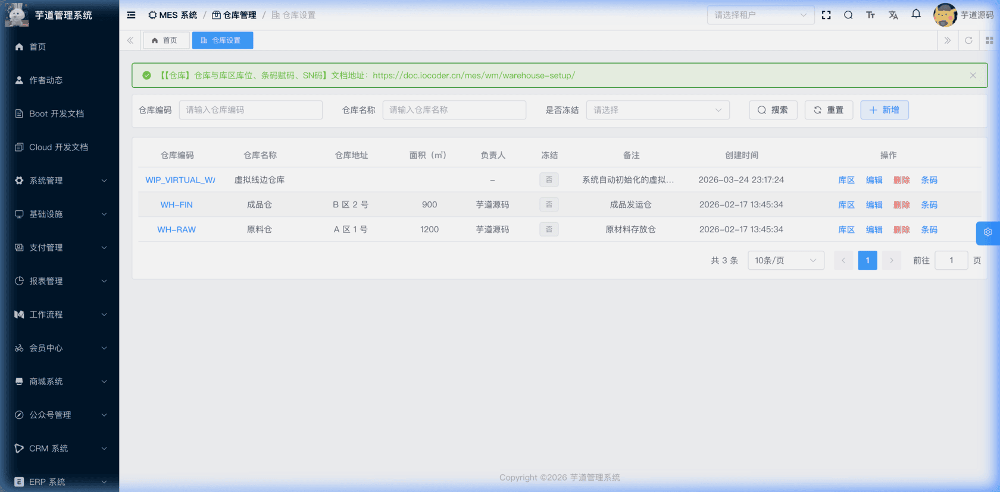
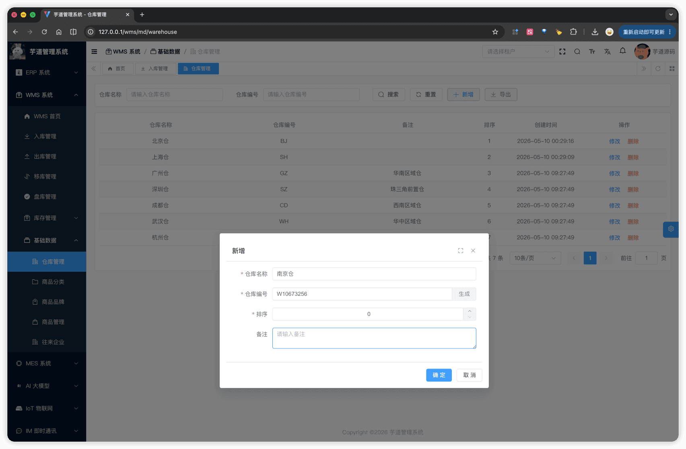

# 【基础】仓库

仓库是 WMS 的最基础主数据，库存与所有出入库 / 移库 / 盘库单据都挂载在仓库上。当前版本库存维度仅到 `仓库 + SKU`，不引入库区与库位（详见 [《功能开启》](/wms/build/) ⑤）。
仓库模块由 `yudao-module-wms` 后端模块的 `md.warehouse` 包实现，前端实现在 `@/views/wms/md/warehouse` 目录。
## # 1. 仓库
仓库，由 WmsWarehouseController 提供接口。
### # 1.1 表结构
省略 creator/create_time/updater/update_time/deleted/tenant_id 等通用字段
CREATE TABLE `wms_warehouse` (
`id` bigint NOT NULL AUTO_INCREMENT COMMENT '编号',
`code` varchar(20) NOT NULL COMMENT '仓库编号',
`name` varchar(50) NOT NULL COMMENT '仓库名称',
`sort` int NOT NULL COMMENT '排序',
`remark` varchar(255) DEFAULT NULL COMMENT '备注',
PRIMARY KEY (`id`)
) ENGINE=InnoDB COMMENT='WMS 仓库';
① `code` 仓库编号，**新增时由用户填写**，**全局唯一**。前端表单提供【生成】按钮，调用工具函数 `generateWmsCode('W')`（`@/views/wms/utils/constants.ts`）按 `W + 8 位随机数字` 默认填充（如 `W12345678`），允许手动修改。后端 WmsWarehouseServiceImpl 的 `validateWarehouseCodeUnique` 方法校验唯一。
为什么编号在前端生成
工具注释说明："由前端在表单【生成】按钮上调用，避免后端兜底生成造成编号不可控。" 同一工具函数还为商品（`I`）、SKU（`S`）、往来企业（`M`）等基础数据提供前缀化编号，详见 [《【基础】商品、SKU、分类、品牌》](/wms/md/item/)。
② `name` 仓库名称，**全局唯一**，由 WmsWarehouseServiceImpl 的 `validateWarehouseNameUnique` 方法校验。
### # 1.2 管理后台
对应 [WMS 系统 -> 基础数据 -> 仓库管理] 菜单，对应 `yudao-ui-admin-vue3` 项目的 `@/views/wms/md/warehouse` 目录。
支持按「仓库名称」「仓库编号」筛选；列表展示仓库名称、仓库编号、备注、排序、创建时间，以及修改 / 删除操作。
 
#### # 新增 / 修改
新增 / 修改通过弹窗 `WarehouseForm.vue` 完成，表单仅 4 个字段：仓库名称、仓库编号（带【生成】按钮）、排序、备注。
 
### # 1.3 仓库选择器
`WarehouseSelect.vue`（`@/views/wms/md/warehouse/components/WarehouseSelect.vue`）是单据主单与明细行选择仓库的**统一下拉组件**，通过 `/wms/warehouse/simple-list` 接口加载全量仓库，本地按"仓库名称"模糊过滤。入库 / 出库 / 移库 / 盘库各篇文档不再重复说明此组件。
.pageB img{width:80px!important;}
.wwads-horizontal .wwads-text, .wwads-content .wwads-text{line-height:1;}
[功能开启](/wms/build/) [【基础】商品、SKU、分类、品牌](/wms/md/item/) 
←
[功能开启](/wms/build/) [【基础】商品、SKU、分类、品牌](/wms/md/item/)→
 
Theme by
[Vdoing](https://github.com/xugaoyi/vuepress-theme-vdoing) 
| Copyright © 2019-2026
芋道源码 | MIT License   
- 跟随系统
- 浅色模式
- 深色模式
- 阅读模式
× 
.windowRB{ padding: 0;}
.windowRB .wwads-img{margin-top: 10px;}
.windowRB .wwads-content{margin: 0 10px 10px 10px;}
.custom-html-window-rb .close-but{
display: none;
}