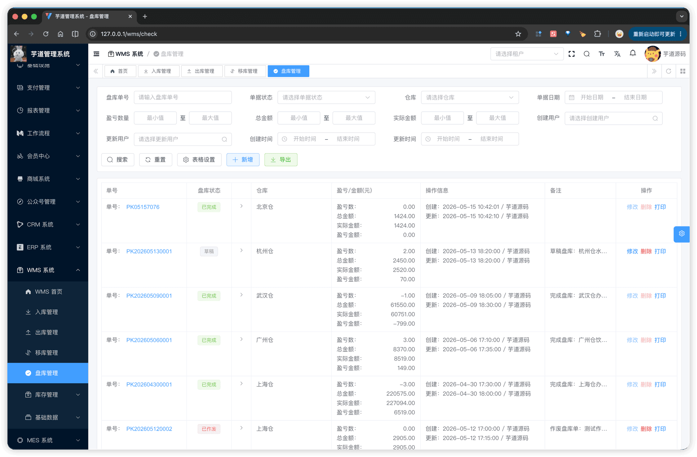
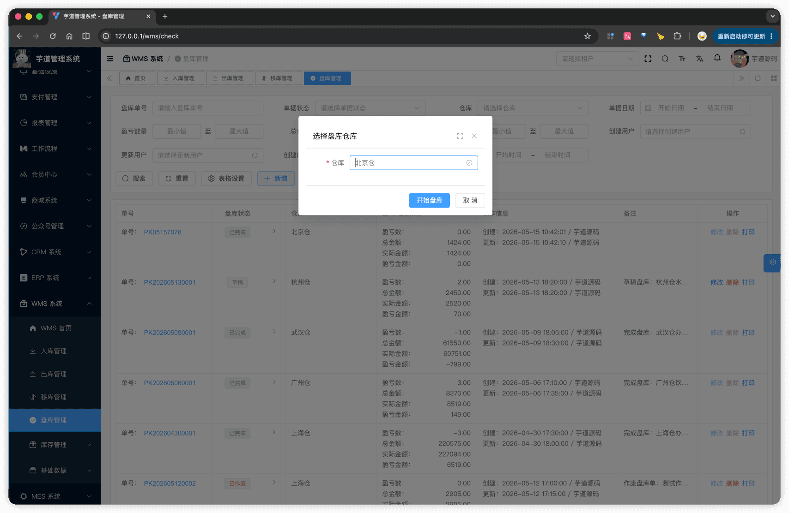
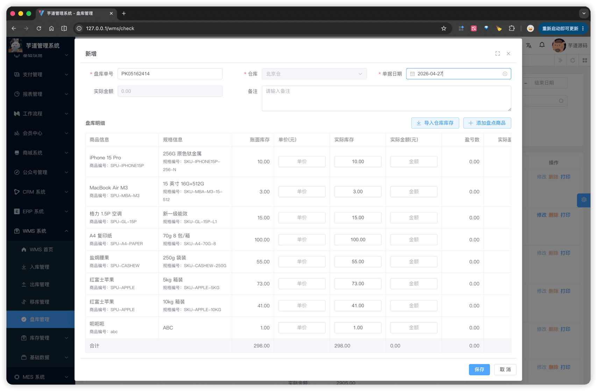
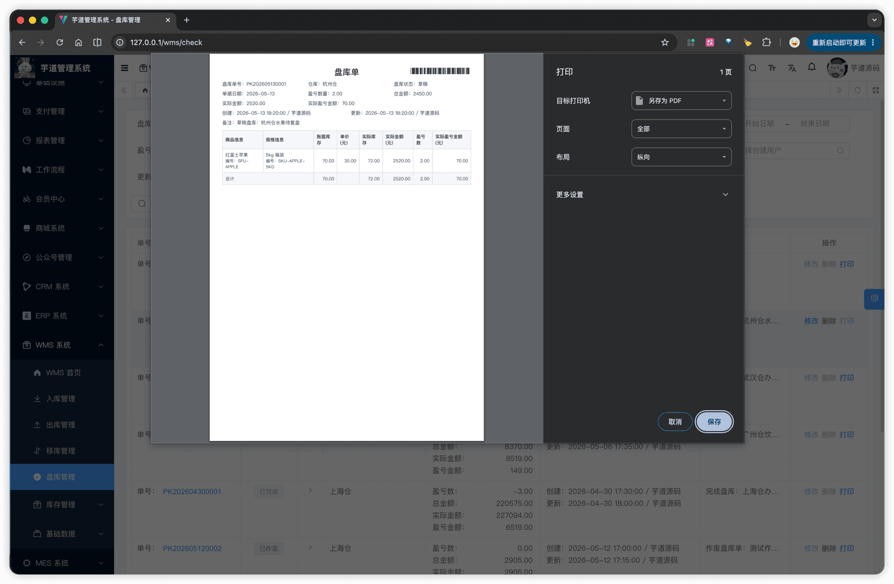

# 【单据】盘库

盘库单用于实物盘点后调整账面库存差异，由主表 + 明细子表两张表实现。与入库 / 出库 / 移库的关键差异：
- **明细带账面快照**：每条明细同时保存"账面数量"（草稿期抓取的 `wms_inventory.quantity`）和"实盘数量"（用户填入），并通过 `inventory_id` 关联当时的库存记录行，用于完成时的快照校验。
- **库存事务走 `checkInventory` 而非 `changeInventory`**：完成盘库时由库存事务按差量写 ADJUST 流水（`order_type = 4`），无盈亏的明细**不写流水也不更新库存**。
- **完成时校验账面未变**：如果草稿期间他人通过其他单据改动过库存，盘库完成会抛 `CHECK_ORDER_INVENTORY_CHANGED` 并整单回滚（详见 [《【库存】库存记录、流水、统计》§3.2](/wms/inventory/#_3-2-盘库调整-checkinventory)）。
- **三个汇总字段**：除了总数量（盈亏量）、总金额（账面金额），额外保存"实际金额"（实盘金额）便于盘点报表对账。
盘库单模块由 `yudao-module-wms` 后端模块的 `order.check` 包实现，前端实现在 `@/views/wms/order/check` 目录。
## # 1. 盘库单
盘库单，由 WmsCheckOrderController 提供接口（`/wms/check-order`）；明细子表由 WmsCheckOrderDetailController 提供接口。
### # 1.1 主表表结构
省略 creator/create_time/updater/update_time/deleted/tenant_id 等通用字段
CREATE TABLE `wms_check_order` (
`id` bigint NOT NULL AUTO_INCREMENT COMMENT '编号',
`no` varchar(64) NOT NULL COMMENT '盘库单号',
`status` tinyint NOT NULL DEFAULT '0' COMMENT '盘库状态',
`order_time` datetime NOT NULL COMMENT '单据日期',
`remark` varchar(255) DEFAULT NULL COMMENT '备注',
`warehouse_id` bigint NOT NULL COMMENT '仓库编号',
`total_quantity` decimal(14,3) DEFAULT NULL COMMENT '盈亏数量（实盘 - 账面）',
`total_price` decimal(14,2) DEFAULT NULL COMMENT '总金额（账面）',
`actual_price` decimal(14,2) DEFAULT NULL COMMENT '实际金额（实盘）',
PRIMARY KEY (`id`),
UNIQUE KEY `uk_no` (`no`)
) ENGINE=InnoDB COMMENT='WMS 盘库单';
① `no` 盘库单号，**新增时由前端默认按 `PK + 月日 + 4 位随机数` 生成**（详见 [《功能开启》](/wms/build/) ①），允许手动修改，由后端校验全局唯一。
② `status` 共用 `WmsOrderStatusEnum`（0 = 草稿，4 = 已完成，5 = 已作废）。
③ 汇总字段三件套，保存时由后端 `fillCheckOrderTotal` 按明细自动计算：
- `total_quantity` **盈亏数量**：`Σ(实盘数量 - 账面数量)`，可正可负。
- `total_price` **总金额（账面）**：`Σ(账面数量 × 单价)`。
- `actual_price` **实际金额（实盘）**：`Σ(实盘数量 × 单价)`。
该表包含一个子表：
- `wms_check_order_detail`（盘库明细）：在新增 / 编辑弹窗中维护，至少 1 条（完成盘库时由 `validateCheckOrderDetailListExists` 强校验）。
### # 1.2 明细子表结构
CREATE TABLE `wms_check_order_detail` (
`id` bigint NOT NULL AUTO_INCREMENT COMMENT '编号',
`order_id` bigint NOT NULL COMMENT '盘库单编号',
`sku_id` bigint NOT NULL COMMENT '商品 SKU 编号',
`warehouse_id` bigint NOT NULL COMMENT '仓库编号',
`inventory_id` bigint DEFAULT NULL COMMENT '库存编号',
`receipt_time` datetime DEFAULT NULL COMMENT '入库时间',
`quantity` decimal(14,3) NOT NULL COMMENT '账面数量',
`check_quantity` decimal(14,3) DEFAULT NULL COMMENT '实盘数量',
`price` decimal(14,2) DEFAULT NULL COMMENT '单价',
PRIMARY KEY (`id`)
) ENGINE=InnoDB COMMENT='WMS 盘库单明细';
① `order_id` 关联主表的 `id` 字段。
② `sku_id` 待盘点的 SKU；`warehouse_id` 从主表继承的冗余字段。
③ `inventory_id` 关联 `wms_inventory` 表的 `id`，**草稿期由前端抓取**当时的库存记录主键，完成时用于快照校验：
- 若 `inventory_id` 非空：`checkInventory` 通过 `SELECT ... FOR UPDATE` 重读该库存行，**对比 `quantity` 是否仍等于明细抓取的账面数量**，不等则抛 `CHECK_ORDER_INVENTORY_CHANGED`。
- 若 `inventory_id` 为空（盘库首次出现的 SKU + 仓库 组合）：尝试 `INSERT` 一行 `quantity = checkQuantity` 的新库存记录，若被并发 INSERT 抢先（命中唯一索引）也按 `CHECK_ORDER_INVENTORY_CHANGED` 处理。
④ `receipt_time` **入库时间**，可空，由用户填入用于备注盘点时的入库参考。
⑤ `quantity` 账面数量（**草稿期抓取的快照**），`check_quantity` 实盘数量（用户填入），差量在完成时计算并写流水。
### # 1.3 状态流转
与入库 / 出库 / 移库一致，共用 `WmsOrderStatusEnum`：
| 状态 | 值 | 可执行操作 |
| --- | --- | --- |
| 草稿 | 0 | 编辑、完成盘库、作废、删除 |
| 已完成 | 4 | — |
| 已作废 | 5 | 删除 |
四个核心操作方法：**创建**（`createCheckOrder`）、**修改**（`updateCheckOrder`）、**完成盘库**（`completeCheckOrder`）、**作废**（`cancelCheckOrder`）。
### # 1.4 管理后台
对应 [WMS 系统 -> 盘库管理] 菜单，对应 `yudao-ui-admin-vue3` 项目的 `@/views/wms/order/check` 目录。
#### # 列表
支持按盘库单号、单据状态、仓库、单据日期、盈亏数量范围、总金额范围、创建 / 更新人、创建 / 更新时间筛选。列表展示盘库单号、仓库、单据日期、盈亏数量、账面金额、实盘金额、状态等。
 
#### # 新增
① 点击列表「新增」按钮，先弹出「选择盘库仓库」前置框，选定仓库后才会进入新增弹窗 —— 因为盘库要按仓库拉取库存当账面快照，仓库不确定就无法初始化明细。
 ② 进入新增弹窗 `CheckOrderForm.vue` 后：表单上半部分是单据基础信息（盘库单号 + 自动生成、单据日期、仓库、备注），下半部分是明细子表。
明细通过弹窗顶部的【**导入仓库库存**】按钮一次性拉取该仓库的全部库存余额（调 `InventoryApi.getInventoryList({ warehouseId })`）作为盘点对象，自动填充 `inventory_id` + 账面数量 + 单价。用户在明细行直接修改实盘数量；也支持通过 [SKU 选择器](/wms/md/item/#_1-4-sku-选择器) 手工添加"盘库首次出现"的新 SKU 行（`inventory_id` 留空）。
 
#### # 修改
弹窗结构与新增相同，仅在草稿状态下可打开。建议在完成盘库之前不要切换仓库，避免明细的 `inventory_id` 与新仓库不匹配。
#### # 完成盘库
编辑弹窗底部的「完成盘库」按钮触发（仅草稿状态显示）。前端先做脏检查：若表单有改动则先调 `updateCheckOrder` 保存，再调 `/wms/check-order/complete?id=`。后端在同一事务内：① CAS 翻状态为已完成；② 调用 `inventoryService.checkInventory`，传入明细列表（含 `inventory_id` / `quantity` / `check_quantity`）。
`checkInventory` 内部逐条处理：
1. **快照校验**：用 `inventory_id` 重读库存行，对比 `quantity` 是否变动。变动则整单抛 `CHECK_ORDER_INVENTORY_CHANGED` 回滚。
1. **无盈亏跳过**：`quantity == check_quantity` 时不更新库存、不写流水。
1. **有盈亏写流水**：按差量写 `wms_inventory_history`（`order_type = 4` 盘库单），同时更新 `wms_inventory.quantity` 为新值。
详细机制见 [《【库存】库存记录、流水、统计》§3.2](/wms/inventory/#_3-2-盘库调整-checkinventory)。
#### # 作废
编辑弹窗底部的「作废」按钮触发（仅草稿状态显示），二次确认后调 `/wms/check-order/cancel?id=`。作废后单据进入终态，可被删除。
### # 1.5 库存影响
完成盘库时调用 `inventoryService.checkInventory` 写入库存与流水：
- **库存记录**：按明细的 `inventory_id` 锁定 `wms_inventory` 行，将 `quantity` 直接覆盖为 `check_quantity`；首次盘点的 SKU + 仓库 组合通过 `INSERT` 创建新行。
- **库存流水**：每条**有盈亏**的明细写一条 `wms_inventory_history`，`order_type = 4`，`quantity` 为盈亏差量（`check_quantity - quantity`），`total_price` 按差量与单价计算。
## # 2. 网页打印
`CheckOrderPrint.vue`（`@/views/wms/order/check/CheckOrderPrint.vue`）通过 `v-print` 指令将单据渲染为可打印 HTML：
- **页头**：标题"盘库单" + 右上角的盘库单号 **CODE39 条码**。
- **基础信息**：3 列网格展示盘库单号、仓库、状态、单据日期、盈亏数量、账面金额、实盘金额、创建 / 更新人 + 时间、备注。
- **明细表格**：商品信息、规格信息、账面数量、实盘数量、盈亏、单价 6 列。
 
.pageB img{width:80px!important;}
.wwads-horizontal .wwads-text, .wwads-content .wwads-text{line-height:1;}
[【单据】移库](/wms/order/movement/) [【其它】WMS、MES、ERP 对比](/wms/compare/) 
←
[【单据】移库](/wms/order/movement/) [【其它】WMS、MES、ERP 对比](/wms/compare/)→
 
Theme by
[Vdoing](https://github.com/xugaoyi/vuepress-theme-vdoing) 
| Copyright © 2019-2026
芋道源码 | MIT License   
- 跟随系统
- 浅色模式
- 深色模式
- 阅读模式
× 
.windowRB{ padding: 0;}
.windowRB .wwads-img{margin-top: 10px;}
.windowRB .wwads-content{margin: 0 10px 10px 10px;}
.custom-html-window-rb .close-but{
display: none;
}