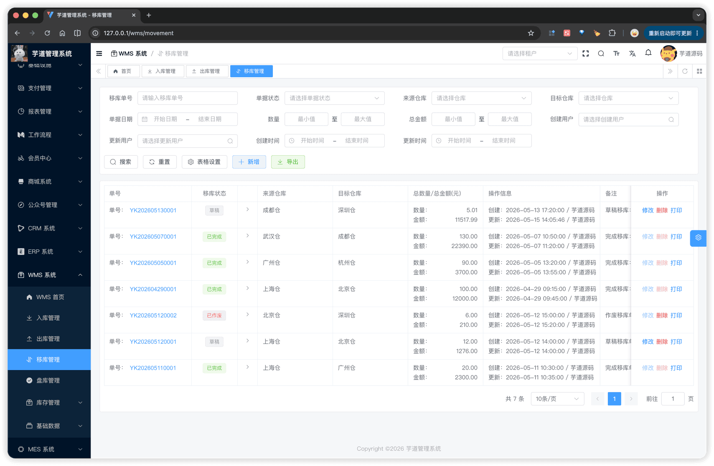
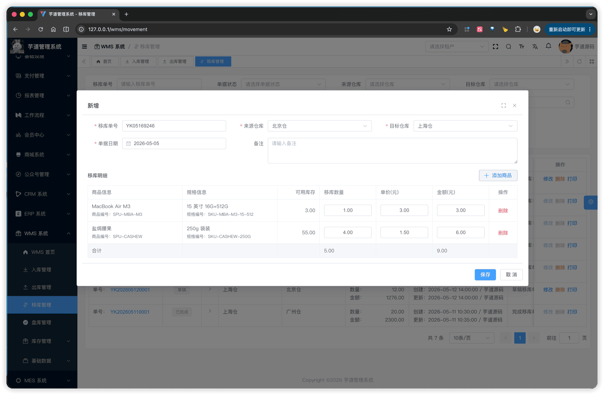
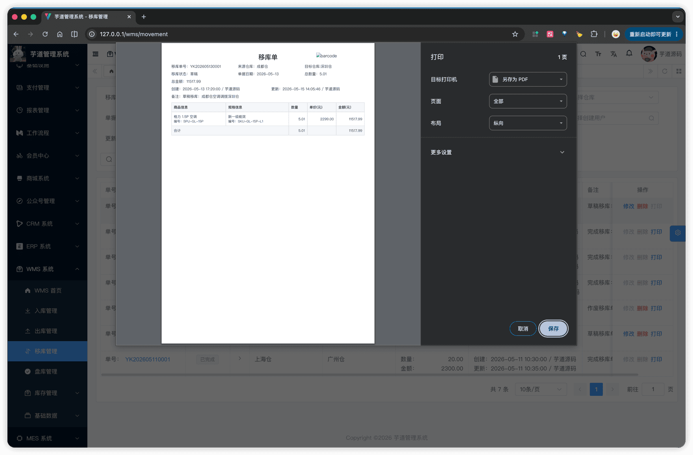

# 【单据】移库

移库单用于将物料从**源仓库**转移到**目标仓库**，由主表 + 明细子表两张表实现。与入库 / 出库的关键差异：
- **双仓库**：主表同时记录 `source_warehouse_id`（源）和 `target_warehouse_id`（目标），源 ≠ 目标由后端 `validateMovementOrderSaveData` 校验（抛 `MOVEMENT_ORDER_WAREHOUSE_SAME`）。
- **库存事务一次两条流水**：完成移库时一条单据明细拆为 OUT（源仓库负数）+ IN（目标仓库正数）两条 `WmsInventoryChangeReqDTO.Item` 一并提交，库存事务在同一事务内写入两条 `wms_inventory_history`（同 `order_id`、同 `order_no`、`order_type = 3`）。
- **无往来企业**：移库是内部库存调拨，无需关联供应商或客户。
移库单模块由 `yudao-module-wms` 后端模块的 `order.movement` 包实现，前端实现在 `@/views/wms/order/movement` 目录。
## # 1. 移库单
移库单，由 WmsMovementOrderController 提供接口（`/wms/movement-order`）；明细子表由 WmsMovementOrderDetailController 提供接口。
### # 1.1 主表表结构
省略 creator/create_time/updater/update_time/deleted/tenant_id 等通用字段
CREATE TABLE `wms_movement_order` (
`id` bigint NOT NULL AUTO_INCREMENT COMMENT '编号',
`no` varchar(64) NOT NULL COMMENT '移库单号',
`status` tinyint NOT NULL DEFAULT '0' COMMENT '移库状态',
`order_time` datetime NOT NULL COMMENT '单据日期',
`remark` varchar(255) DEFAULT NULL COMMENT '备注',
`source_warehouse_id` bigint NOT NULL COMMENT '来源仓库编号',
`target_warehouse_id` bigint NOT NULL COMMENT '目标仓库编号',
`total_quantity` decimal(14,3) DEFAULT NULL COMMENT '总数量',
`total_price` decimal(14,2) DEFAULT NULL COMMENT '总金额',
PRIMARY KEY (`id`),
UNIQUE KEY `uk_no` (`no`)
) ENGINE=InnoDB COMMENT='WMS 移库单';
① `no` 移库单号，**新增时由前端默认按 `YK + 月日 + 4 位随机数` 生成**（详见 [《功能开启》](/wms/build/) ①），允许手动修改，由后端校验全局唯一。
② `source_warehouse_id` / `target_warehouse_id` 分别关联 `wms_warehouse` 表，**保存时校验两者不相等**（同仓库内的物料调整不算移库，应由其他单据处理）。两个仓库的存在性也都会校验。
③ `status` 共用 `WmsOrderStatusEnum`（0 = 草稿，4 = 已完成，5 = 已作废）。
④ `total_quantity` / `total_price` 保存时由后端 `fillMovementOrderTotal` 按明细自动汇总写入。
该表包含一个子表：
- `wms_movement_order_detail`（移库明细）：在新增 / 编辑弹窗中维护，至少 1 条（完成移库时由 `validateMovementOrderDetailListExists` 强校验）。
### # 1.2 明细子表结构
CREATE TABLE `wms_movement_order_detail` (
`id` bigint NOT NULL AUTO_INCREMENT COMMENT '编号',
`order_id` bigint NOT NULL COMMENT '移库单编号',
`sku_id` bigint NOT NULL COMMENT '商品 SKU 编号',
`source_warehouse_id` bigint NOT NULL COMMENT '来源仓库编号',
`target_warehouse_id` bigint NOT NULL COMMENT '目标仓库编号',
`quantity` decimal(14,3) NOT NULL COMMENT '移库数量',
`price` decimal(14,2) DEFAULT NULL COMMENT '单价',
`total_price` decimal(14,2) DEFAULT NULL COMMENT '行金额',
PRIMARY KEY (`id`)
) ENGINE=InnoDB COMMENT='WMS 移库单明细';
① `order_id` 关联主表的 `id` 字段。
② `sku_id` 移库 SKU，**新增时由用户从库存选择器选择**（详见 [《【库存】库存记录、流水、统计》§1.3](/wms/inventory/#_1-3-库存选择器)），且必须基于**源仓库**的可用库存，不能超过库存余量。
③ `source_warehouse_id` / `target_warehouse_id` 均为**从主表继承的冗余字段**，便于按仓库聚合明细查询。
### # 1.3 状态流转
与入库 / 出库单一致，共用 `WmsOrderStatusEnum`：
| 状态 | 值 | 可执行操作 |
| --- | --- | --- |
| 草稿 | 0 | 编辑、完成移库、作废、删除 |
| 已完成 | 4 | — |
| 已作废 | 5 | 删除 |
四个核心操作方法：**创建**（`createMovementOrder`）、**修改**（`updateMovementOrder`）、**完成移库**（`completeMovementOrder`）、**作废**（`cancelMovementOrder`）。
### # 1.4 管理后台
对应 [WMS 系统 -> 移库管理] 菜单，对应 `yudao-ui-admin-vue3` 项目的 `@/views/wms/order/movement` 目录。
#### # 列表
支持按移库单号、单据状态、来源仓库、目标仓库、单据日期、数量范围、总金额范围、创建 / 更新人、创建 / 更新时间筛选。列表展示移库单号、来源仓库、目标仓库、单据日期、总数量、总金额、状态等。
 
#### # 新增
通过弹窗 `MovementOrderForm.vue` 完成。表单上半部分是单据基础信息（移库单号 + 自动生成、单据日期、来源仓库、目标仓库、备注），下半部分是明细子表（SKU + 移库数量 + 单价 + 行金额）。
明细的 SKU 通过 [`InventorySelect.vue` 库存选择器](/wms/inventory/#_1-3-库存选择器) 选择，弹窗传入**来源仓库**作为 `warehouseId`，只能选源仓库下 `quantity > 0` 的 SKU。
 
#### # 修改
弹窗结构与新增相同，仅在草稿状态下可打开。切换来源 / 目标仓库会清空已有明细，避免数据错位。
#### # 完成移库
编辑弹窗底部的「完成移库」按钮触发（仅草稿状态显示）。前端先做脏检查：若表单有改动则先调 `updateMovementOrder` 保存，再调 `/wms/movement-order/complete?id=`。后端在同一事务内：① CAS 翻状态为已完成；② 调用 `changeInventory` 提交 OUT + IN 两笔事务，源仓库扣减、目标仓库增加。若源仓库库存不足整单回滚。
#### # 作废
编辑弹窗底部的「作废」按钮触发（仅草稿状态显示），二次确认后调 `/wms/movement-order/cancel?id=`。作废后单据进入终态，可被删除。
### # 1.5 库存影响
完成移库时调用 `inventoryService.changeInventory` 一次性写入**两条** `wms_inventory_history`：
- **OUT 流水**：`warehouse_id = source_warehouse_id`，`quantity` 为**负数**，扣减源仓库 `wms_inventory`。
- **IN 流水**：`warehouse_id = target_warehouse_id`，`quantity` 为**正数**，增加目标仓库 `wms_inventory`。
两条流水通过相同的 `order_id` / `order_no` / `order_type = 3` 关联同一张移库单。
实现细节：service 的 `changeInventory` 方法把每条明细在内存中拆成两个 `WmsInventoryChangeReqDTO.Item` 一并入参，库存事务按统一流程处理（详见 [《【库存】库存记录、流水、统计》§3.1](/wms/inventory/#_3-1-通用变更-changeinventory)）。
## # 2. 网页打印
`MovementOrderPrint.vue`（`@/views/wms/order/movement/MovementOrderPrint.vue`）通过 `v-print` 指令将单据渲染为可打印 HTML：
- **页头**：标题"移库单" + 右上角的移库单号 **CODE39 条码**。
- **基础信息**：3 列网格展示移库单号、来源仓库、目标仓库、状态、单据日期、总数量、总金额、创建 / 更新人 + 时间、备注。
- **明细表格**：商品信息、规格信息、数量、单价、金额 5 列。
 
.pageB img{width:80px!important;}
.wwads-horizontal .wwads-text, .wwads-content .wwads-text{line-height:1;}
[【单据】出库](/wms/order/shipment/) [【单据】盘库](/wms/order/check/) 
←
[【单据】出库](/wms/order/shipment/) [【单据】盘库](/wms/order/check/)→
 
Theme by
[Vdoing](https://github.com/xugaoyi/vuepress-theme-vdoing) 
| Copyright © 2019-2026
芋道源码 | MIT License   
- 跟随系统
- 浅色模式
- 深色模式
- 阅读模式
× 
.windowRB{ padding: 0;}
.windowRB .wwads-img{margin-top: 10px;}
.windowRB .wwads-content{margin: 0 10px 10px 10px;}
.custom-html-window-rb .close-but{
display: none;
}