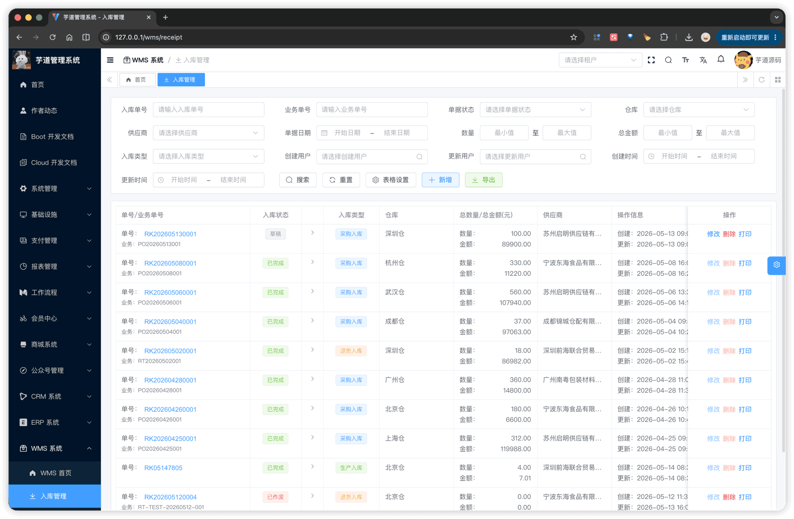
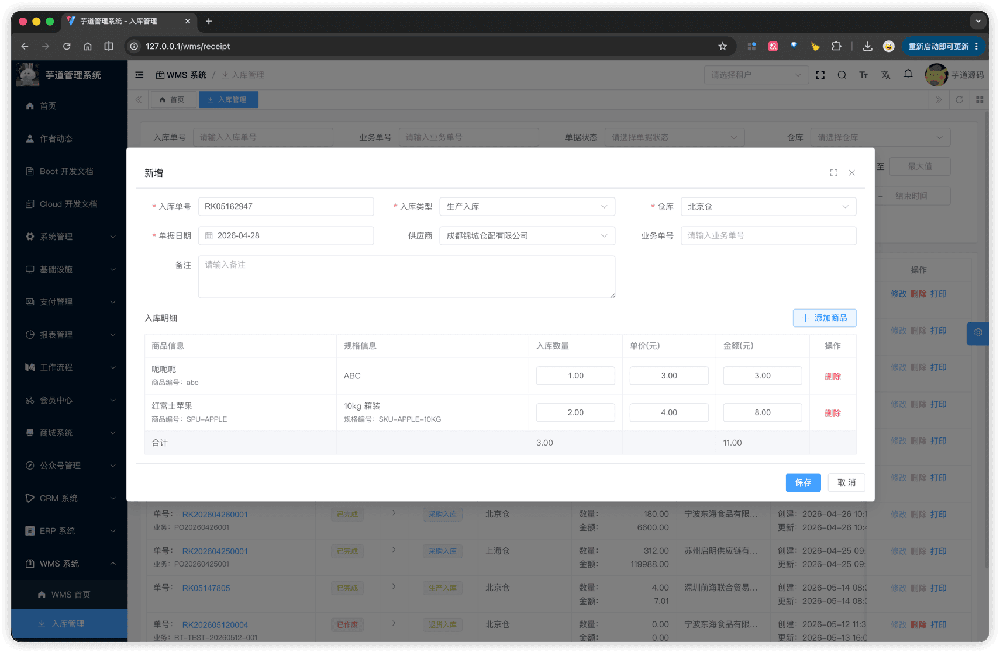
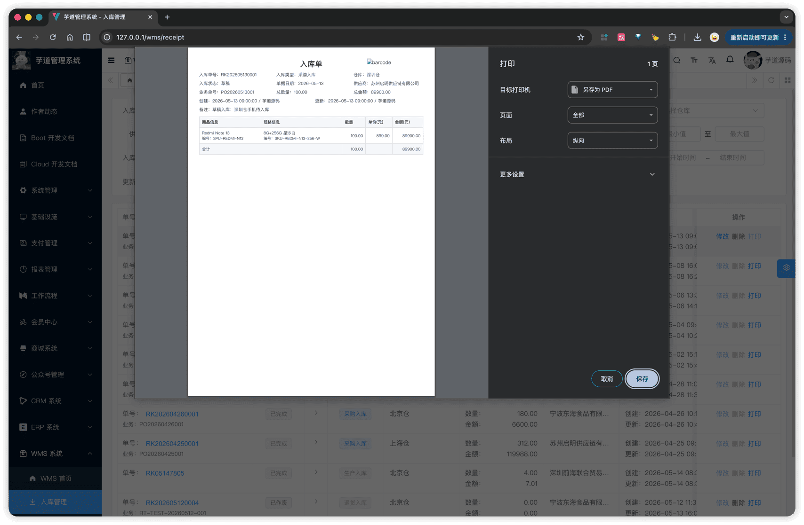

# 【单据】入库

入库单是 WMS 接收物料入库的业务凭证，由主表 + 明细子表两张表实现，通过 `type` 字段区分 4 种入库场景，所有类型共用同一套状态机与库存事务逻辑（详见 [《【库存】库存记录、流水、统计》§3 库存事务](/wms/inventory/#_3-库存事务)）。
入库单模块由 `yudao-module-wms` 后端模块的 `order.receipt` 包实现，前端实现在 `@/views/wms/order/receipt` 目录。
## # 1. 入库单
入库单，由 WmsReceiptOrderController 提供接口（`/wms/receipt-order`）；明细子表由 WmsReceiptOrderDetailController 提供接口。
### # 1.1 主表表结构
省略 creator/create_time/updater/update_time/deleted/tenant_id 等通用字段
CREATE TABLE `wms_receipt_order` (
`id` bigint NOT NULL AUTO_INCREMENT COMMENT '编号',
`no` varchar(64) NOT NULL COMMENT '入库单号',
`type` tinyint NOT NULL COMMENT '入库类型',
`status` tinyint NOT NULL DEFAULT '0' COMMENT '入库状态',
`merchant_id` bigint DEFAULT NULL COMMENT '供应商编号',
`order_time` datetime NOT NULL COMMENT '单据日期',
`biz_order_no` varchar(64) DEFAULT NULL COMMENT '业务单号',
`remark` varchar(255) DEFAULT NULL COMMENT '备注',
`warehouse_id` bigint NOT NULL COMMENT '仓库编号',
`total_quantity` decimal(14,3) DEFAULT NULL COMMENT '总数量',
`total_price` decimal(14,2) DEFAULT NULL COMMENT '总金额',
PRIMARY KEY (`id`),
UNIQUE KEY `uk_no` (`no`)
) ENGINE=InnoDB COMMENT='WMS 入库单';
① `no` 入库单号，**新增时由前端默认按 `RK + 月日 + 4 位随机数` 生成**（详见 [《功能开启》](/wms/build/) ①），允许手动修改，由后端 `validateReceiptOrderNoUnique` 校验全局唯一。
② 枚举 `type` 入库类型（`WmsReceiptOrderTypeEnum`），4 个值共用同一套状态机与库存事务逻辑：
| 值 | 类型 | 业务场景 |
| --- | --- | --- |
| 100 | 生产入库 | 产线产出半成品 / 成品入库 |
| 101 | 采购入库 | 从供应商采购物料入库（最常见） |
| 102 | 退货入库 | 客户退货回到仓库 |
| 103 | 归还入库 | 借出 / 暂存物料归还入库 |
③ 枚举 `status` 入库状态（`WmsOrderStatusEnum`：0 = 草稿，4 = 已完成，5 = 已作废）。详见 [§1.3 状态流转](#_1-3-%E7%8A%B6%E6%80%81%E6%B5%81%E8%BD%AC)。
④ `merchant_id` 关联 `wms_merchant` 表，**可空**（如生产入库无供应商）。传入时由 WmsMerchantServiceImpl 的 `validateSupplierMerchantExists` 校验类型必须为供应商或客户/供应商（详见 [《【基础】往来企业》§1.3](/wms/md/merchant/#_1-3-往来企业选择器)）。
⑤ `total_quantity` / `total_price` 总数量与总金额，**保存时由后端 `fillReceiptOrderTotal` 按明细自动汇总写入**，不需要前端传入。
该表包含一个子表：
- `wms_receipt_order_detail`（入库明细）：在新增 / 编辑弹窗的明细 Tab 中维护，至少 1 条（完成入库时由 `validateReceiptOrderDetailListExists` 强校验，抛 `RECEIPT_ORDER_DETAIL_REQUIRED`）。
### # 1.2 明细子表结构
CREATE TABLE `wms_receipt_order_detail` (
`id` bigint NOT NULL AUTO_INCREMENT COMMENT '编号',
`order_id` bigint NOT NULL COMMENT '入库单编号',
`sku_id` bigint NOT NULL COMMENT '商品 SKU 编号',
`warehouse_id` bigint NOT NULL COMMENT '仓库编号',
`quantity` decimal(14,3) NOT NULL COMMENT '入库数量',
`price` decimal(14,2) DEFAULT NULL COMMENT '单价',
`total_price` decimal(14,2) DEFAULT NULL COMMENT '行金额',
PRIMARY KEY (`id`)
) ENGINE=InnoDB COMMENT='WMS 入库单明细';
① `order_id` 关联主表的 `id` 字段。
② `sku_id` 入库 SKU，**新增时由用户从 SKU 选择器选择**（详见 [《【基础】商品、SKU、分类、品牌》§1.4](/wms/md/item/#_1-4-sku-选择器)），保存时由 WmsItemSkuServiceImpl 校验 SKU 存在。
③ `warehouse_id` 仓库编号，**从主表继承的冗余字段**（保存时由 `buildReceiptOrderDetailList` 直接取主表 `warehouseId` 写入），便于按仓库聚合明细查询。
④ `quantity` 入库数量，必填且 `> 0`。`price` 单价、`total_price` 行金额均可空：若前端未传 `total_price`，由 `fillDetailTotalPrice` 自动按 `price × quantity` 计算填回。
### # 1.3 状态流转
入库单生命周期由 WmsReceiptOrderServiceImpl 控制，所有状态迁移使用乐观锁（`updateByIdAndStatus(id, expectedStatus, newStatus)`）防止并发。状态枚举 `WmsOrderStatusEnum`：
| 状态值 | 枚举 | 说明 | 可执行操作 |
| --- | --- | --- | --- |
| 0 | `PREPARE` | 草稿 | 编辑、完成入库、作废、删除 |
| 4 | `FINISHED` | 已完成 | — |
| 5 | `CANCELED` | 已作废 | 删除 |
状态流转说明
创建 ──→ 草稿(0) ──完成入库──→ 已完成(4)（终态，写库存 + 流水）
│
└──作废──→ 已作废(5)（终态，不动库存）
- **创建**（`createReceiptOrder`）：创建入库单，初始状态为草稿；同事务内插入明细。
- **修改**（`updateReceiptOrder`）：仅草稿可改；明细通过 `diffList` 对比新老列表，分别 insert / update / delete。
- **完成入库**（`completeReceiptOrder`）：草稿 → 已完成。校验明细存在、CAS 翻状态、调用 [WmsInventoryServiceImpl 的 `changeInventory`](/wms/inventory/#_3-1-通用变更-changeinventory) 写入库存（明细 `quantity` 取正数 → 入库）并批量写流水（`order_type = 1` 入库单）。
- **作废**（`cancelReceiptOrder`）：草稿 → 已作废。CAS 翻状态，不动库存。
- **删除**（`deleteReceiptOrder`）：仅 **草稿** 或 **已作废** 可删；已完成单据不可删，避免破坏流水审计链。
### # 1.4 管理后台
对应 [WMS 系统 -> 入库管理] 菜单，对应 `yudao-ui-admin-vue3` 项目的 `@/views/wms/order/receipt` 目录。
#### # 列表
支持按入库单号、业务单号、单据状态、仓库、供应商、单据日期、入库类型、数量范围、总金额范围、创建 / 更新人、创建 / 更新时间共 11 类条件筛选。列表展示入库单号、入库类型、单据日期、仓库、供应商、总数量、总金额、状态、创建 / 更新人，以及修改 / 删除 / 打印操作（完成入库 / 作废按钮在编辑弹窗底部，详见下方小节）。
仓库下拉用 [`WarehouseSelect.vue`](/wms/md/warehouse/#_1-3-仓库选择器)，供应商下拉用 [`MerchantSelect.vue supplier`](/wms/md/merchant/#_1-3-往来企业选择器)（限定为供应商或客户/供应商）。
 
#### # 新增
通过弹窗 `ReceiptOrderForm.vue` 完成。表单上半部分是单据基础信息（入库单号 + 自动生成、入库类型、单据日期、仓库、供应商、业务单号、备注），下半部分是明细子表（SKU 选择器 + 入库数量 + 单价 + 行金额，可增删行）。保存成功后弹窗自动切换为编辑模式（参考 [《功能开启》](/wms/build/) ②）。
 
#### # 修改
弹窗结构与新增相同，仅在草稿状态下可打开。提交时仅修改主表的明细 diff，主表通过乐观锁防止并发踩到已完成 / 已作废状态（抛 `RECEIPT_ORDER_STATUS_NOT_PREPARE`）。
#### # 完成入库
编辑弹窗底部的「完成入库」按钮触发（仅草稿状态显示）。前端先做脏检查：若表单有改动则先调 `updateReceiptOrder` 保存，再调 `/wms/receipt-order/complete?id=`。后端在同一事务内：① CAS 翻状态为已完成；② 调用 `changeInventory` 写入库存与流水（详见 [《【库存】库存记录、流水、统计》§3.1](/wms/inventory/#_3-1-通用变更-changeinventory)）。完成后单据进入终态，不能再编辑 / 作废。
#### # 作废
编辑弹窗底部的「作废」按钮触发（仅草稿状态显示），二次确认后调 `/wms/receipt-order/cancel?id=`。作废后单据进入终态，但可被删除。
### # 1.5 库存影响
完成入库时调用 `inventoryService.changeInventory` 写入库存与流水：
- **库存记录**：按明细的 `(sku_id, warehouse_id)` 找到或创建 `wms_inventory` 行，`quantity` 增加明细入库数量。
- **库存流水**：每条明细写一条 `wms_inventory_history`，`order_type = 1`（入库单），`quantity` 为正数，关联 `order_id` / `order_no`。
库存事务的并发安全（行锁、按需创建库存行）由库存事务统一处理，本篇不重复说明。
## # 2. 网页打印
`ReceiptOrderPrint.vue`（`@/views/wms/order/receipt/ReceiptOrderPrint.vue`）通过 `v-print` 指令将单据渲染为可打印 HTML：
- **页头**：标题"入库单" + 右上角的入库单号 **CODE39 条码**（`Barcode` 组件）。
- **基础信息**：3 列网格展示入库单号、入库类型、仓库、状态、单据日期、供应商、业务单号、总数量、总金额，以及创建 / 更新人 + 时间、备注。
- **明细表格**：商品信息、规格信息、数量、单价、金额 5 列。
通过列表行 "打印" 按钮触发，仅渲染当前单据，不依赖单据状态。
 
.pageB img{width:80px!important;}
.wwads-horizontal .wwads-text, .wwads-content .wwads-text{line-height:1;}
[【库存】库存记录、流水、统计](/wms/inventory/) [【单据】出库](/wms/order/shipment/) 
←
[【库存】库存记录、流水、统计](/wms/inventory/) [【单据】出库](/wms/order/shipment/)→
 
Theme by
[Vdoing](https://github.com/xugaoyi/vuepress-theme-vdoing) 
| Copyright © 2019-2026
芋道源码 | MIT License   
- 跟随系统
- 浅色模式
- 深色模式
- 阅读模式
× 
.windowRB{ padding: 0;}
.windowRB .wwads-img{margin-top: 10px;}
.windowRB .wwads-content{margin: 0 10px 10px 10px;}
.custom-html-window-rb .close-but{
display: none;
}