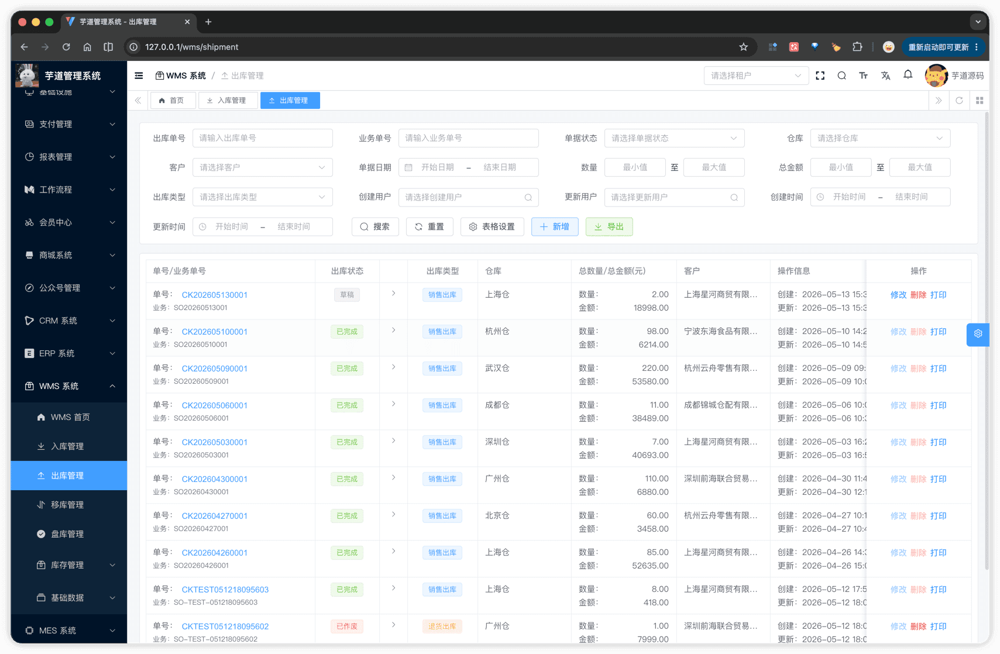
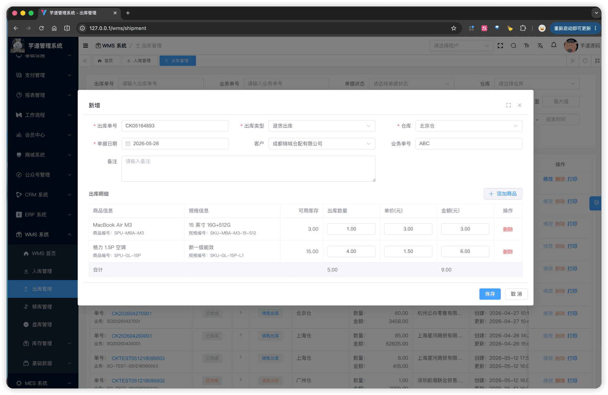
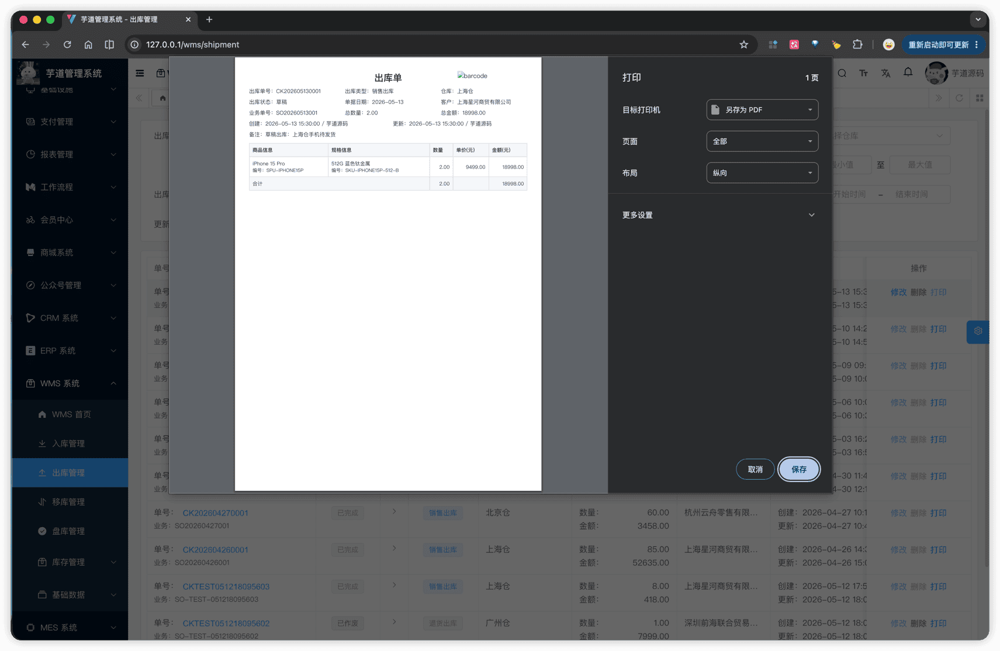

# 【单据】出库

出库单是 WMS 发出物料的业务凭证，由主表 + 明细子表两张表实现，通过 `type` 字段区分 3 种出库场景，所有类型共用同一套状态机与库存事务逻辑（详见 [《【库存】库存记录、流水、统计》§3 库存事务](/wms/inventory/#_3-库存事务)）。
整体结构与 [《【单据】入库》](/wms/order/receipt/) 高度同构，差异点：
- **关联往来企业**：出库关联**客户**（`type` 为客户或客户/供应商），入库关联供应商。
- **明细选 SKU**：出库必须基于已有库存，用 [`InventorySelect.vue` 库存选择器](/wms/inventory/#_1-3-库存选择器)（仅含 `quantity > 0` 的库存行）；入库可用 [`ItemSkuSelect.vue` SKU 选择器](/wms/md/item/#_1-4-sku-选择器)。
- **库存事务方向**：完成出库时明细 `quantity` 取**负数**写入库存事务，触发扣减并由库存事务在内存计算时校验 `afterQuantity ≥ 0`。
出库单模块由 `yudao-module-wms` 后端模块的 `order.shipment` 包实现，前端实现在 `@/views/wms/order/shipment` 目录。
## # 1. 出库单
出库单，由 WmsShipmentOrderController 提供接口（`/wms/shipment-order`）；明细子表由 WmsShipmentOrderDetailController 提供接口。
### # 1.1 主表表结构
省略 creator/create_time/updater/update_time/deleted/tenant_id 等通用字段
CREATE TABLE `wms_shipment_order` (
`id` bigint NOT NULL AUTO_INCREMENT COMMENT '编号',
`no` varchar(64) NOT NULL COMMENT '出库单号',
`type` tinyint NOT NULL COMMENT '出库类型',
`status` tinyint NOT NULL DEFAULT '0' COMMENT '出库状态',
`merchant_id` bigint DEFAULT NULL COMMENT '客户编号',
`order_time` datetime NOT NULL COMMENT '单据日期',
`biz_order_no` varchar(64) DEFAULT NULL COMMENT '业务单号',
`remark` varchar(255) DEFAULT NULL COMMENT '备注',
`warehouse_id` bigint NOT NULL COMMENT '仓库编号',
`total_quantity` decimal(14,3) DEFAULT NULL COMMENT '总数量',
`total_price` decimal(14,2) DEFAULT NULL COMMENT '总金额',
PRIMARY KEY (`id`),
UNIQUE KEY `uk_no` (`no`)
) ENGINE=InnoDB COMMENT='WMS 出库单';
① `no` 出库单号，**新增时由前端默认按 `CK + 月日 + 4 位随机数` 生成**（详见 [《功能开启》](/wms/build/) ①），允许手动修改，由后端 `validateShipmentOrderNoUnique` 校验全局唯一。
② 枚举 `type` 出库类型（`WmsShipmentOrderTypeEnum`），3 个值共用同一套状态机与库存事务逻辑：
| 值 | 类型 | 业务场景 |
| --- | --- | --- |
| 200 | 退货出库 | 给供应商退货 |
| 201 | 销售出库 | 销售发货给客户（最常见） |
| 202 | 生产出库 | 领料给产线消耗 |
③ `status` 与入库单共用 `WmsOrderStatusEnum`（0 = 草稿，4 = 已完成，5 = 已作废）。
④ `merchant_id` 关联 `wms_merchant` 表，**可空**（如生产出库无客户）。传入时由 WmsMerchantServiceImpl 的 `validateCustomerMerchantExists` 校验类型必须为客户或客户/供应商。
⑤ `total_quantity` / `total_price` 保存时由后端 `fillShipmentOrderTotal` 按明细自动汇总写入。
该表包含一个子表：
- `wms_shipment_order_detail`（出库明细）：在新增 / 编辑弹窗中维护，至少 1 条（完成出库时由 `validateShipmentOrderDetailListExists` 强校验）。
### # 1.2 明细子表结构
CREATE TABLE `wms_shipment_order_detail` (
`id` bigint NOT NULL AUTO_INCREMENT COMMENT '编号',
`order_id` bigint NOT NULL COMMENT '出库单编号',
`sku_id` bigint NOT NULL COMMENT '商品 SKU 编号',
`warehouse_id` bigint NOT NULL COMMENT '仓库编号',
`quantity` decimal(14,3) NOT NULL COMMENT '出库数量',
`price` decimal(14,2) DEFAULT NULL COMMENT '单价',
`total_price` decimal(14,2) DEFAULT NULL COMMENT '行金额',
PRIMARY KEY (`id`)
) ENGINE=InnoDB COMMENT='WMS 出库单明细';
字段结构与 [入库明细表](/wms/order/receipt/#_1-2-明细子表结构) 完全一致：`order_id` 关联主表、`sku_id` 出库 SKU、`warehouse_id` 从主表继承的冗余字段、`quantity` / `price` / `total_price` 数量金额。
唯一差异在前端：SKU 必须**从库存选择器中选择**（仅 `quantity > 0` 的 SKU + 仓库行），且 `quantity` 不能超过可用库存。
### # 1.3 状态流转
与入库单 [§1.3](/wms/order/receipt/#_1-3-状态流转) **完全一致**（共用 `WmsOrderStatusEnum`，4 个操作方法签名同形）：
| 状态 | 值 | 可执行操作 |
| --- | --- | --- |
| 草稿 | 0 | 编辑、完成出库、作废、删除 |
| 已完成 | 4 | — |
| 已作废 | 5 | 删除 |
四个核心操作方法：**创建**（`createShipmentOrder`）、**修改**（`updateShipmentOrder`）、**完成出库**（`completeShipmentOrder`）、**作废**（`cancelShipmentOrder`）。状态机迁移全部使用 `updateByIdAndStatus(id, expectedStatus, newStatus)` 乐观锁。
删除操作 `deleteShipmentOrder` 只允许在 **草稿** 或 **已作废** 状态下执行。
### # 1.4 管理后台
对应 [WMS 系统 -> 出库管理] 菜单，对应 `yudao-ui-admin-vue3` 项目的 `@/views/wms/order/shipment` 目录。
#### # 列表
搜索条件、列表展示结构与入库单一致，仅"供应商"换为"客户"（用 [`MerchantSelect.vue customer`](/wms/md/merchant/#_1-3-往来企业选择器) 限定为客户或客户/供应商）、"入库类型"换为"出库类型"。
 
#### # 新增
通过弹窗 `ShipmentOrderForm.vue` 完成。表单上半部分是单据基础信息（出库单号 + 自动生成、出库类型、单据日期、仓库、客户、业务单号、备注），下半部分是明细子表。
明细行的 SKU 选择通过 [`InventorySelect.vue` 库存选择器](/wms/inventory/#_1-3-库存选择器)弹出，**必须先选仓库**才能打开（否则提示"请先选择仓库"），所选 SKU 自动带入"可用库存"作为出库数量上限。
 
#### # 修改
弹窗结构与新增相同，仅在草稿状态下可打开。明细的 SKU 选择器同样必须先有仓库；切换仓库会清空已有明细。
#### # 完成出库
编辑弹窗底部的「完成出库」按钮触发（仅草稿状态显示）。前端先做脏检查：若表单有改动则先调 `updateShipmentOrder` 保存，再调 `/wms/shipment-order/complete?id=`。后端在同一事务内：① CAS 翻状态为已完成；② 调用 `changeInventory` **扣减库存**（明细 `quantity` 取负、`total_price` 同步取负）。若库存不足，库存事务抛 `INVENTORY_QUANTITY_NOT_ENOUGH` 异常并整单回滚，单据保持草稿状态。
#### # 作废
编辑弹窗底部的「作废」按钮触发（仅草稿状态显示），二次确认后调 `/wms/shipment-order/cancel?id=`。作废后单据进入终态，可被删除。
### # 1.5 库存影响
完成出库时调用 `inventoryService.changeInventory` 写入库存与流水：
- **库存记录**：按明细的 `(sku_id, warehouse_id)` 锁定 `wms_inventory` 行，`quantity` 扣减明细出库数量。若 `afterQuantity  
.pageB img{width:80px!important;}
.wwads-horizontal .wwads-text, .wwads-content .wwads-text{line-height:1;}
[【单据】入库](/wms/order/receipt/) [【单据】移库](/wms/order/movement/) 
←
[【单据】入库](/wms/order/receipt/) [【单据】移库](/wms/order/movement/)→
 
Theme by
[Vdoing](https://github.com/xugaoyi/vuepress-theme-vdoing) 
| Copyright © 2019-2026
芋道源码 | MIT License   
- 跟随系统
- 浅色模式
- 深色模式
- 阅读模式
× 
.windowRB{ padding: 0;}
.windowRB .wwads-img{margin-top: 10px;}
.windowRB .wwads-content{margin: 0 10px 10px 10px;}
.custom-html-window-rb .close-but{
display: none;
}